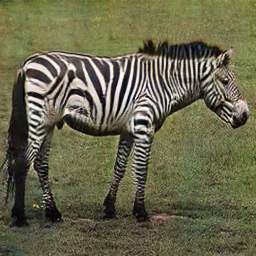
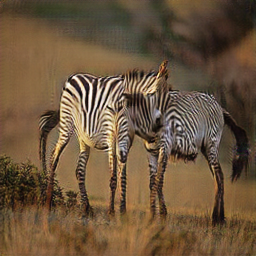

# Cycle GAN

Cycle-GAN example in NNabla.

These are the example of generated images.

 

## Dataset

Dataset is now automatically downloaded from [the author's site](https://people.eecs.berkeley.edu/~taesung_park/CycleGAN/datasets/) when you run the following scripts.

## Train

```python
python train.py --device-id 0 \
                --context "cudnn" \
                --lambda-idt 0.5 \
                --monitor-path identity.monitor \
                --model-save-path identity.monitor
```

This will take about one day using one GeForce 1080 Ti, and you can find the result in `identity.monitor`.
                

## Test

```python
python test.py --device-id 0 \
               --context "cudnn" \
               --monitor-path identity.monitor.evaluation \
               --model-load-path identity.monitor/params_266799.h5
```

You can find the result of generated images in `identity.monitor.evaluation` for all corresponding test images.


For other settings of hyper parameters, see `args.py` or simply run `train.py` with `-h` option, or see the `train_samples.sh` and `test_samples.sh`.

# Note
- Examples do not use `ReflectionPad`. This is one of differences from [the author's code](https://github.com/junyanz/pytorch-CycleGAN-and-pix2pix).
- [TODO] verification of training with datasets except for `horse2zebra`.

# References

1. Jun-Yan Zhu, Taesung Park, Phillip Isola, Alexei A. Efros, "Unpaired Image-to-Image Translation using Cycle-Consistent Adversarial Networks", https://arxiv.org/abs/1703.10593
2. Xudong Mao, Qing Li, Haoran Xie, Raymond Y.K. Lau, Zhen Wang, Stephen Paul Smolley, "Least Squares Generative Adversarial Networks", https://arxiv.org/abs/1611.04076
3. https://github.com/junyanz/pytorch-CycleGAN-and-pix2pix
