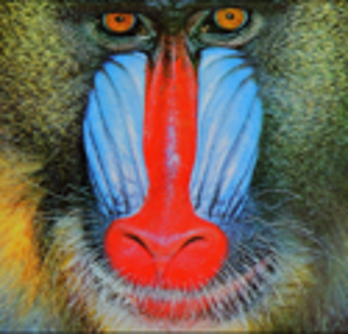
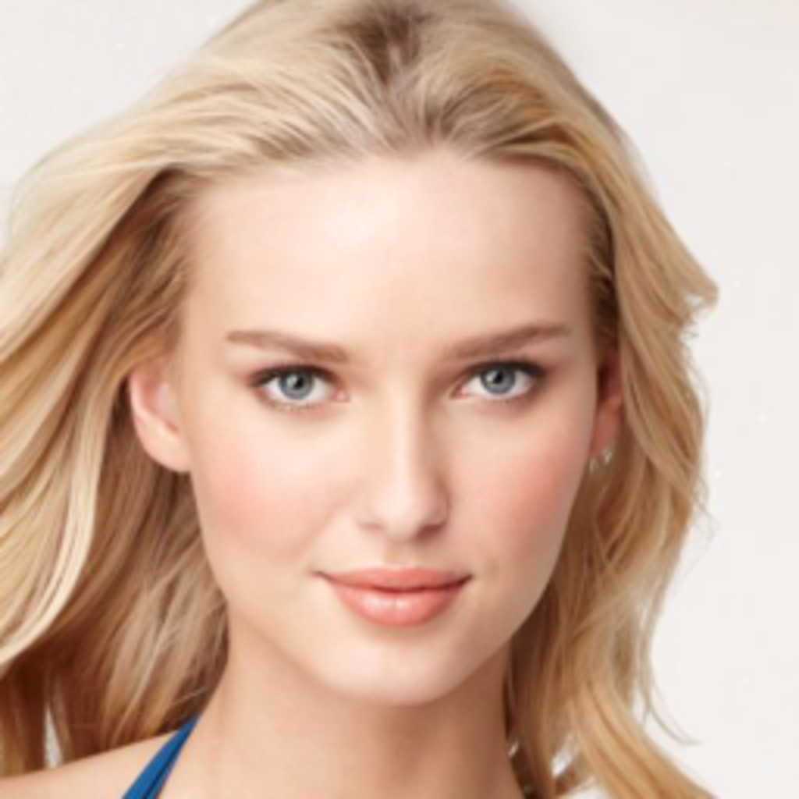

# Enhanced Super Resolution GAN
This repository contains the code (in NNabla) for "[ESRGAN](https://arxiv.org/abs/1809.00219)" 
paper by [Xintao et al.](https://github.com/xinntao/ESRGAN).

## Introduction
Super-resolution GAN [(SRGAN)](https://arxiv.org/abs/1609.04802) applies a deep network in combination with an adversary network to 
produce higher resolution images. To further enhance the visual quality ESRGAN has been proposed, which is an improved
version of SRGAN. The below three aspects have been improved in ESRGAN:
* Residual-in-Residual Dense Block (RRDB) without batch normalization as the basic network building unit.
* Relativistic GAN to let the discriminator predict relative realness instead of the absolute value.
* Improve the perceptual loss by using the features before activation, which could provide stronger supervision for 
brightness consistency and texture recovery.

__Result Examples__

| Input                  | Output                  |
| :--------------------: | :---------------------: |
|  |  |
|  |  |
|  |  |

## Dataset Preparation
In this example, DIV2K (DIVerse 2K resolution high quality images) dataset has been used for training, which contains 800 high definition images. This dataset can be downloaded from [here](https://data.vision.ee.ethz.ch/cvl/DIV2K/). For Validation, Set14 dataset has been used, which can be downloaded from [here](https://drive.google.com/drive/folders/1pRmhEmmY-tPF7uH8DuVthfHoApZWJ1QU). The steps for data pre-processing have been mentioned [here](https://github.com/xinntao/BasicSR/wiki/Prepare-datasets-in-LMDB-format#how-to-prepare) by original authors.
1. Since DIV2K images are large, we first crop them to sub-images using [authors-scripts/extract_subimgs_single.py](./authors-scripts/extract_subimgs_single.py)
2. Generate LR images with [authors-scripts/generate_mod_LR_bic.py](./authors-scripts/generate_mod_LR_bic.py). If you already have LR images, you can skip this step. Please make sure the LR and HR folders have the same number of images.

After following the steps for preparing dataset, the training dataset folder should look something like this:
```
-Div2k (HR training images)
-Div2K_subset 
  -Bic
    -x4
      -images...
  -HR
    -x4
      -images...
  -LR
    -x4
      -images...
```
## Inference
A trained ESRGAN model can be used to create SR images from given LR images. The trained ESRGAN model can be obtained after training the network by following the steps mentioned in [training section](#training). It should be noted that you can use different datasets to train your custom models. If you don't want to train ESRGAN, you can simply download the pre-trained weights provided by us from the below links:
### Pre-trained Weights
| ESRGAN |  PSNR Oriented RRDB |
|---|---|
|[ESRGAN pre-trained weights](https://nnabla.org/pretrained-models/nnabla-examples/esrgan/esrgan_latest_g.h5)|[PSNR oriented RRDB pre-trained weights](https://nnabla.org/pretrained-models/nnabla-examples/esrgan/psnr_rrdb.h5)|

The `ESRGAN pre-trained weights` can directly be used for inference whereas the `PSNR oriented RRDB pre-trained weights` can be used for finetuning ESRGAN network as mentioned in the [training section.](#training-a-psnr-oriented-model)
### Inference using the trained model obtained after training in NNabla
Inference can be done either by using the above mentioned `ESRGAN pre-trained weights` or the last saved generator weights obtained after training. Type the below commands in terminal to generate a SR image from a given LR image:
```
python inference.py --loadmodel {path to the ESRGAN pre-trained weights} --input_image {sample LR image}
```
### Inference using pre-trained weights provided by original authors
The pre-trained ESRGAN and the pre-trained PSNR oriented weight files can be obtained from [here](https://drive.google.com/drive/folders/17VYV_SoZZesU6mbxz2dMAIccSSlqLecY) which has been provided by the [original authors](https://github.com/xinntao/ESRGAN). These pre-trained weight file can directly be used to do inference on images. See the following [link](./authors_weights_inference.md) to use the original author's pre-trained weights for inference.

## Training
The training of ESRGAN is divided in two steps:
1. At first a PSNR oriented model is trained using L1 loss.
2. Then the ESRGAN network is finetuned using the pre-trained PSNR oriented model. 
### Training a PSNR oriented model 
All the experiments are done using a scaling factor of 4 between LR and HR images.
A Residual-in-Residual Dense Block (RRDB) is used for training a PSNR oriented model. Use the below code to start the training.
#### Single GPU training
```
python train.py \
     --gt_train {path to GT training images} \
     --lq_train {path to LR training images} \
     --gt_val {path to GT val images} \
     --lq_val {path to LR val images} \
     --n_epochs 497 \
     --lr_g 2e-4 \
     --savemodel {path to save the trained model} \
```
#### Distributed Training
For distributed training [install NNabla package compatible with Multi-GPU execution](https://nnabla.readthedocs.io/en/latest/python/pip_installation_cuda.html#pip-installation-distributed). Use the below code to start the distributed training.
```
export CUDA_VISIBLE_DEVICES=0,1,2,3 {device ids that you want to use}
mpirun -n {no. of devices} python train.py \
     --gt_train {path to GT training images} \
     --lq_train {path to LR training images} \
     --gt_val {path to GT val images} \
     --lq_val {path to LR val images} \
     --n_epochs 497 \
     --lr_g 2e-4 \
     --savemodel {path to save the trained model} \
```
### Training ESRGAN
As discussed in the introduction, ESRGAN uses VGG19 features before activation for improving the perceptual loss of generator. So, we are going to need VGG19 pre-trained weights to compute the perceptual loss. Download the VGG19 NNabla weights from [here](https://nnabla.org/pretrained-models/nnabla-examples/esrgan/vgg19.h5). If you want to convert pytorch VGG19 weights to NNabla h5 format, see the following [link](./authors_weights_inference.md).  
The pre-trained PSNR model is used for finetuning the ESRGAN network. To obtain this you can train a PSNR oriented RRDB network or use our [pre-trained weight.](https://nnabla.org/pretrained-models/nnabla-examples/esrgan/psnr_rrdb.h5) The intention of using a pre-trained PSNR oriented model as initializer for generator is to avoid undesired local optima for generator and to provide the discriminator relatively good super-resolved images instead of extreme fake or noisy ones. Use the code below to train ESRGAN:
#### Single GPU training
```
export CUDA_VISIBLE_DEVICES=0,1,2,3 {device ids that you want to use}
python train.py \
     --gt_train {path to GT training images} \
     --lq_train {path to LR training images} \
     --gt_val {path to GT val images} \
     --lq_val {path to LR val images} \
     --n_epochs 199 \
     --lr_g 1e-4 \
     --vgg_pre_trained_weights {path to pre-trained vgg19 weights} \
     --gen_pretrained {path to pre-trained PSNR oriented model} \
     --savemodel {path to save the trained model} \
     --esrgan True
```
#### Distributed training
```
mpirun -n {no. of devices} python train.py \
     --gt_train {path to GT training images} \
     --lq_train {path to LR training images} \
     --gt_val {path to GT val images} \
     --lq_val {path to LR val images} \
     --n_epochs 199 \
     --lr_g 1e-4 \
     --vgg_pre_trained_weights {path to pre-trained vgg19 weights} \
     --gen_pretrained {path to pre-trained PSNR oriented model} \
     --savemodel {path to save the trained model} \
     --esrgan True
```

