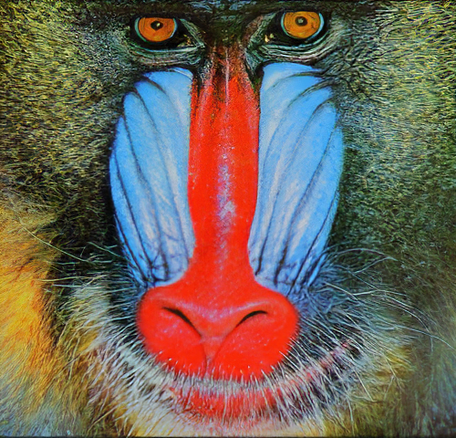

# Enhanced Super Resolution GAN
This repository contains the code (in NNabla) for "[ESRGAN](https://arxiv.org/abs/1809.00219)" 
paper by [Xintao et al.](https://github.com/xinntao/ESRGAN).

## Introduction
Super-resolution GAN [(SRGAN)](https://arxiv.org/abs/1609.04802) applies a deep network in combination with an adversary network to 
produce higher resolution images. To further enhance the visual quality ESRGAN has been proposed, which is an improved
version of SRGAN. The below three aspects have been improved in ESRGAN:
* Residual-in-Residual Dense Block (RRDB) without batch normalization as the basic network building unit.
* Relativistic GAN to let the discriminator predict relative realness instead of the absolute value.
* Improve the perceptual loss by using the features before activation, which could provide stronger supervision for 
brightness consistency and texture recovery.

## Dataset Preparation
[TO DO]

## Training
[TO DO]

## Inference using pre-trained model
The pre-trained ESRGAN weight files can be obtained from [here](https://drive.google.com/drive/folders/17VYV_SoZZesU6mbxz2dMAIccSSlqLecY),
which has been provided by the [original authors](https://github.com/xinntao/ESRGAN). This pre-trained weight file can directly be used to do inference on images by
following the below steps:
1. From the above link, download the file named as `RRDB_ESRGAN_x4.pth`.
2. Clone the nnabla examples [repository](https://github.com/sony/nnabla-examples.git).
3. Convert the weight file to NNabla .h5 format and then use the inference code to produce a SR image on a given sample
of LR image using the code below:
```
cd nnabla-examples/GANs/esrgan
python convert_weights.py --pretrained_model {path to pretrained weights} --save_path {path to save the h5 file}
python inference.py --loadmodel {path to the converted h5 file} --input_image {sample LR image}
```
## Results obtained from ESRGAN


