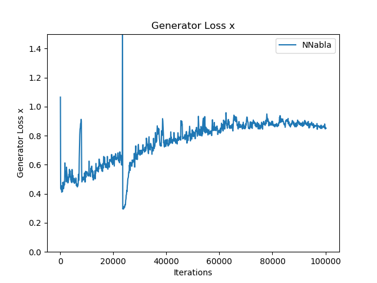
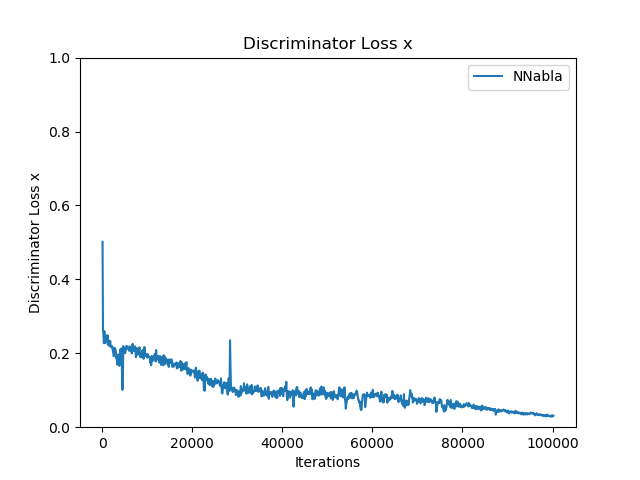
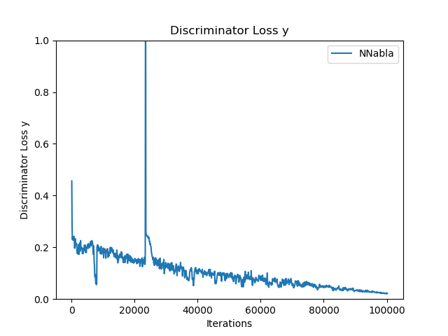
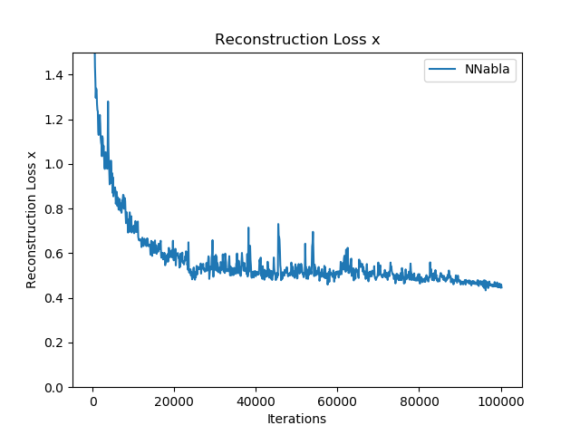
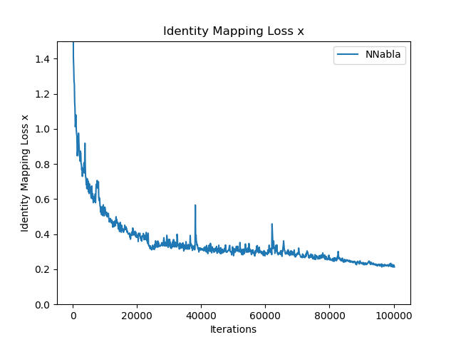
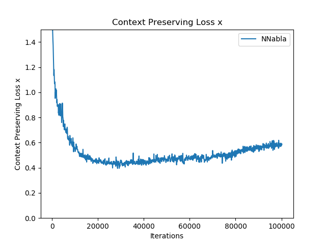
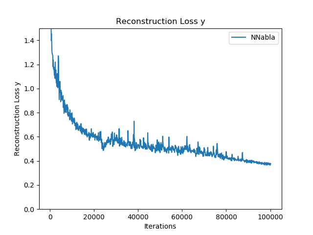
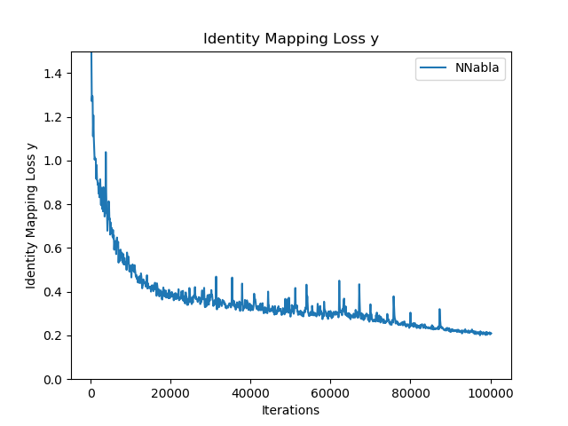
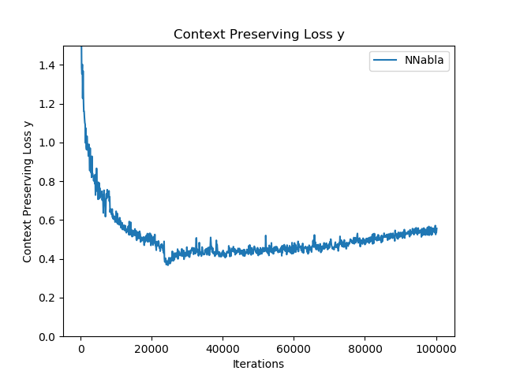

# InstaGAN

## Overview

NNabla implementation of ["InstaGAN: Instance-aware Image-to-Image Translation"](https://github.com/sangwoomo/instagan) by Sangwoo Mo, Minsu Cho and Jinwoo Shin.
InstaGAN is another image-to-image translation model which focuses on instance-wise translation.


### Image-to-Image translation samples (left: original, right: generated)

| Skirt to Jeans | Jeans to Skirt |
|:----:|:----:|
|   |   |
|   |   |
|   |   |


## Dependency
This example requires NNabla v1.4 or later.


## Dataset

Currently this example is supposed to use [CCP dataset](https://github.com/bearpaw/clothing-co-parsing) for training. First you need to get the dataset by

```sh
git clone https://github.com/bearpaw/clothing-co-parsing ./datasets/clothing-co-parsing
```

Then you will find the dataset in `dataset` directory. Next, you need to generate the mask images from that.

```sh
python ./datasets/generate_ccp_dataset.py --save_root ./datasets/jeans2skirt_ccp --cat1 jeans --cat2 skirt
```
**Acknowledgement**: dataset generation script is from original [InstaGAN repository](https://openreview.net/forum?id=ryxwJhC9YX).


## Training

Once dataset is ready, you can start training by the following command.

```
python train.py  --dataroot datasets/jeans2skirt_ccp 
```

It takes about one day using a single Tesla V100 (with default configuration). After every epoch, a pair of translated images (from both domains in the training set) is saved in a directory specified by `--monitor-path`.  Note that due to the lack of mask images in test dataset, this example does not translate images contained in the test dataset.

Training curve would be like the following. Here, domain x means *jeans* and domain y means *skirt*.

<p align="center">
<br>

</p>
<p align="center">
Figure 1: Generator / Discriminator loss for both domains.
</p>

<p align="center">
<br>
</p>
<p align="center">
Figure 2: Reconstruction / Identity Mapping / Context Preserving Loss for both domains.
</p>


## Note
There are some difference from the original implementation.
* In original implementation, `ImagePool` is used for training, but this example omits that.
* The number of trainable paramters are not the same. This is due to the different implementation of `deconvolution`.
* Sequential mini-batch translation is not implemented yet.


## References
* Sangwoo Mo, Minsu Cho and Jinwoo Shin, ["InstaGAN: Instance-aware Image-to-Image Translation"](https://openreview.net/forum?id=ryxwJhC9YX)
* https://github.com/sangwoomo/instagan
