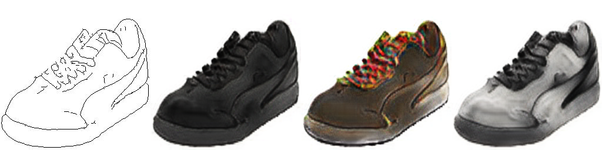
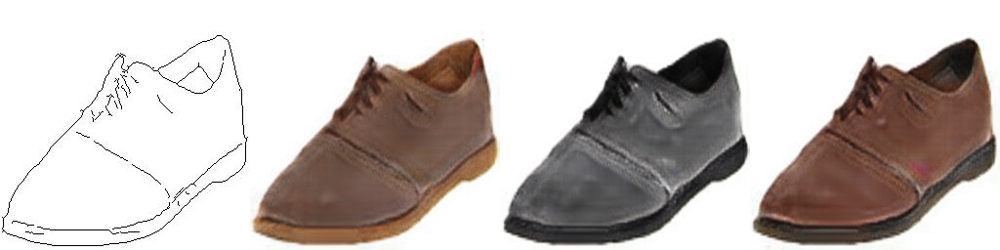
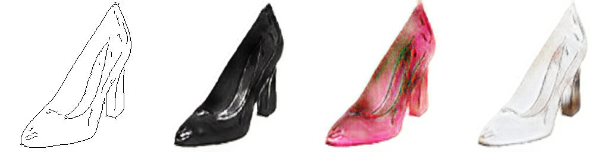

# Multimodal Unsupervised Image-to-Image Translation

NNabla reproduction of *Multimodal Unsupervised Image-to-Image Translation*.







## Dataset

To prepare dataset(s), 

```bash
# Training dataset
python prepare_dataset.py --dataset edges2shoes --data-type train

# Validation dataset
python prepare_dataset.py --dataset edges2shoes --data-type val

```

You can find the specified dataset under *~/nnabla_data* directory.


## Training

For training MUNIT in the distributed training, 

```bash
mpirun -n 4 python train_mgpu.py -b 1 \
	--max-iter 1000000 \
	--img-path-a ~/nnabla_data/edges2shoes_A/train \
	--img-path-b ~/nnabla_data/edges2shoes_B/train \
	--monitor-path ./result/example_000
```

It takes about 1.5 days using 4 GeForce GTX 1080 Ti.


After the training finishes, you can find the results under *./result/example_000* directory in the above case.

If you want to use your own dataset(s), set the directory path which contains your images to *--img-path-a* for one domain and do the same to *--img-path-b* for the other domain.


## Generation

To generate samples using the trained models, 

```bash
python generate.py -b 1 \
	--img-path-a ~/nnabla_data/edges2shoes_A/val \
	--img-path-b ~/nnabla_data/edges2shoes_B/val \
	--monitor-path ./result/example_000 \
	--model-load-path ./result/example_000/param_249999.h5
```

The directory containing generated images are created under *./result/example_000*. If you want to generate example-guided images (i.e., the style encode comes from the other domain), add *--example-guided* option and a single image path to *--img-files-a* and/or *--img-files-b* option.

## Interpolation

To interpolate latent variables in the latent space and generate samples using the trained model, 

```bash
python interpolate.py \
	--img-files-a ~/nnabla_data/edges2shoes_A/val/1_AB.jpg <other image files> \
	--img-files-b ~/nnabla_data/edges2shoes_B/val/1_AB.jpg <other image files> \
	--monitor-path ./result/example_000 \
	--model-load-path ./result/example_000/param_249999.h5 \
	--num-repeats 128
```


# References
- Xun Huang, Ming-Yu Liu, Serge Belongie, Jan Kautz, "Multimodal Unsupervised Image-to-Image Translation", https://arxiv.org/abs/1804.04732
- https://github.com/NVlabs/MUNIT


