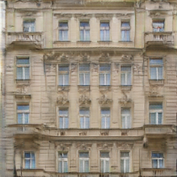
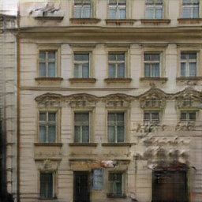

# Pix2Pix Example by NNabla
NNabla example code of Image-to-Image Translation with Conditional Adversarial Nets a.k.a. pix2pix.


__Result Examples (cherry picked)__

| Output                 |
| :--------------------: |
|  |
|  |
|  |
|  |

## Running Code
### Train Pix2Pix Model
```
python pix2pix.py --train -c "cudnn" -d 0 --patch-gan
```
Trained model will be saved at log directory (default is `tmp.monitor`).
### Generate Fakes from Trained Pix2Pix Model
```
python pix2pix.py --generate --model "<path to your trained model>" -c "cudnn" -d 0
```
Generated images will be saved at log directory (default is `tmp.monitor/generated`).

## Note 

Currently, this example is only for the facade dataset.

## Reference
- P. Isola, J. Zhu, T. Zhou, and A. A. Efros. "[Image-to-Image Translation with Conditional Adversarial Networks](https://arxiv.org/abs/1611.07004)," arXiv:1611.07004, 2016.

