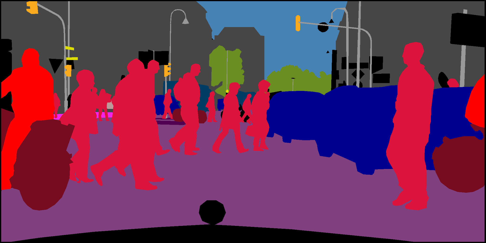
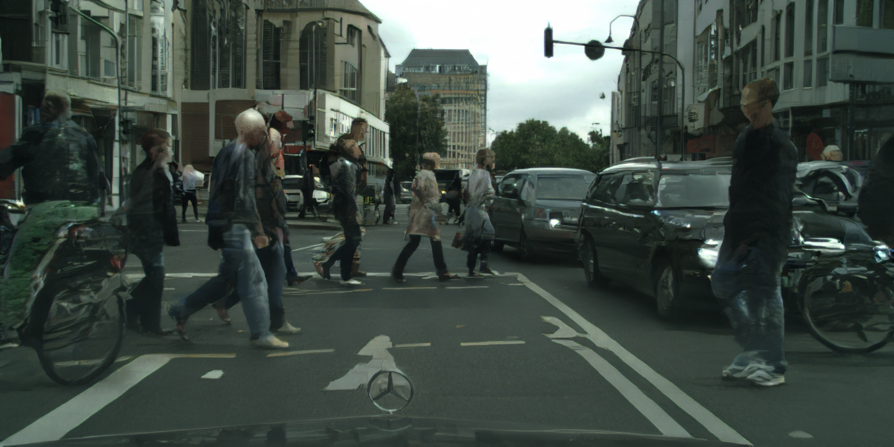
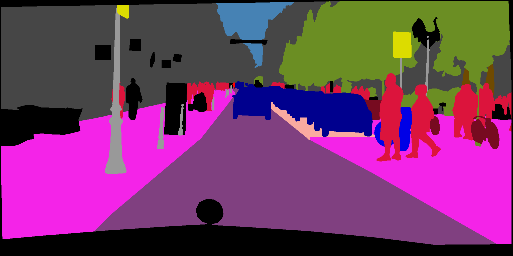
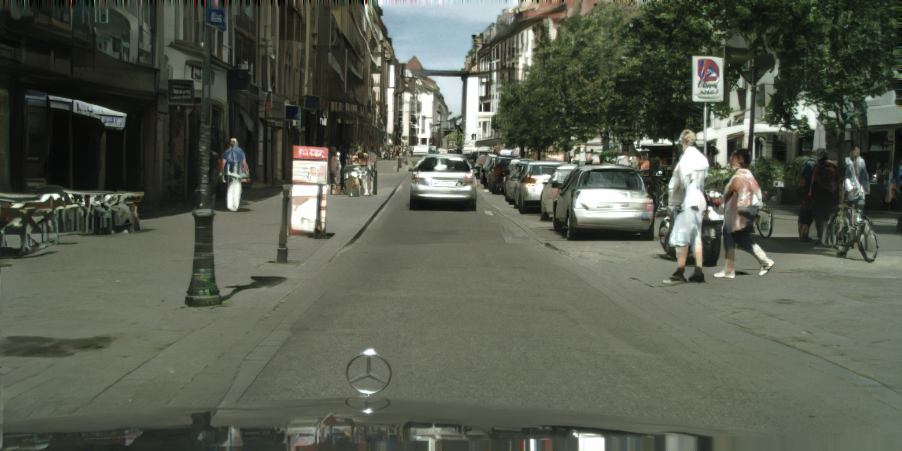
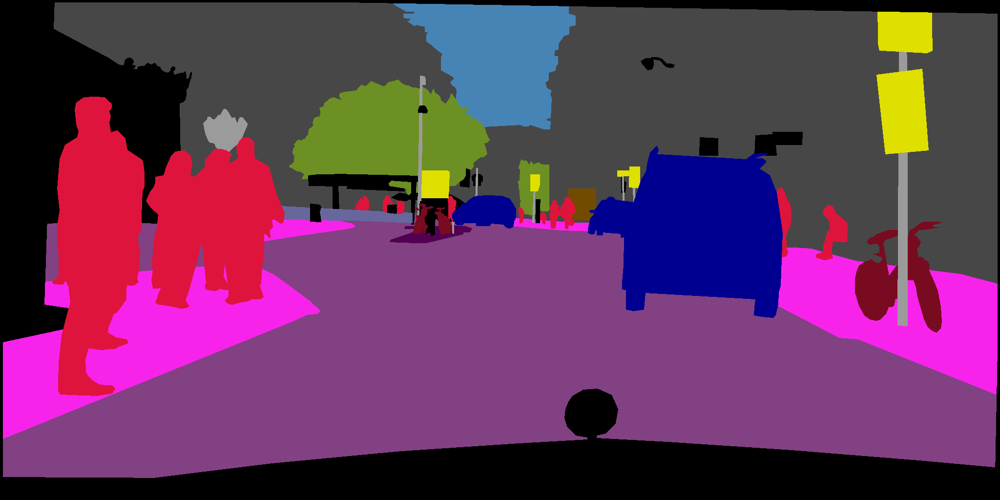
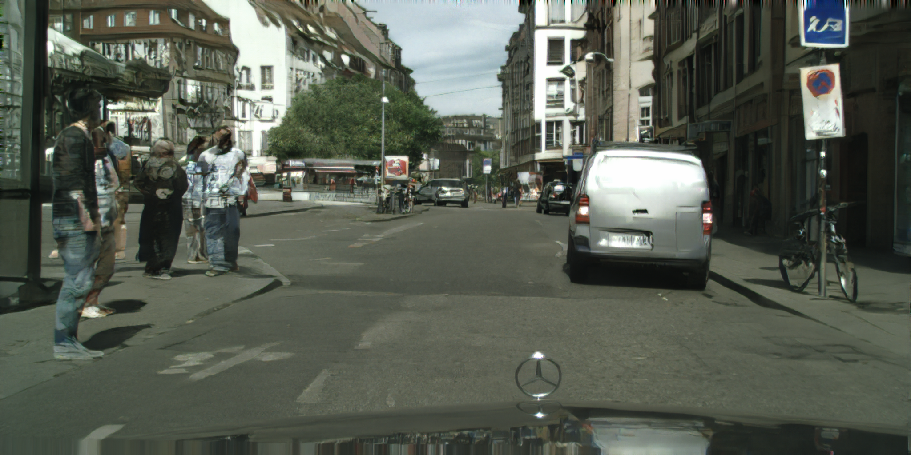
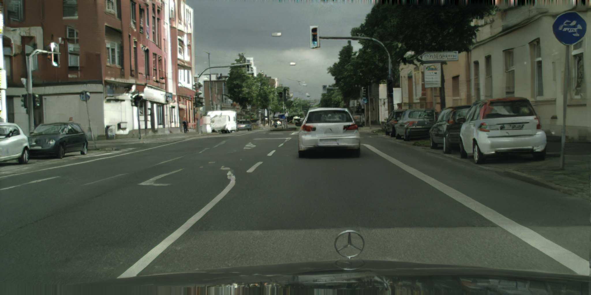

# Pix2PixHD Example by NNabla
This is a NNabla implementation of the "High-Resolution Image Synthesis and Semantic Manipulation with Conditional GANs" (Pix2PixHD).


__Result Examples (cherry picked)__

| Input                  | Output                  |
| :--------------------: | :---------------------: |
|  |  |
|  |  |
|  |  |
|  |  |

## Requirements
### system environments
* CUDA, CUDNN
* 15G GPU memory or larger for half, 28GB GPU memory or larger for float are needed to train full model on 1024x2048 images.
* (For multi GPUs execution) OpenMPI

### python environments
You can install all dependencies from `requirements.txt`.
```bash
pip install -r ./requirements.txt
``` 

Note that `nnabla-ext-cuda101`(requiring CUDA 10.1 and CUDNN 7.6.0) will be installed in default settings.  
If you've installed other version of CUDA, please modify `requirements.txt` to meet your environment.  
For more information, see [NNabla CUDA extension package installation guild](https://nnabla.readthedocs.io/en/latest/python/pip_installation_cuda.html).

## Dataset
Download Cityscapes dataset from [here](https://www.cityscapes-dataset.com/).  
In this example, `gtFine_trainvaltest.zip` and `leftImg8bit_trainvaltest.zip` are needed.  
Once you download and extract them, create `./data/Cityscapes` dir and place extracted directories to it.


## Running Code
### Train 512 x 1024 Model (Global Generator)
```
# by a single GPU
./scripts/train_cityscapes_global.sh 

# by multi GPUs
./scripts/train_cityscapes_global_mgpu.sh 
```
Trained model will be saved at log directory (default is `./result/cityscapes_512_1024/`).

### Train 1024 x 2048 Model (Local Enhancer)
```
# by a single GPU
./scripts/train_cityscapes_local.sh 

# by multi GPUs
./scripts/train_cityscapes_local_mgpu.sh 
```
Trained model will be saved at log directory (default is `./result/cityscapes_1024_2048/`).

### Generate image by 512 x 1024 Model (Global Generator)
```
# by a single GPU
./scripts/generate_global.sh 

# by multi GPUs
./scripts/generate_global_mgpu.sh 
```
In the default setting, model parameter is loaded from `./result/cityscapes_512_1024/final_param.h5` which is created in the end of training script.  
Generated images will be saved at log directory (default is `./result/cityscapes_512_1024/generated`).

### Generate image by 1024 x 2048 Model (Local Enhancer)
```
# by a single GPU
./scripts/generate_local.sh

# by multi GPUs
./scripts/generate_local_mgpu.sh
```
In the default setting, model parameter is loaded from `./result/cityscapes_1024_2048/final_param.h5` which is created in the end of training script.  
Generated images will be saved at log directory (default is `./result/cityscapes_1024_2048/generated`).


## Note 
* All configurations are listed in config.yaml. You can change model settings by editing this.
* Currently, this example only supports cityscapes dataset.
* Instance encoding hasn't implemented yet. (Image manipulation is not supported.)


## Reference
- Ting-Chun Wang, Ming-Yu Liu, Jun-Yan Zhu, Andrew Tao, Jan Kautz, Bryan Catanzaro,  "[High-Resolution Image Synthesis and Semantic Manipulation with Conditional GANs](https://tcwang0509.github.io/pix2pixHD/)"

