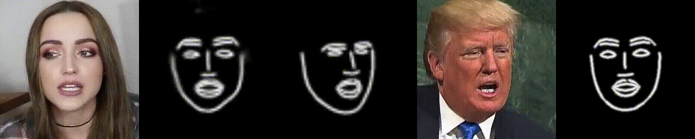
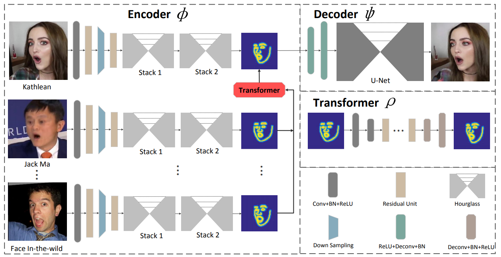

# ReenactGAN: Learning to Reenact Faces via Boundary Transfer

<p align="center">

</p>
<p align="center">
Figure: Face Reenactment by ReenactGAN. 
Left to right: input image, predicted boundary, transformed boundary, fake image, ground truth input's boundary.
Note that the encoder is never trained on input images, so some mispredictions can be found.
</p>

This is a NNabla implementation of [ReenactGAN](https://github.com/wywu/ReenactGAN).
ReenactGAN is a GAN model for face reenactment, which can let other person act as you do. ReenactGAN consists of 3 modules, namely, `Encoder`, `Transformer`, and `Decoder`. As shown in the figure below, given source person's face, `Encoder` first extracts the source person's boundary, and `Transformer` changes it into that of the target person, then finally, `Decoder` reconstructs / generates target's face from the boundary. The point is that, it does not directly transfer images in the pixel space, but utilizes a boundary latent space for better translation. 

<p align="center">

</p>
<p align="center">
Figure: Overview of ReenactGAN (image from the original repository).
</p>

# Preparation

## Prerequisites

* nnabla == 1.9.0
* python >= 3.6
* opencv

## Getting Dataset and Preprocessing
### WLFW

For training `Encoder`, you need to get [WLFW Dataset](https://wywu.github.io/projects/LAB/WFLW.html). Please visit the website and download `WFLW_images.tar.gz` and `WFLW_annotations.tar.gz`.

This dataset contains 10000 (7500 for training and 2500 for validation) faces with 98 fully manual annotated landmarks. 

After downloading the dataset, please make a directory for datasets first.

```
mkdir datasets
```

We assume all the datasets are stored in this directory. Then put WFLW datasets there and decompress them by;

```
tar -zxvf datasets/WFLW_images.tar.gz -C datasets
tar -zxvf datasets/WFLW_annotations.tar.gz -C datasets
```

#### Alignment and Preprocessing

WFLW dataset contains raw images, which means, faces are **not aligned** and sometimes there are more than 2 faces in one image. In addition, ground truth boundary images are not provided. So you need to preprocess the raw images and get the aligned face images and corresponding (ground truth) boundary images by yourself. 
To do this, you can use `preprocess.py` like the following.

```
python preprocess.py --dataset WFLW --mode train --out-dir datasets/WFLW_heatmaps
python preprocess.py --dataset WFLW --mode test --out-dir datasets/WFLW_heatmaps
```

By running the script above, you will get the preprocessed data (saved as `.npz` files) at `./dataset/WFLW_heatmaps` and they are used when training `encoder`. However, since we don't know what kind of preprocessing the author did, our preprocess may be different from the way they did. 

### CelebV Dataset

For training `Transformer` and `Decoder`, you need to get [CelebV Dataset](https://drive.google.com/file/d/1jQ6d76T5GQuvQH4dq8_Wq1T0cxvN0_xp/view?usp=sharing).

This dataset contains five celebrities (Donald Trump, Emmanuel Macron, Kathleen, Jack Ma, Theresa May) face images. For each person, there are 40000 (except for Theresa May, in which only 35351 images exist) face images and 98 annotation of landmarks for each image.

After downloading the dataset, please locate them at `./datasets/` and decompress them by;

```
tar -zxvf datasets/CelebV.tar.gz -C datasets
```

#### (Option) Preprocess CelebV Dataset

Similar to WFLW, ground truth boundary images are not provided. Unlike encoder, you don't have to use `preprocess.py` to obtain ground truth data (in that case, for each iteration the boundary images are *generated* on the fly) but it may speed up training if you have preprocessed data in advance. To do preprocessing, just run the following command.

```
python preprocess.py --dataset CelebV --out-dir datasets/celebv_heatmaps_GT
```

**Note that this requires much CPU memory!**

By this, you will get 3 `.npz` files such as `<person>_heatmap.npz`, `<person>_image.npz`, `<person>_resized_heatmap.npz` respectively, for each person. If you specify the directory containing these files when you train transformer or decoder, they are automatically used and training should be a bit faster.


#### (Option) Split CelebV into Train/Test set

Originally, CelebV dataset has no Train/Test sets. If you want, you can split the dataset by `split_celebV.sh`. In this example, by default *all the images are used for training*, but for executing reenactment (for more details, please see `Reenactment` section), you need to split the dataset.

```
sh split_CelebV.sh ./datasets/CelebV
```

By default it divides the data into 30000 for training and the rest for test. This scripts simply creates new annotation files (`train_98pt.txt` and `test_98pt.txt`) and when you train transformer, the data iterator retrieves the data according to these annotation files. This won't create any new images or directories. Don't forget to specify which set to use for training or test (you need to specify using configuration files).


# Training each module

Throughout this example, each `train_<module>.py` generates the `training_info.yaml` during the training (you can find it stored in `tmp.monitor/<module>/<experiment_dir>/`). You can use that `.yaml` file for testing that module (it runs inference on test dataset). Though the training can be done as written below, you can change some training configuration such as weight for each loss, target person, whether or not to use the preprocessed data and so on. If you want to change the configuration, you need to run the script with a `--conf` option and pass the `.yaml` file (in which you write your own setting) to it.

Normally the training script uses the default parameters written in `config/config_<module>.py`, but if you pass your custom configuration file with a `--conf` option, the default parameter will be overwritten by that if it exists in the configuration file. You can also change training configuration by modifying each `config/config_<module>.py` directly.

Also, you will need each module's `training_info.yaml` for running reenactment. See below for more details.

## Encoder

<p align="center">

</p>
<p align="center">
From left to right: input facial image, predicted boundary, ground truth boundary.
</p>

Encoder takes face images as input (3x256x256), and predicts / generates its boundary heatmaps (15x64x64). 

### Training (and Test)

```
python train_encoder.py
```

After training finishes, pretrained weights can be found at `tmp.monitor/encoder/`.

In `train_encoder.py` both training and test are conducted together. That's why you don't have `test_encoder.py`.

Note that, not only preprocessing, they don't mention the training details of `encoder` in the paper. We tried to replicate the training detail, but there might be a difference. So it is recommended to get the [pretrained weights provided by the author](https://github.com/wywu/ReenactGAN/blob/master/pretrained_models/v8_net_boundary_detection.pth). We prepared the converted weights, so you can download it from [here](https://nnabla.org/pretrained-models/nnabla-examples/GANs/reenactgan/converted_v8_net_boundary_detection.h5), or use a script described in the next section to download all the pretrained weights. You can optionally finetune the encoder with this weights.

## Transformer

<p align="center">

</p>
<p align="center">
From left to right: real A's boundary (X_A), fake B's boundary (generated from X_A), real B's boundary (X_B), reconstructed A's boundary, fake A's boundary (generated from X_B), reconstructed B's boundary.
</p>

`Transformer` takes boundary heatmaps (15x64x64), and transforms it into that of others (15x64x64).
 By default `transformer` is trained to change the boundary of `Kathleen` into that of `Donald_Trump` (you can change the target person by modifying `config/config_transformer.py` or passing your own config file).

### Training

```
python train_transformer.py
```

You need additional pretrained weights for alignment and PCA. To get these weights, you can simply use `download_converted_weights.sh`.
When training started, it generates `training_info.yaml` and you can use it for test like the following.

Note that there are some different implementation from the original implementation.
* We don't apply edge enhancement to the output of transformer.
* We don't have multiple Discriminators and Generators. 
* We don't use data augmentation.

### (Option) Test

Note that you need test images.

```
python test_transformer.py ./path/to/the/training_info.yaml -n 1000
```

It will use the same configuration as training (such as source person and target person), and the pretrained weights for inference. `-n` option determines the number of images used for test. By default it will use the **weights saved at the end of the training**, but you can specify the pretrained weights with `--param-file` option.

## Decoder

<p align="center">

</p>
<p align="center">
From left to right: input boundary image, generated image, ground truth image.
</p>

`Decoder`, opposite to `Encoder`, takes boundary heatmaps as input (15x64x64), and predicts / generates face images (3x256x256). By default `decoder` is trained on `Donald_Trump` (you can change the target person by modifying `config/config_decoder.py` or passing your own config file).

### Training
```
python train_decoder.py
```

Similarly to `transformer`, when training started, it generates `training_info.yaml` and you can use it for test like the following.

### (Option) Test

```
python test_decoder.py ./path/to/the/training_info.yaml -n 1000
```

You can use the same options as `test_transformer.py`.

# Reenactment

## Run ReenactGAN

Once you finish training all the 3 modules, you should have had 3 pretrained weights and `training_info.yaml` for each module. With them you can run these 3 modules altogether to get the *reenactment* images. Note that you need to have prepared the test set by splitting the dataset. 

```
python test_reenactment.py --encoder-config ./path/to/encoder/training_info.yaml \
                           --transformer-config ./path/to/transformer/training_info.yaml \
                           --decoder-config ./path/to/decoder/training_info.yaml \
                           --src-celeb-name <source_person> \
                           --trg-celeb-name <target_person>
```

Like described in other modules' test sections, you can explicitly specify which pretrained weights to be used for inference with `--encoder-param-file`, `--transformer-param-file` and `--decoder-param-file` option. If not specified, it uses the pretrained weights obtained at the end of the training, stored at the directory specified in each `training_info.yaml`.

It generates a directory named `reenactment_result` and inside it you can see the result.

We also provide pretrained weights for all 3 modules. Just use `download_pretrained_weight.sh` to get required files and then run

```
python test_reenactment.py --encoder-config pretrained_weights/encoder/training_info.yaml \
                           --transformer-config pretrained_weights/transformer/Kathleen2Donald_Trump/training_info.yaml \
                           --decoder-config pretrained_weights/decoder/Donald_Trump/training_info.yaml \
                           --encoder-param-file pretrained_weights/encoder/weights.h5 \
                           --decoder-param-file pretrained_weights/decoder/Donald_Trump/weights.h5 \
                           --transformer-param-file pretrained_weights/transformer/Kathleen2Donald_Trump/weights.h5 \
                           --src-celeb-name Kathleen \
                           --trg-celeb-name Donald_Trump
```

## See the result as video

If `ffmpeg` is installed in your machine, you can make a video with it.

```
ffmpeg  -framerate 30 -i reenactment_result/<source_person>2<target_person>/<experiment_dir>/result/00%04d-000.png -vcodec libx264 -pix_fmt yuv420p -r 30 result.mp4 -y -crf 18
```

All the setting above (such as framerate) is just an example.

# Citation

This project based on [ReenactGAN: Learning to Reenact Faces via Boundary Transfer](https://arxiv.org/pdf/1807.11079.pdf).
```bibtex
inproceedings{wayne2018reenactgan,
 author = {Wu, Wayne and Zhang, Yunxuan and Li, Cheng and Qian, Chen and Loy, Chen Change},
 title = {ReenactGAN: Learning to Reenact Faces via Boundary Transfer},
 booktitle = {ECCV},
 month = September,
 year = {2018}
} 
```


# Acknowledgment

This work was mostly done by the intern students (2020 Winter), thanks!
