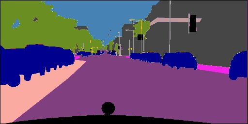
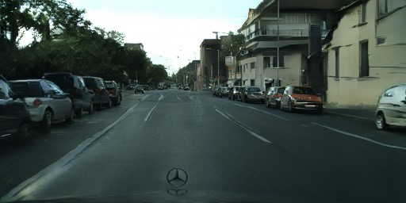
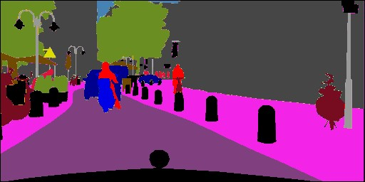
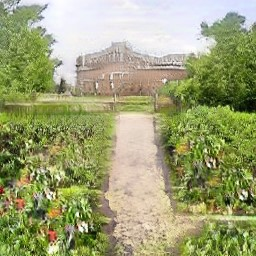
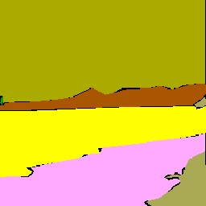
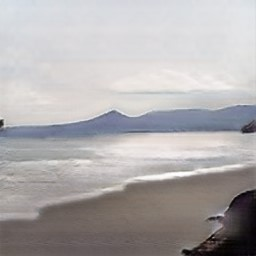

# SPADE Example by NNabla
This is a NNabla implementation of the 
"[Semantic Image Synthesis with Spatially-Adaptive Normalization](https://arxiv.org/abs/1903.07291)" (as known as SPADE).

__Result Examples (cherry picked)__

| Input                  | Output                  |
| :--------------------: | :---------------------: |
|  |  |
|  |  |
|  |  |
|  |  |

## Requirements
### system environments
* CUDA, CUDNN
* 12G GPU memory or larger for half, 23GB GPU memory or larger for float are needed to train model on 512x256 images with batch_size=4.
* (For multi GPUs execution) OpenMPI

### python environments
You can install all dependencies from `requirements.txt`.
```bash
pip install -r ./requirements.txt
``` 

Note that `nnabla-ext-cuda101`(requiring CUDA 10.1 and CUDNN 7.6.0) will be installed in default settings.  
If you've installed other version of CUDA, please modify `requirements.txt` to meet your environment.  
For more information, see [NNabla CUDA extension package installation guild](https://nnabla.readthedocs.io/en/latest/python/pip_installation_cuda.html).

## Dataset

### cityscapes dataset
Download Cityscapes dataset from [here](https://www.cityscapes-dataset.com/).  
In this example, `gtFine_trainvaltest.zip` and `leftImg8bit_trainvaltest.zip` are needed.  
Once you download and extract them, create `./data/Cityscapes` dir and place extracted directories to it.

### ade20k dataset
Download ade20k dataset from [here](http://sceneparsing.csail.mit.edu/index_challenge.html).
Please follow the official instruction to download dataset.
In this example, `ADEChallengeData2016.zip` is needed. 
Once you download and extract them, create `./data/ADEChallengeData2016` dir ans place extracted directories to it.

## Running Code

### Generate images by pretrained model
We have prepared two types of the pretrained weights trained on cityscapes or ade20k.
You can download the weight trained on cityscapes from [here](https://nnabla.org/pretrained-models/nnabla-examples/GANs/spade/params_cityscapes.h5),
and on ade20k from [here](https://nnabla.org/pretrained-models/nnabla-examples/GANs/spade/params_ade20k.h5).

To run the generation script, the weight should be placed to `./pretrained_model/${Dataset_name}/`.
For example, when you download the pretrained weights trained on cityscapes, you can get `params_cityscapes.h5`
and place it to `./pretrained_model/cityscapes/`.

Then you can easily generate images by:
```shell script
python generate.py -L ./pretrained_model/cityscapes/params_cityscapes.h5
```

The generated results will be saved on `./pretrained_model/cityscapes/generated` by default.

You can also run this code by your own weight after training your model.
For example, when you have a parameter named `params.h5` on `results/spade/cityscapes/`,
you can generate images by calling:
```shell script
python generate.py -L results/spade/cityscapes/params.h5
```
In this case, `results/spade/cityscapes/config.yaml` is automatically detected and used as a model config file.

Note that currently generate.py supports only cityscapes and ade20k dataset.

### Training on cityscapes
```
# make sure you are on the root dir of spade example.
cd /path/to/nnabla-examples/GANs/spade

# by a single GPU
./scripts/train_cityscapes.sh 

# by multi GPUs
./scripts/mgpu_train_cityscapes.sh 
```
Trained model will be saved on log directory (default value is `./results/spade/`).

### Trainig on ade20k
```
# make sure you are on the root dir of spade example.
cd /path/to/nnabla-examples/GANs/spade

# by a single GPU
./scripts/train_ade20k.sh 

# by multi GPUs
./scripts/mgpu_train_ade20k.sh 
```

## Note 
* All configurations are listed in config.yaml. You can change model settings by editing this.

