# StarGAN

## Overview

NNabla implementation of ["StarGAN: Unified Generative Adversarial Networks for Multi-Domain Image-to-Image Translation"](https://arxiv.org/abs/1711.09020) by Choi et al.
StarGAN is one of the image-to-image translation model. However, unlike CycleGAN, which basically translate images from one domain to another, StarGAN can translate from one domain to multiple domains with one single model. 


### Image-to-Image translation samples

| Hair Color | Age | Hair Color + Gender |
|:----:|:----:|:----:|
|  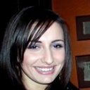  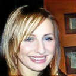<br>&ensp;&ensp;***Black Hair*** to ***Blond Hair***&ensp;&ensp; | 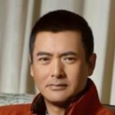   <br>&ensp;&ensp;***Young*** to ***Aged***&ensp;&ensp; | 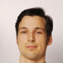  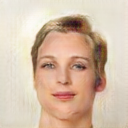 <br>***Black Hair/Male*** to ***Blond Hair/Female***|

### From one domain to multi-domains

|  Source<br>Black-Haired<br>Young Female |  Generated 1<br>Blond-Haired<br>Young Female  |  Generated 2<br>Brown-Haired<br>Young Female  |  Generated 3<br>Black-Haired<br>Young Male  |  Generated 4<br>Black-Haired<br>Aged Female |
| ---- | ---- | ---- | ---- | ---- |
|  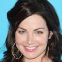  |  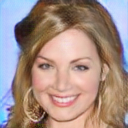  |  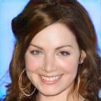  |  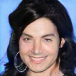  |  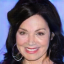  |

|  Source<br>Black-Haired<br>Young Male |  Generated 1<br>Blond-Haired<br>Young Male  |  Generated 2<br>Brown-Haired<br>Young Male  |  Generated 3<br>Black-Haired<br>Young Female  |  Generated 4<br>Black-Haired<br>Aged Male |
| ---- | ---- | ---- | ---- | ---- |
|  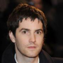  |  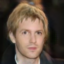  |  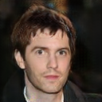  |    |  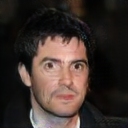  |

## Dataset

Currently this example is supposed to use CelebA dataset for training. You need to download the dataset and store it in the directory named `data`. The original author kindly offers [an easy way](https://github.com/yunjey/stargan/blob/master/download.sh) to prepare the dataset. Following that, you can download the dataset like this way.

```sh
URL=https://www.dropbox.com/s/d1kjpkqklf0uw77/celeba.zip?dl=0
ZIP_FILE=./data/celeba.zip
mkdir -p ./data/
wget -N $URL -O $ZIP_FILE
unzip $ZIP_FILE -d ./data/
rm $ZIP_FILE
```

Once dataset is downloaded, you will find a text file named `list_attr_celeba.txt`. It should be like the following.

```
5_o_Clock_Shadow Arched_Eyebrows Attractive Bags_Under_Eyes Bald Bangs Big_Lips Big_Nose ...
000001.jpg -1  1  1 -1 -1 -1 -1 -1 ...
000002.jpg -1 -1 -1  1 -1 -1 -1  1 ...
000003.jpg -1 -1 -1 -1 -1 -1  1 -1 ...
...
```

On the first line, attribute names are listed. After the 2nd line, image name and its attribute table (1 for true, -1 for false) are recorded.
If you want to use your own data for training, you need to prepare the similarly arranged text file and the directory containing the data.


## Configuration

In `args.py,` you can find many configuration. You can choose attributes to use for translation with `--selected-attrs` option (by default, 5 attributes, namely, "Black Hair", "Blond Hair", "Brown Hair", "Male", "Young" are used). Available attributes are listed in `celeba_attributes_list.txt`. Note that you need to specify the dataset directory (with `--celeba-image-dir` option) and the path to the `.txt` file containing image names (should be located under the directory specified by `--celeba-image-dir`) and attribute information (with `--attr-path` option).


## Training

Once dataset is ready, you can start training by the following command. If you download the dataset by the way described above, you don't need to specify `--celeba-image-dir` and `--attr-path`.

```
python train.py --celeba-image-dir <path to the image directory> --attr-path <path to the data information .txt>
```

It takes about half a day using a single Tesla V100. During training, some images randomly chosen from training dataset (and if `--test-during-training` option is set, from test dataset as well) are used for translation. These images are saved in a directory specified by `--monitor-path`. Once training finishes, some of the images from test dataset is used for image translation.

Training curve would be like the following.

<p align="center">
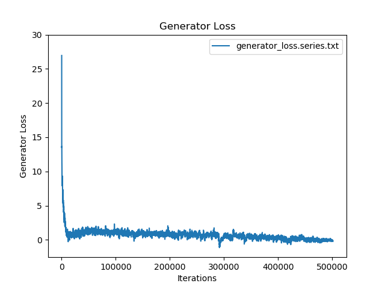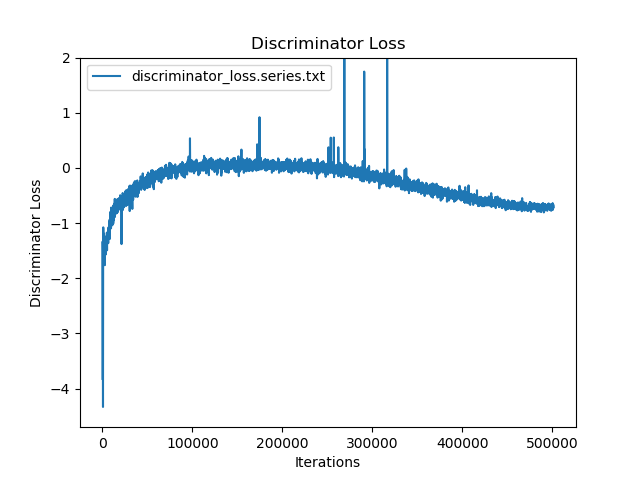
</p>
<p align="center">
Figure: Generator and Discriminator Loss Curve.
</p>

<p align="center">
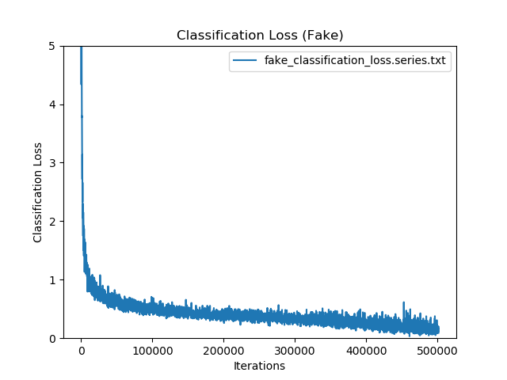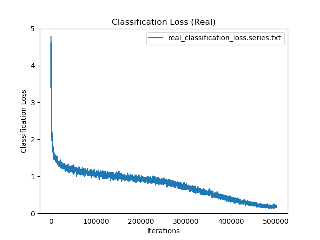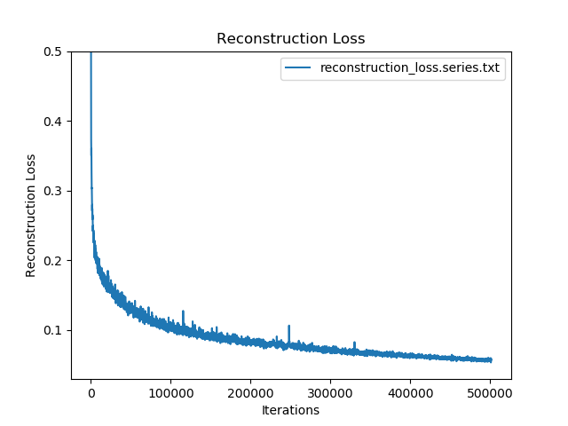
</p>
<p align="center">
Figure: Other Loss Curve.
</p>

## Generation 

After training finishes, you should have the trained parameters file (`trained_params_XXX.h5`) and a config file (`training_conf_XXX.json`) in the directories you specified by `--model-save-path`. Using these files, you can use StarGAN model to execute image translation on your own images.
You need to prepare a directory which contains images to be used for translation. Suppose you have trained parameters and a directory which contains your own images, you can execute image translation by the following command. Note that an input image are resized when fed to generator, so it is recommended to use the same-sized images as used when training.

```
python generate.py --pretrained-params <path to the parameter file .h5> --config <path to config file .json> --test-image-path <directory containing images>  --result-save-path <directory to save the generated images>
```

Based on the learned attributes you used when training, you will be asked to choose attribute(s) used for translation. Note that currently in the generation process, original attributes of the input images are not considered. (Therefore, adding "Young" attribute to young people's image can happen.) After choosing attributes, generated images are saved in the directory specified by `--result-save-path`.


## Pretrained weights and config file
You can download the pretrained weights named `pretrained_params_on_celebA.h5` from [here](https://nnabla.org/pretrained-models/nnabla-examples/GANs/stargan/pretrained_params_on_celebA.h5) and config file named `pretrained_conf_on_celebA.json` from [here](https://nnabla.org/pretrained-models/nnabla-examples/GANs/stargan/pretrained_conf_on_celebA.json).
With these, you can try image-to-image translation using StarGAN model easily. Note that we used only 5 attributes (black hair, blond hair, brown hair, male/female, and young/aged) for training. For more detail, such as model architecture, please take a look into the `pretrained_conf_on_celebA.json`.


## References
* Yunjey Choi, Minje Choi, Munyoung Kim, Jung-Woo Ha, Sunghun Kim, Jaegul Choo, ["StarGAN: Unified Generative Adversarial Networks for Multi-Domain Image-to-Image Translation"](https://arxiv.org/abs/1711.09020), arXiv:1711.09020
* https://github.com/yunjey/stargan

