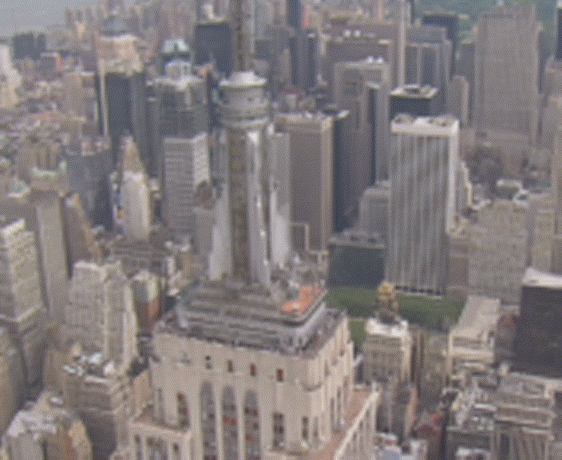
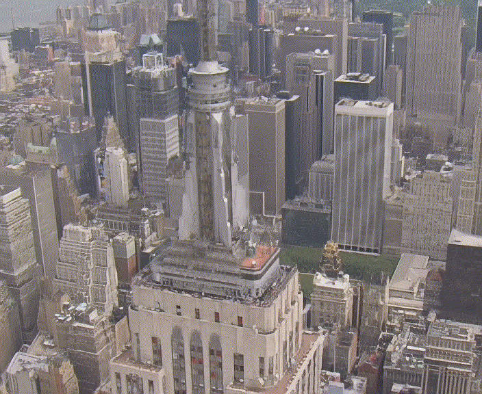
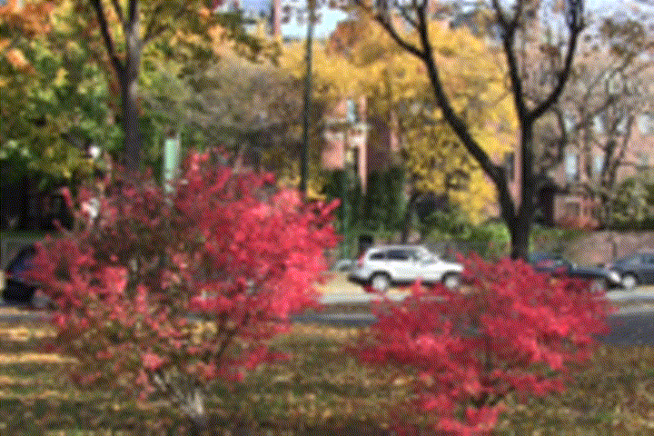
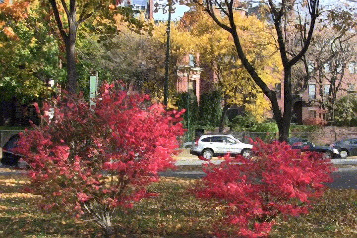

# TecoGAN: TEmporal COherent GAN for video super resolution.
This repository contains the code (in NNabla) for "[ LEARNING TEMPORAL COHERENCE VIA SELFSUPERVISION
FOR GAN-BASED VIDEO GENERATION](https://arxiv.org/pdf/1811.09393.pdf)"
paper by [Mengyu Chu et al.](https://github.com/thunil/TecoGAN)

## Introduction
This paper focuses on temporal self-supervision for GAN-based video generation tasks and targets Video Super Resolution (VSR) and Unpaired Video Translation (UVT). 
The VSR part has been showcased in the current implementation. Major contributions made in this paper are:
* Temporal adversarial training for recurrent training approach to achieve temporal coherency without compromising with spatial details.
* Use of spatio-temporal discriminator for realistic and coherent video generation task.
* Use of ping pong loss for long term temporal consistency.

__Result Examples__

| Input                  | Output                  |
| :--------------------: | :---------------------: |
|  |  |
|  |  |

### Prerequisites

* tensorflow = 1.14.0
* nnabla >= 1.8.0

### Dataset preparation
We would like to attribute credits of data download and sequence preparation to original authors of the paper "[ LEARNING TEMPORAL COHERENCE VIA SELFSUPERVISION FOR GAN-BASED VIDEO GENERATION](https://arxiv.org/pdf/1811.09393.pdf)" and code (https://github.com/thunil/TecoGAN).
Training and validation dataset can be downloaded with the following commands into a chosen directory `TrainingDataPath`.  
Note: online video downloading requires youtube-dl.  

```bash
# Install youtube-dl for online video downloading
pip install --user --upgrade youtube-dl

# take a look of the parameters first:
python authors_scripts/dataPrepare.py --help

# To be on the safe side, if you just want to see what will happen, the following line won't download anything,
# and will only save information into log file.
# TrainingDataPath is still important, it the directory where logs are saved: TrainingDataPath/log/logfile_mmddHHMM.txt
python authors_scripts/dataPrepare.py --start_id 2000 --duration 120 --disk_path TrainingDataPath --TEST

# This will create 308 subfolders under TrainingDataPath, each with 120 frames, from 28 online videos.
# It takes a long time.
python authors_scripts/dataPrepare.py --start_id 2000 --duration 120 --REMOVE --disk_path TrainingDataPath

```

Once ready, please update the parameter TrainingDataPath in config.yaml or as argument for --input_video_dir flag to run train.py, and then you can start training with the downloaded data! 

PS: Authors claim that most of the data (272 out of 308 sequences) downloaded by the script are the same as the ones they used for the published models. As of June 30, 2020,  303 out of those 308 sequences are available. Training is conducted on first 250 samples for results shown here (same # of samples used by authors for training). 

### Inference
The pre-trained TecoGAN models can be used to generate High-Resolution samples from the given Low-Resolution samples. Author's pre-trained weights converted to NNabla format can be downloaded from the below link:

### Pre-trained Weights
| TecoGAN Weights | FRVSR weights |
|---|---|
|[TecoGAN pre-trained weights](https://nnabla.org/pretrained-models/nnabla-examples/GANs/tecogan/teco_model.h5)|[FRVSR pre-trained weights](https://nnabla.org/pretrained-models/nnabla-examples/GANs/tecogan/frvsr_model.h5)|

### Inference using the downloaded pre-trained weights.
Clone the nnabla-examples [repository](https://github.com/sony/nnabla-examples.git) and run the following command to download test data and ground-truth data
```
cd nnabla-examples/GANs/TecoGAN
python download_test_data.py 
```
Run the following command to generate HR images from a given sample of LR images
```
python generate.py --model {path to downloaded TecoGAN NNabla weight file} --input_dir_LR {input directory} --output_dir {path to output directory}
```
### Inference using pre-trained weights provided by original authors
See the following [link](./authors_weights_inference.md) to use the original author's pre-trained weights for inference.

## Training
TecoGAN training is divided in two steps:
1. A FRVSR (frame recurrent video super resolution) model having 10 residual blocks is trained with L2 loss on flow estimator and generator network.
2. Later the TecoGAN network with 16 residual blocks and discriminator is finetuned using the pre-trained FRVSR model. 
### Training a FRVSR model 
All the experiments are done using a scaling factor of 4 between LR and HR images.
Use the below code to start the training.
#### Single GPU training
```
python train.py \
     --input_video_dir {path to training images} \
     --output_dir {path to save trained model} \
     --num_resblock 10 \
     --max_iter 900000 \
     --tecogan False \
```
#### Distributed Training
For distributed training [install NNabla package compatible with Multi-GPU execution](https://nnabla.readthedocs.io/en/latest/python/pip_installation_cuda.html#pip-installation-distributed). Use the below code to start the distributed training.
```
export CUDA_VISIBLE_DEVICES=0,1,2,3 {device ids that you want to use}
mpirun -n {no. of devices} python train.py \
     --input_video_dir {path to training images} \
     --output_dir {path to save trained model} \
     --num_resblock 10 \
     --max_iter 500000 \
     --tecogan False \
```
### Training TecoGAN
TecoGAN uses feature maps from a pre-trained VGG19 network to encourage generator to produce similar feature maps as ground truth.
So, we require a pre-trained VGG19 model for this purpose. Download the VGG19 NNabla weights 
from [here](https://nnabla.org/pretrained-models/nnabla-examples/tecogan/vgg19.h5). If you want to convert tensorflow VGG19 weights to NNabla h5
format, see the following [link](./authors_weights_inference.md). The pre-trained FRVSR model is used for finetuning the TecoGAN network. 
To obtain this you can train a FRVSR network or use our [pre-trained weight.](https://nnabla.org/pretrained-models/nnabla-examples/GANs/tecogan/frvsr_model.h5)
Use the code below to train TecoGAN:
#### Single GPU training
```
python train.py \
     --input_video_dir {path to training images} \
     --output_dir {path to save trained model} \
     --num_resblock 16 \
     --max_iter 500000 \
     --vgg_pre_trained_weights {path to VGG19 trained model} \
     --pre_trained_model {path to FRVSR trained model}
     --tecogan True \
```
#### Distributed training
```
export CUDA_VISIBLE_DEVICES=0,1,2,3 {device ids that you want to use}
mpirun -n {no. of devices} python train.py \
     --input_video_dir {path to training images} \
     --output_dir {path to save trained model} \
     --num_resblock 16 \
     --max_iter 500000 \
     --vgg_pre_trained_weights {path to VGG19 trained model} \
     --pre_trained_model {path to FRVSR trained model}
     --tecogan True \
```

#### Evaluation
Multiple metrics have been reported in the paper. Code for all of them is located on authors' repository [here](https://github.com/thunil/TecoGAN).
