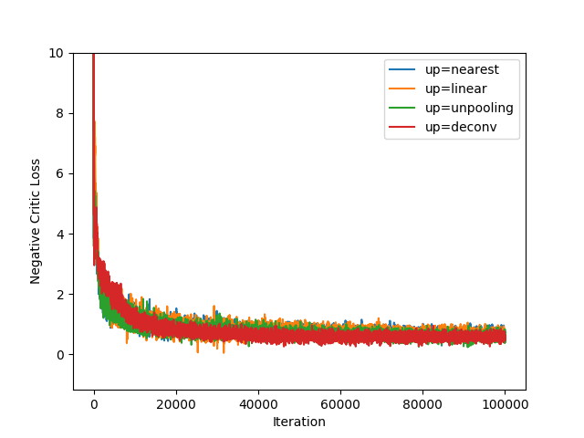
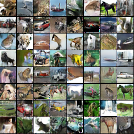
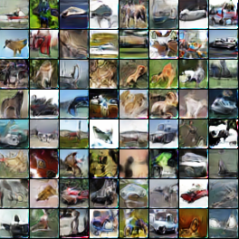
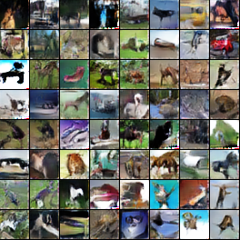

# Wasserstein GAN-GP

This is an example about Wasserstein Generative Adversarial Network with Gradient Penalty, (WGAN-GP).
This example shows how to compute and train WGAN-GP using CIFAR-10 dataset.

Gradient penalty is a constraint for the norm of the gradient being one. In the case of WGAN-GP, it is used for enforcing Lipschitz constraints of a discriminator and basically added to the discriminator loss. The gradients of the overall loss can not be computed using the standard backpropagation. NNabla provides a function `nnabla.grad` which expands a computation graph to obtain gradients with respect to variables as variables (a node in a graph). These gradient variables can be used to define an arbitrary loss function later.

In a nutshell, one can compute the gradient penalty of an output with respect to an input like

```python
...
output = <Variable>
input = <Variable>
input.need_grad = True
grads = nn.grad([output], [input])
l2norms = [F.sum(g ** 2.0, [1, 2, 3]) ** 0.5 for g in grads]
gp = sum([F.mean((l - 1.0) ** 2.0) for l in l2norms])
...
```

In the case of WGAN-GP, `output` is the discriminator output of `input`, and `input` is the randomly linear-interpolated samples between a fake and real sample.
See [train.py](./train.py) for detail.

# Dataset

CIFAR-10 dataset is automatically downloaded when you run the `train.py`.

# Training

```bash
python train.py -c cudnn -d 0 -b 64 --up nearest --monitor-path wgan-gp-000 
```

Run with `-h` for other options. Training finishes in 0.5 days approximately using a single V100.


# Generation

```bash
python generate.py -d 0 -b 64 --up nearest \
    --model-load-path wgan-gp-000/params_99999.h5 \
    --monitor-path wgan-gp-000
```

# Example of Results

## Losses



## Generated Images with Various Upsampling Methods

| Nearest | Linear|
|:-----:|:-----:|
|||

| Unpooling | Deconv |
|:-----:|:-----:|
|||


# References
* Martin Arjovsky, Soumith Chintala, and Léon Bottou, "Wasserstein GAN", https://arxiv.org/abs/1701.07875
* Ishaan Gulrajani, Faruk Ahmed, Martin Arjovsky, Vincent Dumoulin, and Aaron Courville, "Improved Training of Wasserstein GANs", https://arxiv.org/abs/1704.00028
