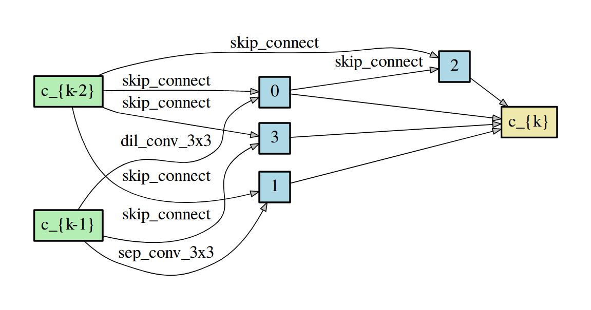
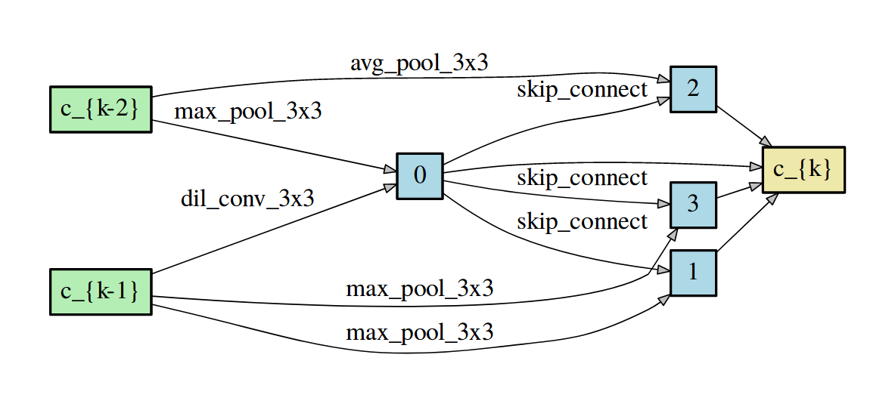
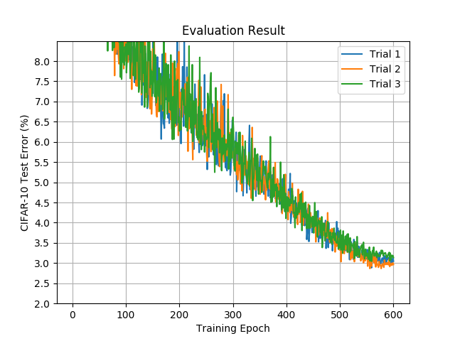

# Differentiable Architecture Search

## Overview

Reproduction of the work, "DARTS: Differentiable Architecture Search"<sup>[1]</sup> by NNabla. 


### Dataset

By default, this example uses CIFAR-10 dataset, and the dataset will be automatically downloaded when you run the script.

### Configuration

In `args.py`, you can find configurations for both architecture search and evaluation.


### Architecture Search

You can start architecture search by a command below,

```
python darts_search.py --device-id 0 --context 'cudnn' \
                       --monitor-path 'search.monitor' \
                       --model-arch-name <filename-you-want>
```

It takes about 30 hours using a single Tesla V100. You can set --second-order flag True if you want to use the 2nd order derivative (approximation) for updating the architecture parameters, but it makes the whole search process take longer.

During the search, you can check model's performance and these records are stored in `--monitor-path`.

Once the architecture search finishes, you will find `.json` file which contains the model architecture. You can give it an arbitrary name by adding `--model-arch-name <filename-you-want>` option, by default, it will be `DARTS_arch.json`, and stored in the current working directory.

In the `.json` file you can see the configuration of each architecture of the cell, represented as;

```
{"arch_normal": {"2": [[6, 0], [0, 1]], "3": [[6, 0], [2, 1]], ...
```

That means, in the normal cell, at the node 2, 

an operation with ops\_id = 6 (identity) is applied to the output of the node 0, 
an operation with ops\_id = 0 (dil\_conv\_3x3) is applied to the output of the node 1, 
and those are summed up then become an output of the node 2.

Similarly,

an operation with ops\_id = 6 (identity) is applied to the output of the node 0, 
an operation with ops\_id = 2 (sep\_conv\_3x3) is applied to the output of the node 1, 
and those are summed up then become an output of the node 3.


<p align="center">

</p>
<p align="center">
Figure: Normal cell architecture found in the search process by nnabla implementation.
</p>


<p align="center">

</p>
<p align="center">
Figure: Reduction cell architectures found in the search process by nnabla implementation.
</p>
<p align="center">
Note that these are visualized by using author's script<sup>[2]</sup>. In these figures, "identity" operation is represented as "skip_connect"
</p>

### Architecture Evaluation

For re-training the model using the architecture found in the architecture search, just run

```
python darts_train.py --device-id 0 --context 'cudnn' \
                      --epoch 600 --batch-size 96 \
                      --num-cells 20 --cutout True \
                      --monitor-path 'result.monitor' \
                      --model-arch-name <path to json file> \
                      --model-save-path 'result.monitor' 
```

This is the same configuration used for the experiment described in the paper.
You need to specify the `.json` file which has information of architecture structure. 

This time the weights parameters are stored in `--model-save-path` while other training records are stored in `--monitor-path`. 

<p align="center">

</p>
<p align="center">
Figure: Learning curves on CIFAR-10.
</p>


## NOTE
- Currently, we observe that re-training process requires much more (almost 5 GPU days) than reported in the paper (1 GPU day). However, some survey<sup>[3]</sup> also shows re-training process does not finish within 1 day.


## References
1. Hanxiao Liu, Karen Simonyan, Yiming Yang, ["DARTS: Differentiable Architecture Search"](https://arxiv.org/abs/1806.09055), arXiv:1806.09055
2. https://github.com/quark0/darts
3. Liam Li, Ameet Talwalkar, ["Random Search and Reproducibility for Neural Architecture Search"](https://arxiv.org/abs/1902.07638), arXiv:1902.07638

