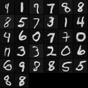
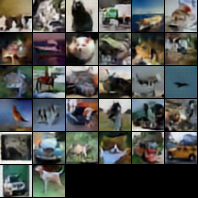
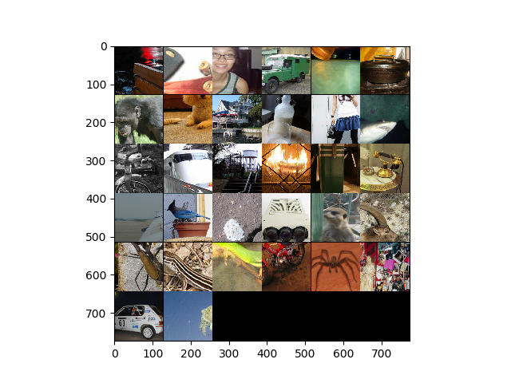

# VQ-VAE Nnabla

This is implementation of [VQ-VAE](https://arxiv.org/abs/1711.00937) in Nnabla. 

## Requirements

- [Nnabla](https://nnabla.readthedocs.io/en/latest/python/install_on_linux.html#installation) (along with [cuda](https://nnabla.readthedocs.io/en/latest/python/pip_installation_cuda.html#pip-installation-cuda) and [distributed execution](https://nnabla.readthedocs.io/en/latest/python/pip_installation_cuda.html#pip-installation-distributed))
- [DALI](https://docs.nvidia.com/deeplearning/sdk/dali-developer-guide/docs/quickstart.html) (For Imagenet Training) (v0.18.0)
- NumPy
- MatPlotLib
- Torch (just for pixelcnn inference)

## Datasets tested

- MNIST
- Cifar10
- ImageNet

## Configuration file

The config folder has a yaml file for each of the datasets ([imagenet.yaml](configs/imagenet.yaml), [cifar10.yaml](configs/cifar10.yaml), [mnist.yaml](configs/mnist.yaml)) which allows for editing of the following: 
- model configurations (hidden dimension. embedding dimension, number of embedding layers, commitment cost, rng, 
checkpoint to start retraining and saving models directory)
- training configuration (batch size, number of epochs, weight decay, learning rate, learning rate decay, solver type, 
logger interval)
- monitor path for training and validation loss and reconstruction
- dataset related parameters (path, dali threads)
- extension module and device id

## Instructions to train VQVAE

To start training, execute:  

`python main.py --data [imagenet/cifar10/mnist]`     

 This will start training  on 1 gpu. For multi-gpu execution (n=4 GPUs), run as follows:        
 `mpirun -n 4 python main.py --data [imagenet/cifar10/mnist]`    

**Note: For MNIST and CIFAR10, the dataset will be automatically downloaded if not found in specified path. For Imagenet, the dataset path must be specified in [imagenet.yaml](configs/imagenet.yaml)**)

The model and solver parameters along with the average epoch loss and reconstructions of training and validation dataset will be 
stored in `tmp.monitor_[imagenet/cifar10/mnist]` folder by default. 

## Instructions for pixelcnn prior

After training the VQVAE, PixelCNN prior can be fit over the learnt VQVAE latent space. After specifying training configuration and learnt model parameters of the VQ-VAE model, one can start to train pixelcnn as follows: 

`$ python main.py --data [imagenet/cifar10/mnist] --pixelcnn-prior` 

The latent space descretized image during training and validation will be saved in `tmp.monitor_[imagenet/cifar10/mnist]/Latent-reconstruction-pixelcnn-mnist` folder

## Image Generation

After training VQVAE and PixelCNN, we can compare the randomized image generation of the uniform prior (imposed on the latent space during VQVAE training) and PixelCNN prior. For that result, run:

`$ python main.py --data [imagenet/cifar10/mnist] --pixelcnn-prior --sample-from-pixelcnn [number of images to be generated] --sample-save-path [path to save results]` 

## Results

- Mnist

  

 

- Cifar10

  

 

- Imagenet

  

 

## References

https://github.com/ritheshkumar95/pytorch-vqvae
https://github.com/deepmind/sonnet/blob/master/sonnet/examples/vqvae_example.ipynb
https://github.com/jiazhao97/VQ-VAE_withPixelCNNprior
https://github.com/anordertoreclaim/PixelCNN
