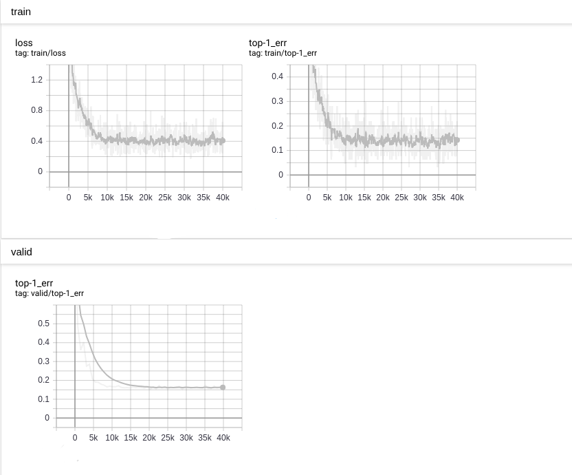

Compress network by fixed point quantization
============================================

This tutorial introduces how to compress your network by fixed point
quantization.

Introduction
------------

Neural networks show reliable results on AI fields, such as object recognition
and detections are useful in real applications. Concurrent to the the
progress in recognition, the increase of IoT devices at the edge of the
network is producing a massive amount of data to be computed to data
centers, pushing network bandwidth requirements to the limit. Despite
the improvements of network technology, data centers cannot guarantee
acceptable transfer rates and response times, which could be a critical
requirement for many applications. But CNN-based recognition systems
need large amounts of memory and computational power, which perform well
on expensive GPU-based machines, for example, AlexNet has 61M parameters
(249MB of memory) and performs 1.5B high precision operations to
classify one image. These numbers are even higher for deeper CNNs
e.g.,VGG. They are often unsuitable for such edge devices, like cell
phones, small devices and embedded electronics. Hence, reducing the
storage of network and computation complexity is the task of
optimization.

Currently, quantizing the weights and (or) input is the way which can
dramatically reduce the memory and computation time and even keep
original accuracy `[1] <https://arxiv.org/pdf/1603.05279.pdf>`__ (*).

This tutorial tends to share a few of experiments using nnabla for such
optimitions.

Two approaches
--------------

There are mainly 2 approaches to design a fixed-point deep convolution
network.

-  Train a network with fix-point constraint
-  Convert a pretrain float-point network to its fixed-point version

Binary Connect series functions, such as BinaryConnectAffine,
BinaryConnectConvolution and Binary Weight series functions, such
BinaryWeightAffine and BinaryWeightConvolution, fixed-point quantized
series, such as FixedPointQuantizedAffine, FixedPointQuantizedConvolution
acts as an important role for the first approach. These functions have different
data paths for forward and backward. When forward, the float-point weights are
converted to fixed-point weights or even binary weights, and the output is calculated
by multiple such binary(quantized) weights with input. When backward,
only float-point(or learnable) weights participate in the calculation of
updating weights. In fact, binarizing weight is too extreme, fixed point
quantization seems to be more commonly used.

Due to the second approach, a few steps need to be performed to keep
minimal loss of accuracy. `[2] <http://proceedings.mlr.press/v48/linb16.pdf>`__ provides a comprehensive analysis
of such quantization for the relationship between quantization size and
performance. Here, we shall do some experiments to illustrate the
trade-off between accuracy and storage size.

We compared the ResNet23's original version and the version using
``binary_weight_convolution()``, we can observe the accuracy loss after
using ``binary_weight_convolution()``, which is worse than `[3] <http://arxiv.org/abs/1603.05279>`__
mentioned. It should be possible to improve after more careful fine-tuning.

This tutorial only shows a basic way to compress network. There are
still a lot of new approach not presented in this tutorial. For example,
a new way is proposed as in `[4] <https://ai.facebook.com/blog/compressing-neural-networks-for-image-classification-and-detection/>`__,
a quantization network is designed as a student network, a float-point
high precision network is designed as a teacher network, the
distillation technique is used to train to obtain the-state-of-art
performance and accuracy.

The benchmark
-------------

We chose a simple network ResNet23 and CIFAR-10 dataset as the
benchmark. First, let us obtain base metrics of this benchmark, such as
accuracy, model size, and so on. The following shows the network
structure:

+------------+----------------------------------------------------------------------+----------------------+
| Layer name | Shape                                                                | Required buffer size |
+============+======================================================================+======================+
| conv1      | (1, 3, 32, 32) -> (1, 64, 32, 32)                                    | 281344               |
+------------+----------------------------------------------------------------------+----------------------+
| conv2      | (1, 64, 32, 32)->(1, 32, 32, 32)->(1, 32, 32, 32) -> (1, 64, 32, 32) | 786432               |
+------------+----------------------------------------------------------------------+----------------------+
| conv3      | (1, 64, 16, 16)->(1, 32, 16, 16)->(1, 32, 16, 16) -> (1, 64, 16, 16) | 196608               |
+------------+----------------------------------------------------------------------+----------------------+
| conv4      | (1, 64, 16, 16)->(1, 32, 16, 16)->(1, 32, 16, 16) -> (1, 64, 16, 16) | 196608               |
+------------+----------------------------------------------------------------------+----------------------+
| conv5      | (1, 64, 8, 8)->(1, 32, 8, 8)->(1, 32, 8, 8) -> (1, 64, 8, 8)         | 49152                |
+------------+----------------------------------------------------------------------+----------------------+
| conv6      | (1, 64, 8, 8)->(1, 32, 8, 8)->(1, 32, 8, 8) -> (1, 64, 8, 8)         | 49152                |
+------------+----------------------------------------------------------------------+----------------------+
| conv7      | (1, 64, 4, 4)->(1, 32, 4, 4)->(1, 32, 4, 4) -> (1, 64, 4, 4)         | 12288                |
+------------+----------------------------------------------------------------------+----------------------+
| conv8      | (1, 64, 4, 4)->(1, 32, 4, 4)->(1, 32, 4, 4) -> (1, 64, 4, 4)         | 12288                |
+------------+----------------------------------------------------------------------+----------------------+

To downsize the footprint, we should consider to downsize both the
parameter size and variable buffer size, and especially prior for the
maximal buffer size.

The network is created by the following code:

.. code:: ipython3

    import nnabla as nn
    import nnabla.functions as F
    import nnabla.parametric_functions as PF
    
    def resnet23_prediction(image, test=False, ncls=10, nmaps=64, act=F.relu):
        """
        Construct ResNet 23
        """
        # Residual Unit
        def res_unit(x, scope_name, dn=False):
            C = x.shape[1]
            with nn.parameter_scope(scope_name):
                # Conv -> BN -> Nonlinear
                with nn.parameter_scope("conv1"):
                    h = PF.convolution(x, C // 2, kernel=(1, 1), pad=(0, 0),
                                       with_bias=False)
                    h = PF.batch_normalization(h, batch_stat=not test)
                    h = act(h)
                # Conv -> BN -> Nonlinear
                with nn.parameter_scope("conv2"):
                    h = PF.convolution(h, C // 2, kernel=(3, 3), pad=(1, 1),
                                       with_bias=False)
                    h = PF.batch_normalization(h, batch_stat=not test)
                    h = act(h)
                # Conv -> BN
                with nn.parameter_scope("conv3"):
                    h = PF.convolution(h, C, kernel=(1, 1), pad=(0, 0),
                                       with_bias=False)
                    h = PF.batch_normalization(h, batch_stat=not test)
                # Residual -> Nonlinear
                h = act(F.add2(h, x, inplace=True))
                # Maxpooling
                if dn:
                    h = F.max_pooling(h, kernel=(2, 2), stride=(2, 2))
                return h
        # Conv -> BN -> Nonlinear
        with nn.parameter_scope("conv1"):
            # Preprocess
            if not test:
                image = F.image_augmentation(image, contrast=1.0,
                                             angle=0.25,
                                             flip_lr=True)
                image.need_grad = False
            h = PF.convolution(image, nmaps, kernel=(3, 3),
                               pad=(1, 1), with_bias=False)
            h = PF.batch_normalization(h, batch_stat=not test)
            h = act(h)
    
        h = res_unit(h, "conv2", False)    # -> 32x32
        h = res_unit(h, "conv3", True)     # -> 16x16
        h = res_unit(h, "conv4", False)    # -> 16x16
        h = res_unit(h, "conv5", True)     # -> 8x8
        h = res_unit(h, "conv6", False)    # -> 8x8
        h = res_unit(h, "conv7", True)     # -> 4x4
        h = res_unit(h, "conv8", False)    # -> 4x4
        h = F.average_pooling(h, kernel=(4, 4))  # -> 1x1
        pred = PF.affine(h, ncls)
    
        return pred

The top-1 error reaches to 0.16 as the following diagram:

We compared the accuracy between ``nnabla_cli infer`` and
``nnablart infer`` in CIFAR10 test dataset. The comparison code is as
the following:

.. code:: ipython3

    import numpy as np
    import os
    from cifar10_data import data_iterator_cifar10
    
    data_iterator = data_iterator_cifar10
    vdata = data_iterator(1, False)
    iter_num = 100
    
    
    def get_infer_result(result_file):
        d0 = np.fromfile(result_file, np.float32)
        d0 = d0.reshape((10, ))
        return np.argmax(d0)
    
    def normalize_image(image):
        image = image.astype(np.float32)
        image -= np.mean(image)
        image_std = np.std(image)
        return image / max(image_std, 1e-5)
    
    
    nnp_correct = 0
    nnb_correct = 0
    for i in range(iter_num):
        img, gt = vdata.next()
        img = normalize_image(img)
        img.tofile('input.bin')
        os.system('nnabla_cli infer -b 1 -c bin_class.nnp -o output_0 input.bin')
        os.system('./nnablart infer bin_class.nnb input.bin output_1')
    
        r1 = get_infer_result('output_0_0.bin')
        r2 = get_infer_result('output_1_0.bin')
    
        if r1 == gt:
            nnp_correct += 1
        if r2 == gt:
            nnb_correct += 1
    
        if r1 == r2 == gt:
            print("{}:  all same!".format(i))
        else:
            print("{}:  not all same".format(i))
    print("nnp accuracy: {}, nnb accuracy: {}".format(
        float(nnp_correct) / iter_num, float(nnb_correct) / iter_num))

In this code, ``nnablart`` is an executable implemented based on
nnabla-c-runtime. ``nnablart`` is a simple command-line interface, which
can infer the network defined by ``*.nnb`` file. As we known,
nnabla-c-runtime is a c implementation aims to small device with
constraint memory, it contains carefully designed memory policy, and the
code for training purpose is removed for saving memory. This test
program iterates 100 samples, comparing with ground truth, figure out
the accuracy.

::

    ...
    NNabla command line interface (Version:1.0.18, Build:190619071959)
         0: input.bin
         1: output_1
    Input[0] size:3072
    Input[0] data type:NN_DATA_TYPE_FLOAT, fp:0
    Input[0] Shape ( 1 3 32 32 )
    Output[0] size:10
    Output[0] filename output_1_0.bin
    Output[0] Shape ( 1 10 )
    Output[0] data type:NN_DATA_TYPE_FLOAT, fp:0
    99:  all same!
    nnp accuracy: 0.81, nnb accuracy: 0.81

binary\_weight\_convolution
---------------------------

We replaced ``PF.convolution()`` with ``PF.binary_weight_convolution()``
as the following:

.. code:: ipython3

    import nnabla as nn
    import nnabla.functions as F
    import nnabla.parametric_functions as PF
    
    
    def resnet23_bin_w(image, test=False, ncls=10, nmaps=64, act=F.relu):
        """
        Construct ResNet 23
        """
        # Residual Unit
        def res_unit(x, scope_name, dn=False):
            C = x.shape[1]
            with nn.parameter_scope(scope_name):
                # Conv -> BN -> Nonlinear
                with nn.parameter_scope("conv1"):
                    h = PF.binary_weight_convolution(x, C // 2, kernel=(1, 1), pad=(0, 0),
                                       with_bias=False)
                    h = PF.batch_normalization(h, batch_stat=not test)
                    h = act(h)
                # Conv -> BN -> Nonlinear
                with nn.parameter_scope("conv2"):
                    h = PF.binary_weight_convolution(h, C // 2, kernel=(3, 3), pad=(1, 1),
                                       with_bias=False)
                    h = PF.batch_normalization(h, batch_stat=not test)
                    h = act(h)
                # Conv -> BN
                with nn.parameter_scope("conv3"):
                    h = PF.binary_weight_convolution(h, C, kernel=(1, 1), pad=(0, 0),
                                       with_bias=False)
                    h = PF.batch_normalization(h, batch_stat=not test)
                # Residual -> Nonlinear
                h = act(F.add2(h, x, inplace=True))
                # Maxpooling
                if dn:
                    h = F.max_pooling(h, kernel=(2, 2), stride=(2, 2))
                return h
        # Conv -> BN -> Nonlinear
        with nn.parameter_scope("conv1"):
            # Preprocess
            if not test:
                image = F.image_augmentation(image, contrast=1.0,
                                             angle=0.25,
                                             flip_lr=True)
                image.need_grad = False
            h = PF.binary_weight_convolution(image, nmaps, kernel=(3, 3),
                               pad=(1, 1), with_bias=False)
            h = PF.batch_normalization(h, batch_stat=not test)
            h = act(h)
    
        h = res_unit(h, "conv2", False)    # -> 32x32
        h = res_unit(h, "conv3", True)     # -> 16x16
        h = res_unit(h, "conv4", False)    # -> 16x16
        h = res_unit(h, "conv5", True)     # -> 8x8
        h = res_unit(h, "conv6", False)    # -> 8x8
        h = res_unit(h, "conv7", True)     # -> 4x4
        h = res_unit(h, "conv8", False)    # -> 4x4
        h = F.average_pooling(h, kernel=(4, 4))  # -> 1x1
        pred = PF.affine(h, ncls)
    
        return pred

The training become a bit slower and the accuracy loss can be detected.
As the following:

We saved the model and parameters as ``*.nnp`` file. Then, we shall
convert it to ``*.nnb`` so that it can fit the memory-constraint device.

Reduce parameter size of ``*.nnb`` model
~~~~~~~~~~~~~~~~~~~~~~~~~~~~~~~~~~~~~~~~

We need to set the data type of corresponding parameters, so that
the binarized weights can be represented by `SIGN` data type.

Export a buffer setting file from our trained model

.. code:: bash

    $/> nnabla_cli nnb_template bin_class.nnp setting.yaml

The output ``setting.yaml`` looks like:

.. code-block:: text

    functions:
      ...
    variables:
      ...
      input: FLOAT32                          <-- buffer
      conv1/bwn_conv/W: FLOAT32               <-- parameter
      conv1/bwn_conv/Wb: FLOAT32              <-- parameter
      conv1/bwn_conv/alpha: FLOAT32           <-- parameter
      BinaryWeightConvolution_Output: FLOAT32
      conv1/bn/beta: FLOAT32
      conv1/bn/gamma: FLOAT32
      conv1/bn/mean: FLOAT32
      conv1/bn/var: FLOAT32
      BatchNormalization_Output: FLOAT32
      ReLU_Output: FLOAT32
      affine/W: FLOAT32
      affine/b: FLOAT32
      output: FLOAT32
      ...

We annotated buffer and parameter type based on its name character. The
different between buffer and parameter is that: buffer value is
undetermined at this time, while parameter values is determined. The
quantization policy is different. As we known, ``conv1/bwn_conv/W`` is
the float version, will not be used, just omit this. We need identify `conv1/bwn_conv/Wb`
to be "SIGN" type, it looks like:

.. code-block:: text

  functions:
    ...
  variables:
    ...
    input: FLOAT32
    conv1/bwn_conv/W: FLOAT32               <-- omit
    conv1/bwn_conv/Wb: SIGN                 <-- identified as SIGN
    ...
    output: FLOAT32
    ...

We tested the top-1 error in test dataset as the following:

::

    nnp accuracy: 0.76, nnb accuracy: 0.73

As we can see, accuracy loss is trivial compared with its float version.

And the ``*.nnb`` size is reduced from 830KB to 219KB.

binary\_connect\_convolution
----------------------------

We replaced ``PF.convolution()`` with
``PF.binary_connect_convolution()`` and do same training as above.

The training become a bit slower and the accuracy loss can be detected.
As the following:

We tested the top-1 error in test dataset as the following:

::

    nnp accuracy: 0.68, nnb accuracy: 0.71

As we can see, accuracy loss can be observed, but nnabla\_cli got worse
result than nnablart. From this test result, we found float32 version worse
than binary quantized version. That seems a problem. The reason might be since the training
process passes the data through 2 data paths, the binary weight data path has
lower loss that the float32 data path at the same time.

Quantization functions
----------------------

The mainly difference between binary\_weight series functions and
binary\_connect series functions is the quantizing formular:

For binary\_weight\_convolution or binary\_weight\_affine:

.. math::

   \alpha^*=\frac{\sum{|W_i|}}{n}=\frac{1}{n}\|\mathbf{W}\|_{\ell_1}

.. math::

   B=\left\{
      	   \begin{array}{ll}
             +1 & if \ \ W \ge 0 \\
             -1 & if \ \ W < 0
      	   \end{array} \right.

.. math::

   W \approx \alpha B

For binary\_connect\_convolution or binary\_connect\_affine, there are 2 alternative binarization operations, one is:

.. math::
  W_b= \left\{
      	   \begin{array}{ll}
             +1 & if\ w \ge 0 \\
             -1 & otherwise
      	   \end{array} \right.

Another way is:

.. math::

  W_b= \left\{
      	   \begin{array}{ll}
             +1 & if\ with\ probability\ p=\sigma (\omega ) \\
             -1 & if\ with\ probability\ 1 - p
      	   \end{array} \right. \\

where \sigma is the "hard sigmoid" function,

.. math::
  \sigma (x) = clip(\frac{x + 1}{2}, 0, 1) = max (0, min(1, \frac{x+1}{2}))

In nnabla implementation, binary\_connect\_xxxx() implements the
following formular:

.. math::

   W_b=sign(W) = \left\{
      	   \begin{array}{ll}
             +1 & if \ \ W > 0 \\
              0 & if \ \ W = 0 \\
             -1 & if \ \ W < 0
      	   \end{array} \right.

According to this experiment, the accuracy is a bit different:

+----------------------------------+-----------------------------+-------------------------------+------------+
|                                  | Accuracy inferred by nnabla | Accuracy inferred by nnablart | Model size |
+==================================+=============================+===============================+============+
| float point                      | 0.81                        | 0.81                          | 449.5 KB   |
+----------------------------------+-----------------------------+-------------------------------+------------+
| using binary weight convolution  | 0.76                        | 0.75                          | 52.1 KB    |
+----------------------------------+-----------------------------+-------------------------------+------------+
| using binary connect convolution | 0.68                        | 0.71                          | 47.3 KB    |
+----------------------------------+-----------------------------+-------------------------------+------------+

The model size has already been cut-down about 10x dramatically.

Further reduce footprint
------------------------

In order to keep maximal accuracy and reduce footprint as much as possible,
let us try the second method as mentioned before. This method tends to work
based on a pretrained network. Quantization process is done after training. Here,
we chose the float-point trained model and start our experiment.

As previous analysis, we knew that the big share of footprint in this
benchmark network is buffer size. As the following diagram, a circle
represents a variable buffer, a rectangle represents a function. When
perform function 1, buffer 1, buffer 2 and buffer 3 are occupied. After
performing function 1, when function2 is performed, buffer 1 and buffer
2 are released, and this function's output reuse buffer 1 if the size of
buffer 1 can hold the data of function 2's output.

This buffer-reuse policy has been implemented during converting from
``*.nnp`` to ``*.nnb``. The maximal of the occupying memory for each
function represents the maximal footprint memory for inferring this
network. In order to reduce this size, we may use quantization data type
for variable buffer. As previous ``setting.yaml``, if the following
buffer type is changed, when converting from ``*.nnp`` to ``*.nnb``, the
buffer size will be calculated based on this new buffer type definition.

::

  functions:
    ...
  variables:
    ...
    input: FLOAT32             ==> input: FIXED8
    conv1/bwn_conv/W: FIXED8
    conv1/bwn_conv/Wb: FIXED8
    ...
    output: FLOAT32
  ...

As we known, this quantization process introduce quantization noise to
the network, which sometimes cause obviously loss of the accuracy. How
to choose best quantization step size, you may refer to `[2] <http://proceedings.mlr.press/v48/linb16.pdf>`__.

Determine the fixed-point position
----------------------------------

In converting from ``*.nnp`` to ``*.nnb``, the fixed-point position can
be determined automatically when quantizing parameter type, since the
histogram(or distribution) is known at that time. Due to the fixed-point
position of the variable's buffer, in order to keep distortion as little
as possible, we should determine its fixed-point according to its
histogram (or distribution). But it is hard to know exactly the
distribution of each of variable buffer, even though we statistics
during training time. We supposed future test dataset has same
distribution as current known dataset, make fixed-point decision based
on the collection of current known dataset.

Manually tuning the fixed-point position is a work like an art. We shared
some experience here. But an intelligent and automatic method seems be necessary.

As the following diagram, we collected the variable buffer's
distribution in a small known dataset. (Not all variable distribution
are listed here.)

   The distribution of buffer values

Of course, the simplest way to determine fixed-point position is only to
dump the minimal and maximal value that occurs in variable buffer, but
doing so might cause the value range is enlarged for values that some
seldom occurs, then, cause precision loss of decimal part.

According to this distribution, we calculated the FP\_POS as the
following: (new\_setting.yaml)

::

  variables:
    ...
    Convolution_3_Output: FIXED16_12  <-- Change data type according to value distribution
    conv2/conv2/bn/beta: FLOAT32
    conv2/conv2/bn/gamma: FLOAT32
    conv2/conv2/bn/mean: FLOAT32
    conv2/conv2/bn/var: FLOAT32
    BatchNormalization_3_Output: FIXED16_12
    ReLU_3_Output: FIXED16_12
    conv2/conv3/conv/W: FIXED8
    Convolution_4_Output: FIXED16_12
    conv2/conv3/bn/beta: FLOAT32
    conv2/conv3/bn/gamma: FLOAT32
    conv2/conv3/bn/mean: FLOAT32
    conv2/conv3/bn/var: FLOAT32
    BatchNormalization_4_Output: FIXED8_4
    Add2_Output: FIXED8_4
    ReLU_4_Output: FIXED8_4
    ...

After modifying ``new_setting.yaml``, the following command is used to
convert from ``*.nnp`` to ``*.nnb``:

.. code:: bash

    $> nnabla_cli convert -b 1 -d nnb_3 models/bin_class_float.nnp models/bin_class_f_fq.nnb -s setting/setting_f_fq.yaml

``-d nnb_3`` is necessary to enable memory saving policy. By tuning, we
got the the-state-of-art result:

::

       nnp accuracy: 0.81, nnb accuracy: 0.79

Summary
-------

After the quantization of variable buffer, the footprint is reduced noticeably
from 1.2M to 495.2K, and accuracy is almost the same, as shown in the following table:

+--------------------------------+------------+-----------+----------+
|                                | model size | footprint | accuracy |
+================================+============+===========+==========+
| float-point model              | 449.5 KB   | 1.2 M     | 0.81     |
+--------------------------------+------------+-----------+----------+
| parameter-quantized            | 126.0 KB   | 1.0 M     | 0.81     |
+--------------------------------+------------+-----------+----------+
| parameter-and-buffer-quantized | 126.0 KB   | 495.2 KB  | 0.79     |
+--------------------------------+------------+-----------+----------+

Comparing these two ways, the second way shows better result on current nnabla's implementation. The reason is currently
nnabla does not support SIGN parameter mode, so binarization weights lose accuracy without gaining the best benefit of saving memory.
Future work is needed such that float-point weight parameters are removed from ``*.nnb`` for binary series functions.

* Notice: Currently, all experiments focus on classification problem, and softmax operation has higher tolerance to quantization error. The testing against regression problem has not yet been performed, so the accuracy loss is still unconfirmed.
