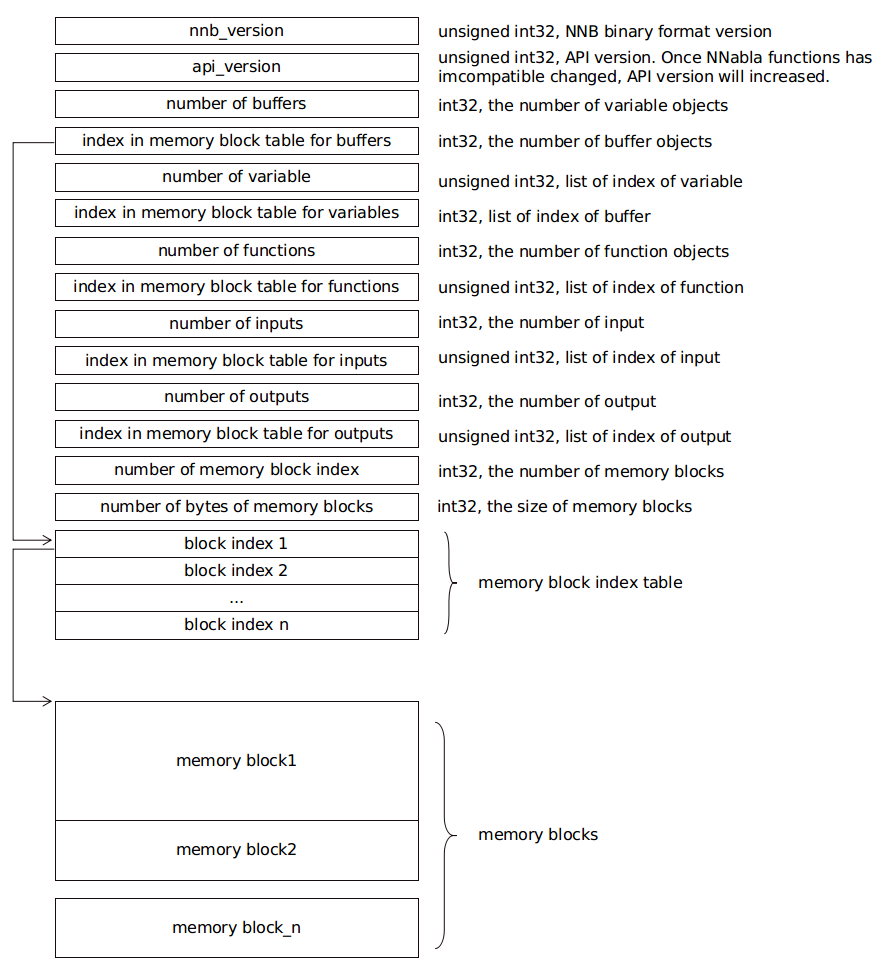

File format converter
=====================

Overview
--------

.. blockdiag::

    blockdiag {
      default_fontsize=8
      span_width = 32;
      span_height = 20;

      NNabla1 [label = "NNabla", color="lime", shape="roundedbox", width=80, height=60, fontsize=12];
      NNabla2 [label = "Use NNabla as\nRuntime", color="lime", shape="roundedbox", width=80, height=60];
      Other [label = "Other\n(Caffe2 etc.)", shape="roundedbox", width=80, height=60];
      ONNX1 [label = "ONNX", color="mediumslateblue", width=40, height=20];
      ONNX2 [label = "ONNX", color="mediumslateblue", width=40, height=20];
      Conv1 [label = "File Format\nConverter", color="lime", shape="roundedbox", width=80, height=60, fontsize=10];
      Conv2 [label = "File Format\nConverter", color="lime", shape="roundedbox", width=80, height=60, fontsize=10];
      NNP1 [label = "NNP", color="cyan", width=40, height=20];
      NNP2 [label = "NNP", color="cyan", width=40, height=20];
      NNB [label = "NNB", color="cyan", width=40, height=20];
      CSRC [label = "C Source\ncode", color="seagreen", width=40];
      TF1 [label = "Tensorflow\n(.pb,ckpt)", shape="roundedbox", color="yellow", width=80, height=60];
      TF2 [label = "Frozen graph(.pb)",      color="yellow", width=80];
      OtherRuntime [label = "Other runtime", shape="roundedbox", width=80];
      NNablaCRuntime [label = "NNabla C\nRuntime", color="lime", shape="roundedbox", width=80];
      Product [label = "Implement to\nproduct", shape="roundedbox", width=80];
      Tensorflow [label = "Tensorflow", shape="roundedbox", width=80];
      
      NNabla1 -> NNP1;
      Other -> ONNX1 -> Conv1 -> NNP1;
      NNP1 -> Conv2;
      Conv2 -> ONNX2 -> OtherRuntime;
      Conv2 -> NNB -> NNablaCRuntime;
      Conv2 -> CSRC -> Product;
      Conv2 -> NNP2 -> NNabla2;
      TF1 -> Conv1;
      Conv2 -> TF2 -> Tensorflow;
    }

File format converter will realize Neural Network Libraries (or
Console) workflow with ONNX file format, and also NNabla C Runtime.

File format converter has following functions.

- Convert NNP variations to valid NNP
- Convert ONNX to NNP
- Convert NNP to ONNX
- Convert NNP to NNB(Binary format for NNabla C Runtime)
- Convert NNP to Tensorflow frozen graph
- Convert Tensorflow checkpoint or frozen graph to NNP
- Experimental: Convert NNP to C Source code for NNabla C Runtime

**IMPORTANT NOTICE**: This file format converter still has some known problems.

- Supported ONNX operator is limited. See :any:`Function-Level_Support_Status`.
- Supported Tensorflow operator is limited. See :any:`Function-Level_Support_Status`.
- Converting NNP to C Source code is still experimental. It should work but did not tested well.

Architecture
+++++++++++++

.. blockdiag::

    blockdiag {
      default_group_color = white;

      INPUT [label="<<file>>\nINPUT", color="lime"];
      OUTPUT [label="<<file>>\nOUTPUT", color="lime"];
      PROCESS [label="Process\n(Split, Expand, etc.)", shape="roundedbox"];
      proto [label="proto", color="cyan", width=60, height=20];

      
      INPUT -> proto [label="import"];
      group {
        orientation = portrait;
        proto <-> PROCESS;
      }
      proto -> OUTPUT [label="export"];
    }

This file format converter uses protobuf defined in Neural Network Libraries as intermediate format.

While this is not a generic file format converter, this is the specified converter for Neural Network Libraries.

This converter can specify both inputs and outputs for ONNX file, but if ONNX file contains a function unsupported by Neural Network Libraries, it may cause error in conversion.

This converter also provides some intermediate process functionalities. See :ref:`Process`.

Conversion
++++++++++

Supported Formats
^^^^^^^^^^^^^^^^^

NNP
^^^

**NNP** is file format of NNabla.

NNP format is described at :any:`../../format`.

But with this file format converter is work with several variation of NNP.

- Standard NNP format (.nnp)
- Contents of NNP files(.nntxt, .prototxt, .h5, .protobuf)

ONNX
^^^^

Limitation
++++++++++

- Training is not supported.
- Only supports operator set 6 and 9.
- Not all functions are supported. See :any:`Function-Level_Support_Status`.
- Only limited Neural Network Console projects supported.  See :any:`Model_Support_Status`.
- In some case you must install onnx package by hand. For example you can install with command `pip install onnx` or if you want to install system wide, you can install with command `sudo -HE pip install onnx`.
  
NNB
^^^

NNB is compact binary format for NNabla C Runtime. The file format is shown as
the following diagram:

There are several concepts, such as buffer, variable, function, input and output in this file. Each of them
is represented as a list. Each list is recorded with 2 members: number of object, and index in memory
block table. The index points to the position in a memory block index table. The index in memory block
index table points to the start address of memory data block.

It is designed for `nnabla-c-runtime`_.

.. _nnabla-c-runtime: https://github.com/sony/nnabla-c-runtime

C Source Code
^^^^^^^^^^^^^

File format converter supports C source code output for `nnabla-c-runtime`_.

Tensorflow
^^^^^^^^^^

Through onnx, tensorflow import and export is partially supported.

As for the importer, 3 formats tends to be supported:
   - .pb, tensorflow frozen graph format
   - .ckpt, tensorflow check point format version 1
   - .ckpt.*, tensorflow check point format version 2

As for the exporter, some of Neural Network Console projects are supported. See :any:`Model_Support_Status`.
The output of converter is tensorflow frozen graph format(e.g. *.pb)

Before using this converter, please confirm if tensorflow and related packages are installed:

.. code-block:: none

   $ pip install -U tensorflow==1.5 onnx==1.4.1 onnx_tf
   $ pip install https://github.com/onnx/tensorflow-onnx.git

Process
+++++++

Expand Repeat and Recurrent
^^^^^^^^^^^^^^^^^^^^^^^^^^^

Neural Network Console supports `LoopControl` pseudo functions `RepeatStart`_,  `RepeatEnd`_, `RecurrentInput`_, `RecurrentOutput`_ or `Delay`_.

Currently, these functions are not supported by Neural Network Libraries directly.

The file format converter expands the network and removes these pseudo functions by default.

.. _RepeatStart: https://support.dl.sony.com/docs/layer_reference/#RepeatStart
.. _RepeatEnd: https://support.dl.sony.com/docs/layer_reference/#RepeatEnd
.. _RecurrentInput: https://support.dl.sony.com/docs/layer_reference/#RecurrentInput
.. _RecurrentOutput: https://support.dl.sony.com/docs/layer_reference/#RecurrentOutput
.. _Delay: https://support.dl.sony.com/docs/layer_reference/#Delay

If you want to preserve these, specify command line option `--nnp-no-expand-network` when converting files.

Split network
^^^^^^^^^^^^^

You can split network with `--split` option.

See :ref:`Splitting network` to use this functionality.

  
Usage
-----

NNP Operation
+++++++++++++

Convert NNP to NNP
^^^^^^^^^^^^^^^^^^

Sometimes we need to convert NNP to NNP.

Most major usecase, expand repeat or recurrent network supported by
Neural Network Console but not supported by C++ API.

.. code-block:: none

   $ nnabla_cli convert input.nnp output.nnp

Convert console output to single NNP file
^^^^^^^^^^^^^^^^^^^^^^^^^^^^^^^^^^^^^^^^^

Current version of Neural Network Console outputs .nntxt and .h5 as
training result.

Then we need to convert separated files into single NNP and parameters
store with protobuf format.

.. code-block:: none

   $ nnabla_cli convert net.nntxt parameters.h5 output.nnp

Convert console output to single NNP file without expanding Repeat or recurrent.
^^^^^^^^^^^^^^^^^^^^^^^^^^^^^^^^^^^^^^^^^^^^^^^^^^^^^^^^^^^^^^^^^^^^^^^^^^^^^^^^

.. code-block:: none

   $ nnabla_cli convert --nnp-no-expand-network net.nntxt parameters.h5 output.nnp

Keep parameter format as hdf5
^^^^^^^^^^^^^^^^^^^^^^^^^^^^^

.. code-block:: none

   $ nnabla_cli convert --nnp-no-expand-network --nnp-parameter-h5 net.nntxt parameters.h5 output.nnp

Everything into single nntxt.
^^^^^^^^^^^^^^^^^^^^^^^^^^^^^

.. code-block:: none

   $ nnabla_cli convert --nnp-parameter-nntxt net.nntxt parameters.h5 output.nntxt

ONNX Operation
++++++++++++++

Convert NNP to ONNX
^^^^^^^^^^^^^^^^^^^

.. code-block:: none

   $ nnabla_cli convert input.nnp output.onnx

If specify output onnx opset 9, please use the following (default is opset 7):

.. code-block:: none

   $ nnabla_cli convert input.nnp output.onnx -d opset_9

Convert ONNX to NNP
^^^^^^^^^^^^^^^^^^^

.. code-block:: none

   $ nnabla_cli convert input.onnx output.nnp

Currently, opset 6,7,9,10,11 are supported to import.

C Runtime Operation
+++++++++++++++++++

Generally, it is better to set the batch size to 1 when convert file to C runtime.
If the batch size is larger than 1, it is necessary to process the batch size data collectively
To make the batch size 1, add `-b 1` to command line option.

Convert NNP to NNB
^^^^^^^^^^^^^^^^^^

.. code-block:: none

   $ nnabla_cli convert -b 1 input.nnp output.nnb

Convert NNP to C source code
^^^^^^^^^^^^^^^^^^^^^^^^^^^^

.. code-block:: none

   $ nnabla_cli convert -b 1 -O CSRC input.onnx output-dir

Quantization
^^^^^^^^^^^^

C-runtime library supports binary(or fixed point) weights, which can dramatically downsize the model (and footprint). See :any:`compress_network` for how
to quantize your model.

Tensorflow Operation
++++++++++++++++++++

Convert NNP to Tensorflow frozen graph
^^^^^^^^^^^^^^^^^^^^^^^^^^^^^^^^^^^^^^

.. code-block:: none

   $ nnabla_cli convert input.nnp output.pb

Convert Tensorflow frozen graph to NNP
^^^^^^^^^^^^^^^^^^^^^^^^^^^^^^^^^^^^^^

.. code-block:: none

   $ nnabla_cli convert input.pb output.nnp

Convert Tensorflow checkpoint to NNP
^^^^^^^^^^^^^^^^^^^^^^^^^^^^^^^^^^^^

For checkpoint version 1:

.. code-block:: none

   $ nnabla_cli convert input.ckpt output.nnp --inputs x0,x1 --outputs y0,y1

In the same directory of input.ckpt, the related files, such as checkpoint, input.ckpt.meta and so on are required
to exist. The `inputs` required the input name of model, separated by comma. The `outputs` is same. In parsing checkpoint format, input and output needs to be provided.

For checkpoint version 2:

.. code-block:: none

   $ nnabla_cli convert input.ckpt.meta output.nnp --inputs x0,x1 --outputs y0,y1

In the same directory of input.ckpt.meta, the related files, such as checkpoint, *.ckpt.index, ... and
so on are required to exist.

Splitting network
+++++++++++++++++

Splitting network is a bit complicated and can be troublesome.

NNP file could have multiple Executor networks, but Split supports only single network to split.

First, you must confirm how many Executors there are in the NNP, and specify what executor to split with `nnabla_cli dump`.

.. code-block:: none
   
    $ nnabla_cli dump squeezenet11.files/SqueezeNet-1.1/*.{nntxt,h5}
    2018-08-27 15:02:40,006 [nnabla][INFO]: Initializing CPU extension...
    Importing squeezenet11.files/SqueezeNet-1.1/net.nntxt
    Importing squeezenet11.files/SqueezeNet-1.1/parameters.h5
     Expanding Training.
     Expanding Top5Error.
     Expanding Top1Error.
     Expanding Runtime.
      Optimizer[0]: Optimizer
      Optimizer[0]:  (In) Data      variable[0]: Name:TrainingInput                  Shape:[-1, 3, 480, 480]
      Optimizer[0]:  (In) Data      variable[1]: Name:SoftmaxCrossEntropy_T          Shape:[-1, 1]
      Optimizer[0]:  (Out)Loss      variable[0]: Name:SoftmaxCrossEntropy            Shape:[-1, 1]
      Monitor  [0]: train_error
      Monitor  [0]:  (In) Data      variable[0]: Name:Input                          Shape:[-1, 3, 320, 320]
      Monitor  [0]:  (In) Data      variable[1]: Name:Top5Error_T                    Shape:[-1, 1]
      Monitor  [0]:  (Out)Monitor   variable[0]: Name:Top5Error                      Shape:[-1, 1]
      Monitor  [1]: valid_error
      Monitor  [1]:  (In) Data      variable[0]: Name:Input                          Shape:[-1, 3, 320, 320]
      Monitor  [1]:  (In) Data      variable[1]: Name:Top1rror_T                     Shape:[-1, 1]
      Monitor  [1]:  (Out)Monitor   variable[0]: Name:Top1rror                       Shape:[-1, 1]
      Executor [0]: Executor
      Executor [0]:  (In) Data      variable[0]: Name:Input                          Shape:[-1, 3, 320, 320]
      Executor [0]:  (Out)Output    variable[0]: Name:y'                             Shape:[-1, 1000]

As above output now you know only 1 executor.

Then you can show executor information with `nnabla_cli dump -E0`.

.. code-block:: none
   
    $ nnabla_cli dump -E0 squeezenet11.files/SqueezeNet-1.1/*.{nntxt,h5}
    2018-08-27 15:03:26,547 [nnabla][INFO]: Initializing CPU extension...
    Importing squeezenet11.files/SqueezeNet-1.1/net.nntxt
    Importing squeezenet11.files/SqueezeNet-1.1/parameters.h5
     Try to leave only executor[Executor].
     Expanding Runtime.
      Executor [0]: Executor
      Executor [0]:  (In) Data      variable[0]: Name:Input                          Shape:[-1, 3, 320, 320]
      Executor [0]:  (Out)Output    variable[0]: Name:y'                             Shape:[-1, 1000]

You can get list of function adding `-F` option.

.. code-block:: none
   
    $ nnabla_cli dump -FE0 squeezenet11.files/SqueezeNet-1.1/*.{nntxt,h5}
    2018-08-27 15:04:10,954 [nnabla][INFO]: Initializing CPU extension...
    Importing squeezenet11.files/SqueezeNet-1.1/net.nntxt
    Importing squeezenet11.files/SqueezeNet-1.1/parameters.h5
     Try to leave only executor[Executor].
     Expanding Runtime.
      Executor [0]: Executor
      Executor [0]:  (In) Data      variable[0]: Name:Input                          Shape:[-1, 3, 320, 320]
      Executor [0]:  (Out)Output    variable[0]: Name:y'                             Shape:[-1, 1000]
      Executor [0]:   Function[  0  ]: Type: Slice                Name: Slice
      Executor [0]:   Function[  1  ]: Type: ImageAugmentation    Name: ImageAugmentation
      Executor [0]:   Function[  2  ]: Type: MulScalar            Name: SqueezeNet/MulScalar
      Executor [0]:   Function[  3  ]: Type: AddScalar            Name: SqueezeNet/AddScalar
      Executor [0]:   Function[  4  ]: Type: Convolution          Name: SqueezeNet/Convolution
      Executor [0]:   Function[  5  ]: Type: ReLU                 Name: SqueezeNet/ReLU
      Executor [0]:   Function[  6  ]: Type: MaxPooling           Name: SqueezeNet/MaxPooling
    
        SNIP...
    
      Executor [0]:   Function[ 63  ]: Type: ReLU                 Name: SqueezeNet/FireModule_8/Expand1x1ReLU
      Executor [0]:   Function[ 64  ]: Type: Concatenate          Name: SqueezeNet/FireModule_8/Concatenate
      Executor [0]:   Function[ 65  ]: Type: Dropout              Name: SqueezeNet/Dropout
      Executor [0]:   Function[ 66  ]: Type: Convolution          Name: SqueezeNet/Convolution_2
      Executor [0]:   Function[ 67  ]: Type: ReLU                 Name: SqueezeNet/ReLU_2
      Executor [0]:   Function[ 68  ]: Type: AveragePooling       Name: SqueezeNet/AveragePooling
      Executor [0]:   Function[ 69  ]: Type: Reshape              Name: SqueezeNet/Reshape
      Executor [0]:   Function[ 70  ]: Type: Identity             Name: y'

If you want to get network without Image Augmentation, according to above output, ImageAugmentation is placed on index 2.
With splitting after index 3, you can get network without ImageAugmentation.
You must specify `-E0 -S 3-` option to `nnabla_cli convert`
This command rename output to `XXX_S_E.nnp`, XXX is original name, S is start function index, and E is end function index.

.. code-block:: none

    $ nnabla_cli convert -E0 -S 3- squeezenet11.files/SqueezeNet-1.1/*.{nntxt,h5} splitted.nnp
    2018-08-27 15:20:21,950 [nnabla][INFO]: Initializing CPU extension...
    Importing squeezenet11.files/SqueezeNet-1.1/net.nntxt
    Importing squeezenet11.files/SqueezeNet-1.1/parameters.h5
     Try to leave only executor[Executor].
     Expanding Runtime.
       Shrink 3 to 70.
        Output to [splitted_3_70.nnp]

Finally you got `splitted_3_70.nnp` as splitted output.
You can check splitted NNP with `nnabla_cli dump`

NOTE: Input shape is changed from original network. New input shape is same as start function's input.

.. code-block:: none

    $ nnabla_cli dump splitted_3_70.nnp
    2018-08-27 15:20:28,021 [nnabla][INFO]: Initializing CPU extension...
    Importing splitted_3_70.nnp
     Expanding Runtime.
      Executor [0]: Executor
      Executor [0]:  (In) Data      variable[0]: Name:SqueezeNet/MulScalar           Shape:[-1, 3, 227, 227]
      Executor [0]:  (Out)Output    variable[0]: Name:y'                             Shape:[-1, 1000]
    
Done.
