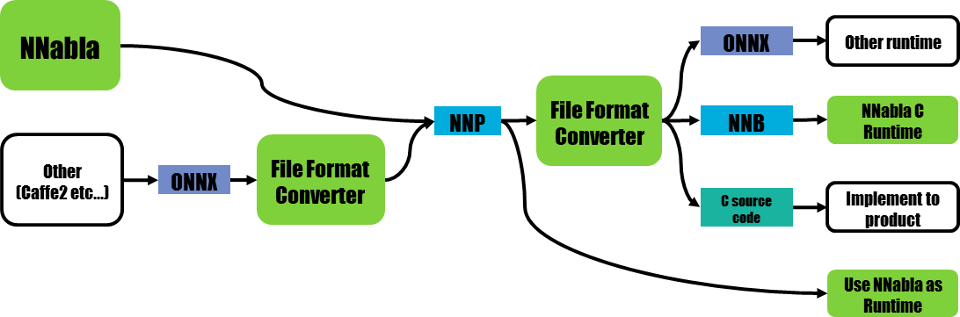

File format converter
=====================

Overview
--------

File format converter will realize Neural Network Libraries (or
Console) workflow with ONNX file format, and also NNabla C Runtime.

File format converter has following functions.

- Convert NNP valiations to valid NNP
- Convert ONNX to NNP
- Convert NNP to ONNX
- Convert NNP to NNB(Binary format for NNabla C Runtime)
- Experimental: Convert NNP to C Source code for NNabla C Runtime

**IMPORTANT NOTICE**: This file format converter still has some known problems.

- Supported ONNX operater is limited. See :any:`onnx/operator_coverage`.
- Converting NNP to C Source code is still experimental. It should work but did not tested well.

  
NNP
---

**NNP** is file format of NNabla.

NNP format is described at :any:`../../format`.

But with this file format converter is work with several variation of NNP.

- Standard NNP format (.nnp)
- Contents of NNP files(.nntxt, .prototxt, .h5, .protobuf)

Convert NNP to NNP
++++++++++++++++++

Sometimes we neeed convert NNP to NNP.

Most major usecase, expand repeat or recurrent network supported by
Neural Network Console but does not supported by C++ API.

.. code-block:: none

   $ nnabla_cli convert --nnp-no-expand-network input.nnp output.nnp

Convert Contents of NNP to NNP
++++++++++++++++++++++++++++++

Current version of Neural Network Console outputs .nntxt and .h5 as
training result.

Then we need to convert separated files into single NNP and parameters
store with protobuf format.

Usage
+++++

- Convert console output to single NNP file
.. code-block:: none

   $ nnabla_cli convert net.nntxt parameters.h5 output.nnp

- Convert console output to single NNP file without expanding Repeat or recurrent.
.. code-block:: none

   $ nnabla_cli convert --nnp-no-expand-network net.nntxt parameters.h5 output.nnp

- Keep parameter format as hdf5
.. code-block:: none

   $ nnabla_cli convert --nnp-no-expand-network --nnp-parameter-h5 net.nntxt parameters.h5 output.nnp

- Everything into single nntxt.
.. code-block:: none

   $ nnabla_cli convert --nnp-parameter-nntxt net.nntxt parameters.h5 output.nntxt

ONNX converter
--------------

Limitation
++++++++++

- Training does not supported
- Only supports operatior set 3
- Not all functions are supported. See :any:`onnx/operator_coverage`.
- Only limited Neural Network Console projects supported.  See :any:`onnx/neural_network_console_example_coverage`.
- In some case you must install onnx package by hand. For example you can install with command `pip install onnx` or if you want to install system wide, you can install with command `sudo -HE pip install onnx`.
  
Usage
+++++

- Convert NNP to ONNX
.. code-block:: none

   $ nnabla_cli convert input.nnp output.onnx

- Convert ONNX to NNP
.. code-block:: none

   $ nnabla_cli convert input.onnx output.nnp

Work with NNabla C Runtime
--------------------------

NNB
+++

NNB is compact binary format for NNabla C Runtime.
It is designed for `nnabla-c-runtime`_.

.. _nnabla-c-runtime: https://github.com/sony/nnabla-c-runtime

C Source Code
+++++++++++++

File format converter supports C source code output for `nnabla-c-runtime`_.

Usage
+++++

- Convert NNP to NNB
.. code-block:: none

   $ nnabla_cli convert input.nnp output.nnb

- Convert NNP to C source code.
.. code-block:: none

   $ nnabla_cli convert -O CSRC input.onnx output-dir

