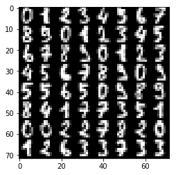
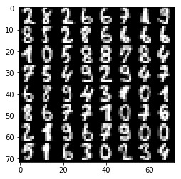
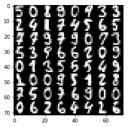
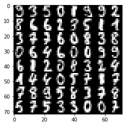
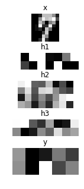
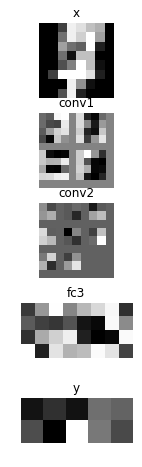
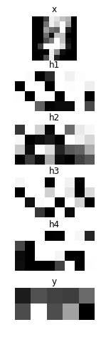
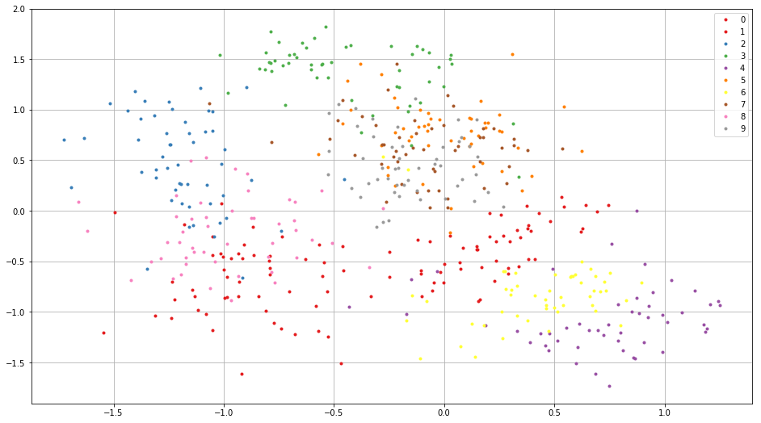

NNabla by Examples
==================

This tutorial demonstrates how you can write a script to train a neural
network by using a simple hand digits classification task.

Note: This tutorial notebook requires
`scikit-learn <http://scikit-learn.org>`__ and
`matplotlib <https://matplotlib.org/>`__ installed in your Python
environment.

First let us prepare some dependencies.

.. code-block:: python

    import nnabla as nn
    
    import nnabla.functions as F
    import nnabla.parametric_functions as PF
    import nnabla.solvers as S
    from nnabla.monitor import tile_images
    
    import numpy as np
    import matplotlib.pyplot as plt
    import tiny_digits
    %matplotlib inline
    
    np.random.seed(0)
    imshow_opt = dict(cmap='gray', interpolation='nearest')

.. parsed-literal::

    2017-06-26 23:09:49,971 [nnabla][INFO]: Initializing CPU extension...

The ``tiny_digits`` module is located under this folder. It provides
some utilities for loading a handwritten-digit classification dataset
(MNIST) available in scikit-learn.

Logistic Regression
-------------------

We will first start by defining a computation graph for logistic
regression. (For details on logistic regression, see Appendix A.)

The training will be done by gradient descent, where gradients are
calculated using the error backpropagation algorithm (backprop).

Preparing a Toy Dataset
~~~~~~~~~~~~~~~~~~~~~~~

This section just prepares a dataset to be used for demonstration of
NNabla usage.

.. code-block:: python

    digits = tiny_digits.load_digits(n_class=10)
    tiny_digits.plot_stats(digits)

.. parsed-literal::

    Num images: 1797
    Image shape: (8, 8)
    Labels: [0 1 2 3 4 5 6 7 8 9]

The next block creates a dataset loader which is a generator providing
images and labels as minibatches. Note that this dataset is just an
example purpose and not a part of NNabla.

.. code-block:: python

    data = tiny_digits.data_iterator_tiny_digits(digits, batch_size=64, shuffle=True)

.. parsed-literal::

    2017-06-26 23:09:50,545 [nnabla][INFO]: DataSource with shuffle(True)
    2017-06-26 23:09:50,546 [nnabla][INFO]: Using DataSourceWithMemoryCache
    2017-06-26 23:09:50,546 [nnabla][INFO]: DataSource with shuffle(True)
    2017-06-26 23:09:50,547 [nnabla][INFO]: On-memory
    2017-06-26 23:09:50,547 [nnabla][INFO]: Using DataIterator

A minibatch is as follows. ``img`` and ``label`` are in
``numpy.ndarray``.

.. code-block:: python

    img, label = data.next()
    plt.imshow(tile_images(img), **imshow_opt)
    print("labels: {}".format(label.reshape(8, 8)))
    print("Label shape: {}".format(label.shape))

.. parsed-literal::

    labels: [[ 2.  8.  2.  6.  6.  7.  1.  9.]
     [ 8.  5.  2.  8.  6.  6.  6.  6.]
     [ 1.  0.  5.  8.  8.  7.  8.  4.]
     [ 7.  5.  4.  9.  2.  9.  4.  7.]
     [ 6.  8.  9.  4.  3.  1.  0.  1.]
     [ 8.  6.  7.  7.  1.  0.  7.  6.]
     [ 2.  1.  9.  6.  7.  9.  0.  0.]
     [ 5.  1.  6.  3.  0.  2.  3.  4.]]
    Label shape: (64, 1)

Preparing the Computation Graph
~~~~~~~~~~~~~~~~~~~~~~~~~~~~~~~

NNabla provides two different ways for backprop-based gradient descent
optimization. One is with a static graph, and another is with a dynamic
graph. We are going to show a static version first.

.. code-block:: python

    # Forward pass
    x = nn.Variable(img.shape)  # Define an image variable
    with nn.parameter_scope("affine1"):
        y = PF.affine(x, 10)  # Output is 10 class

This code block shows one of the most important features in graph
building in NNabla, the **parameter scope**. The first line defines an
input variable ``x``. The second line creates a **parameter scope**. The
third line then applies ``PF.affine`` - an affine transform - to ``x``,
and creates a variable ``y`` holding that result. Here, the ``PF``
(parametric\_function) module provides functions that contain learnable
parameters, such as affine transforms (which contains weights),
convolution (which contains kernels) and batch normalization (which
contains transformation factors and coefficients). We will call these
functions as **parametric functions**. The parameters are created and
initialized randomly at function call, and registered by a name
"affine1" using ``parameter_scope`` context.

.. code-block:: python

    # Building a loss graph
    t = nn.Variable(label.shape)  # Define an target variable
    loss = F.mean(F.softmax_cross_entropy(y, t))  # Softmax Xentropy fits multi-class classification problems

The remaining lines shown above define a target variable and attach
functions for loss at the end of the graph. Note that the static graph
build doesn't execute any computation, but the shapes of output
variables are inferred. Therefore, we can inspect the shapes of each
variable at this time:

.. code-block:: python

    print("Printing shapes of variables")
    print(x.shape)
    print(y.shape)
    print(t.shape)
    print(loss.shape)  # empty tuple means scalar

.. parsed-literal::

    Printing shapes of variables
    (64, 1, 8, 8)
    (64, 10)
    (64, 1)
    ()

Executing a static graph
~~~~~~~~~~~~~~~~~~~~~~~~

You can execute the computation of the graph by calling the
``forward()`` method in a sink variable. Inputs can be set via ``.d``
accessor. It will borrow CPU array references as ``numpy.ndarray``.

.. code-block:: python

    # Set data
    x.d = img
    t.d = label
    # Execute a forward pass
    loss.forward()
    # Showing results
    print("Prediction score of 0-th image: {}".format(y.d[0]))
    print("Loss: {}".format(loss.d))

.. parsed-literal::

    Prediction score of 0-th image: [  9.75851917   6.49118519  16.47323608  -1.36296904  -0.78583491
       4.08872032   7.84134388   2.42956853   3.31485462   3.61868763]
    Loss: 10.6016616821

The output doesn't make sense since the network is just randomly
initialized.

Backward propagation through the graph
~~~~~~~~~~~~~~~~~~~~~~~~~~~~~~~~~~~~~~

The parameters registered by ``parameter_scope`` management function can
be queried by ``get_parameters()`` as a dict format.

.. code-block:: python

    print(nn.get_parameters())

.. parsed-literal::

    OrderedDict([('affine1/affine/W', <Variable((64, 10), need_grad=True) at 0x7fa0ba361d50>), ('affine1/affine/b', <Variable((10,), need_grad=True) at 0x7fa0ba361ce8>)])

Before executing backpropagation, we should initialize gradient buffers
of all parameter to zeros.

.. code-block:: python

    for param in nn.get_parameters().values():
        param.grad.zero()

Then, you can execute backprop by calling ``backward()`` method at the
sink variable.

.. code-block:: python

    # Compute backward
    loss.backward()
    # Showing gradients.
    for name, param in nn.get_parameters().items():
        print(name, param.shape, param.g.flat[:20])  # Showing first 20.

.. parsed-literal::

    affine1/affine/W (64, 10) [  0.00000000e+00   0.00000000e+00   0.00000000e+00   0.00000000e+00
       0.00000000e+00   0.00000000e+00   0.00000000e+00   0.00000000e+00
       0.00000000e+00   0.00000000e+00   4.98418584e-02   8.72317329e-03
      -4.06671129e-02  -4.68742661e-02   2.52632981e-09   7.86017510e-04
       9.06870365e-02  -1.56249944e-02  -1.56217301e-02  -3.12499963e-02]
    affine1/affine/b (10,) [ 0.42710391 -0.01852455  0.07369987 -0.04687012 -0.07798236 -0.03664626
      0.01651323 -0.1249291  -0.11862005 -0.09374455]

Gradient is stored in grad field of ``Variable``. ``.g`` accessor can be
used to access grad data in ``numpy.ndarray`` format.

Optimizing parameters (=Training)
~~~~~~~~~~~~~~~~~~~~~~~~~~~~~~~~~

To optimize parameters, we provide solver module (aliased as S here).
The solver module contains a bunch of optimizer implementations such as
SGD, SGD with momentum, Adam etc. The below block creates SGD solver and
sets parameters of logistic regression to it.

.. code-block:: python

    # Create a solver (gradient-based optimizer)
    learning_rate = 1e-3
    solver = S.Sgd(learning_rate)
    solver.set_parameters(nn.get_parameters())  # Set parameter variables to be updated.

In the next block, we demonstrate a single step of optimization loop.
``solver.zero_grad()`` line does equivalent to calling ``.grad.zero()``
for all parameters as we shown above. After backward computation, we
apply weight decay, then applying gradient descent implemented in Sgd
solver class as follows

.. math::

   \theta \leftarrow \theta - \eta \nabla_{\theta} L(\theta, X_{\mathrm minibatch})

where :math:`\eta` denotes learning rate.

.. code-block:: python

    # One step of training
    x.d, t.d = data.next()
    loss.forward()
    solver.zero_grad()  # Initialize gradients of all parameters to zero.
    loss.backward()
    solver.weight_decay(1e-5)  # Applying weight decay as an regularization
    solver.update()
    print(loss.d)

.. parsed-literal::

    12.9438686371

Next block iterates optimization steps, and shows the loss decreases.

.. code-block:: python

    for i in range(1000):
        x.d, t.d = data.next()
        loss.forward()
        solver.zero_grad()  # Initialize gradients of all parameters to zero.
        loss.backward()
        solver.weight_decay(1e-5)  # Applying weight decay as an regularization
        solver.update()
        if i % 100 == 0:  # Print for each 10 iterations
            print(i, loss.d)

.. parsed-literal::

    0 12.6905069351
    100 3.17041015625
    200 1.60036706924
    300 0.673069953918
    400 0.951370298862
    500 0.724424362183
    600 0.361597299576
    700 0.588107347488
    800 0.28792989254
    900 0.415006935596

Show prediction
~~~~~~~~~~~~~~~

The following code displays training results.

.. code-block:: python

    x.d, t.d = data.next()  # Here we predict images from training set although it's useless. 
    y.forward()  # You can execute a sub graph.
    plt.imshow(tile_images(x.d), **imshow_opt)
    print("prediction:")
    print(y.d.argmax(axis=1).reshape(8, 8))  # Taking a class index based on prediction score.

.. parsed-literal::

    prediction:
    [[5 0 1 9 0 1 3 3]
     [2 4 1 7 4 5 6 5]
     [7 7 9 7 9 0 7 3]
     [5 3 7 6 6 8 0 9]
     [0 1 3 5 5 5 4 9]
     [1 0 0 8 5 1 8 8]
     [7 5 0 7 6 9 0 0]
     [0 6 2 6 4 4 2 6]]

Dynamic graph construction support
~~~~~~~~~~~~~~~~~~~~~~~~~~~~~~~~~~

This is another way of running computation graph in NNabla. This example
doesn't show how useful dynamic graph is, but shows a bit of flavor.

The next block just define computation graph building as functions for
later use.

.. code-block:: python

    def logreg_forward(x):
        with nn.parameter_scope("affine1"):
            y = PF.affine(x, 10)
        return y
    
    def logreg_loss(y, t):
        loss = F.mean(F.softmax_cross_entropy(y, t))  # Softmax Xentropy fits multi-class classification problems
        return loss

To run a computation graph dynamically during creation, you use
``nnabla.auto_forward()`` context as you see in the below block. By
this, computation is fired immediately at functions are called. (You can
also use ``nnabla.set_auto_forward(auto)`` to set the auto-forward state
globally.)

.. code-block:: python

    x = nn.Variable(img.shape)
    t = nn.Variable(label.shape)
    x.d, t.d = data.next()
    with nn.auto_forward():  # Graph are executed 
        y = logreg_forward(x)
        loss = logreg_loss(y, t)
    print("Loss: {}".format(loss.d))
    plt.imshow(tile_images(x.d), **imshow_opt)
    print("prediction:")
    print(y.d.argmax(axis=1).reshape(8, 8))

.. parsed-literal::

    Loss: 0.43071603775
    prediction:
    [[9 3 5 0 1 9 9 2]
     [5 6 6 2 7 5 1 1]
     [3 7 7 6 0 8 3 8]
     [0 6 4 6 0 6 9 9]
     [6 1 2 5 8 3 2 4]
     [1 4 4 0 5 7 1 7]
     [7 8 9 5 8 3 7 8]
     [5 7 5 3 3 0 0 7]]

Backward computation can be done on a dynamically constructed graph.

.. code-block:: python

    solver.zero_grad()
    loss.backward()

Multi-Layer Perceptron (MLP)
----------------------------

In this section, you see an example of MLP graph building and training.

Before starting, we clear all parameters registered in the logistic
regression example.

.. code-block:: python

    nn.clear_parameters()  # Clear all parameters

Here is the function that builds a MLP with an arbitrary depth and width
for 10 class classification.

.. code-block:: python

    def mlp(x, hidden=[16, 32, 16]):
        hs = []
        with nn.parameter_scope("mlp"):  # Parameter scope can be nested
            h = x
            for hid, hsize in enumerate(hidden):
                with nn.parameter_scope("affine{}".format(hid + 1)):
                    h = F.tanh(PF.affine(h, hsize))
                    hs.append(h)
            with nn.parameter_scope("classifier"):
                y = PF.affine(h, 10)
        return y, hs

.. code-block:: python

    # Construct a MLP graph
    y, hs = mlp(x)

.. code-block:: python

    print("Printing shapes")
    print("x: {}".format(x.shape))
    for i, h in enumerate(hs):
        print("h{}:".format(i + 1), h.shape)
    print("y: {}".format(y.shape))

.. parsed-literal::

    Printing shapes
    x: (64, 1, 8, 8)
    h1: (64, 16)
    h2: (64, 32)
    h3: (64, 16)
    y: (64, 10)

.. code-block:: python

    # Training
    loss = logreg_loss(y, t)  # Reuse logreg loss function.
    
    # Copied from the above logreg example.
    def training(steps, learning_rate):
        solver = S.Sgd(learning_rate)
        solver.set_parameters(nn.get_parameters())  # Set parameter variables to be updated.
        for i in range(steps):
            x.d, t.d = data.next()
            loss.forward()
            solver.zero_grad()  # Initialize gradients of all parameters to zero.
            loss.backward()
            solver.weight_decay(1e-5)  # Applying weight decay as an regularization
            solver.update()
            if i % 100 == 0:  # Print for each 10 iterations
                print(i, loss.d)
                
    
    # Training
    training(1000, 1e-2)

.. parsed-literal::

    0 2.42193937302
    100 1.83251476288
    200 1.49943637848
    300 1.30751883984
    400 1.00974023342
    500 0.904026031494
    600 0.873289525509
    700 0.725554704666
    800 0.614291608334
    900 0.555113613605

.. code-block:: python

    # Showing responses for each layer
    num_plot = len(hs) + 2
    gid = 1
    
    def scale01(h):
        return (h - h.min()) / (h.max() - h.min())
    
    def imshow(img, title):
        global gid
        plt.subplot(num_plot, 1, gid)
        gid += 1
        plt.title(title)
        plt.imshow(img, **imshow_opt)
        plt.axis('off')
      
    plt.figure(figsize=(2, 5))
    imshow(x.d[0, 0], 'x')
    for hid, h in enumerate(hs):
        imshow(scale01(h.d[0]).reshape(-1, 8), 'h{}'.format(hid + 1))
    imshow(scale01(y.d[0]).reshape(2, 5), 'y')

Convolutional Neural Network with CUDA acceleration
---------------------------------------------------

Here we demonstrates a CNN with CUDA GPU acceleration.

.. code-block:: python

    nn.clear_parameters()

.. code-block:: python

    def cnn(x):
        with nn.parameter_scope("cnn"):  # Parameter scope can be nested
            with nn.parameter_scope("conv1"):
                c1 = F.tanh(PF.batch_normalization(
                    PF.convolution(x, 4, (3, 3), pad=(1, 1), stride=(2, 2))))
            with nn.parameter_scope("conv2"):
                c2 = F.tanh(PF.batch_normalization(
                    PF.convolution(c1, 8, (3, 3), pad=(1, 1))))
                c2 = F.average_pooling(c2, (2, 2))
            with nn.parameter_scope("fc3"):
                fc3 = F.tanh(PF.affine(c2, 32))
            with nn.parameter_scope("classifier"):
                y = PF.affine(fc3, 10)
        return y, [c1, c2, fc3]

To enable CUDA extension in NNabla, you have to install nnabla-ext-cuda
package first. See `the install
guide <http://nnabla.readthedocs.io/en/latest/python/installation.html>`__.
After installing the CUDA extension, you can easily switch to run on
CUDA by specifying a context before building a graph. We strongly
recommend using a CUDNN context that is fast. Although the context class
can be instantiated by ``nn.Context()``, specifying a context descriptor
might be a bit complicated for users. There for we recommend create a
context by using a helper function ``get_extension_context()`` found in the
``nnabla.ext_utils`` module. NNabla officially supports ``cpu``
and ``cudnn`` as a context specifier passed to the first argument
(extension name). NOTE: By setting the cudnn context as a global default
context, Functions and solves created are instantiated with CUDNN
(preferred) mode. You can also specify a context using
``with nn.context_scope()``. See `API
reference <http://nnabla.readthedocs.io/en/latest/python/api/common.html#context>`__
for details.

.. code-block:: python

    # Run on CUDA
    from nnabla.ext_utils import get_extension_context
    cuda_device_id = 0
    ctx = get_extension_context('cudnn', device_id=cuda_device_id)
    print("Context: {}".format(ctx))
    nn.set_default_context(ctx)  # Set CUDA as a default context.
    y, hs = cnn(x)
    loss = logreg_loss(y, t)

.. parsed-literal::

    2017-06-26 23:09:54,555 [nnabla][INFO]: Initializing CUDA extension...
    2017-06-26 23:09:54,731 [nnabla][INFO]: Initializing cuDNN extension...

.. parsed-literal::

    Context: Context(backend='cpu|cuda', array_class='CudaCachedArray', device_id='0', compute_backend='default|cudnn')

.. code-block:: python

    training(1000, 1e-1)

.. parsed-literal::

    0 2.34862923622
    100 1.00527024269
    200 0.416576713324
    300 0.240603536367
    400 0.254562884569
    500 0.206138283014
    600 0.220851421356
    700 0.161689639091
    800 0.230873346329
    900 0.121101222932

.. code-block:: python

    # Showing responses for each layer
    num_plot = len(hs) + 2
    gid = 1
    plt.figure(figsize=(2, 8))
    imshow(x.d[0, 0], 'x')
    imshow(tile_images(hs[0].d[0][:, None]), 'conv1')
    imshow(tile_images(hs[1].d[0][:, None]), 'conv2')
    imshow(hs[2].d[0].reshape(-1, 8), 'fc3')
    imshow(scale01(y.d[0]).reshape(2, 5), 'y')

``nn.save_parameters`` writes parameters registered in
``parameter_scope`` system in HDF5 format. We use it a later example.

.. code-block:: python

    path_cnn_params = "tmp.params.cnn.h5"
    nn.save_parameters(path_cnn_params)

.. parsed-literal::

    2017-06-26 23:09:56,132 [nnabla][INFO]: Parameter save (hdf5): tmp.params.cnn.h5

Recurrent Neural Network (Elman RNN)
------------------------------------

This is an example of recurrent neural network training.

.. code-block:: python

    nn.clear_parameters()

.. code-block:: python

    def rnn(xs, h0, hidden=32):
        hs = []
        with nn.parameter_scope("rnn"):
            h = h0
            # Time step loop
            for x in xs:
                # Note: Parameter scopes are reused over time
                # which means parameters are shared over time.
                with nn.parameter_scope("x2h"):
                    x2h = PF.affine(x, hidden, with_bias=False)
                with nn.parameter_scope("h2h"):
                    h2h = PF.affine(h, hidden)
                h = F.tanh(x2h + h2h)
                hs.append(h)
            with nn.parameter_scope("classifier"):
                y = PF.affine(h, 10)
        return y, hs

It is not meaningful, but just a demonstration purpose. We split an
image into 2 by 2 grids, and feed them sequentially into RNN.

.. code-block:: python

    def split_grid4(x):
        x0 = x[..., :4, :4]
        x1 = x[..., :4, 4:]
        x2 = x[..., 4:, :4]
        x3 = x[..., 4:, 4:]
        return x0, x1, x2, x3

.. code-block:: python

    hidden = 32
    seq_img = split_grid4(img)
    seq_x = [nn.Variable(subimg.shape) for subimg in seq_img]
    h0 = nn.Variable((img.shape[0], hidden))  # Initial hidden state.
    y, hs = rnn(seq_x, h0, hidden)
    loss = logreg_loss(y, t)

.. code-block:: python

    # Copied from the above logreg example.
    def training_rnn(steps, learning_rate):
        solver = S.Sgd(learning_rate)
        solver.set_parameters(nn.get_parameters())  # Set parameter variables to be updated.
        for i in range(steps):
            minibatch = data.next()
            img, t.d = minibatch
            seq_img = split_grid4(img)
            h0.d = 0  # Initialize as 0
            for x, subimg in zip(seq_x, seq_img):
                x.d = subimg
            loss.forward()
            solver.zero_grad()  # Initialize gradients of all parameters to zero.
            loss.backward()
            solver.weight_decay(1e-5)  # Applying weight decay as an regularization
            solver.update()
            if i % 100 == 0:  # Print for each 10 iterations
                print(i, loss.d)
    
    training_rnn(1000, 1e-1)

.. parsed-literal::

    0 2.62527275085
    100 0.780260562897
    200 0.486522495747
    300 0.289345681667
    400 0.249717146158
    500 0.538961410522
    600 0.276877015829
    700 0.159639537334
    800 0.249660402536
    900 0.0925596579909

.. code-block:: python

    # Showing responses for each layer
    num_plot = len(hs) + 2
    gid = 1
    plt.figure(figsize=(2, 8))
    imshow(x.d[0, 0], 'x')
    for hid, h in enumerate(hs):
        imshow(scale01(h.d[0]).reshape(-1, 8), 'h{}'.format(hid + 1))
    imshow(scale01(y.d[0]).reshape(2, 5), 'y')

Siamese Network
---------------

This example show how to embed an image in a categorical dataset into 2D
space using deep learning. This also demonstrates how to reuse a
pretrained network.

First, we load parameters learned in the CNN example.

.. code-block:: python

    nn.clear_parameters()
    # Loading CNN pretrained parameters.
    _ = nn.load_parameters(path_cnn_params)

.. parsed-literal::

    2017-06-26 23:09:57,838 [nnabla][INFO]: Parameter load (<built-in function format>): tmp.params.cnn.h5

We define embedding function. Note that the network structure and
parameter hierarchy is identical to the previous CNN example. That
enables you to reuse the saved parameters and finetune from it.

.. code-block:: python

    def cnn_embed(x, test=False):
        # Note: Identical configuration with the CNN example above.
        # Parameters pretrained in the above CNN example are used.
        with nn.parameter_scope("cnn"):
            with nn.parameter_scope("conv1"):
                c1 = F.tanh(PF.batch_normalization(PF.convolution(x, 4, (3, 3), pad=(1, 1), stride=(2, 2)), batch_stat=not test))
            with nn.parameter_scope("conv2"):
                c2 = F.tanh(PF.batch_normalization(PF.convolution(c1, 8, (3, 3), pad=(1, 1)), batch_stat=not test))
                c2 = F.average_pooling(c2, (2, 2))
            with nn.parameter_scope("fc3"):
                fc3 = PF.affine(c2, 32)
        # Additional affine for map into 2D.
        with nn.parameter_scope("embed2d"):
            embed = PF.affine(c2, 2)
        return embed, [c1, c2, fc3]
    
    def siamese_loss(e0, e1, t, margin=1.0, eps=1e-4):
        dist = F.sum(F.squared_error(e0, e1), axis=1)  # Squared distance
        # Contrastive loss
        sim_cost = t * dist
        dissim_cost = (1 - t) * \
            (F.maximum_scalar(margin - (dist + eps) ** (0.5), 0) ** 2)
        return F.mean(sim_cost + dissim_cost)

We build two stream CNNs and compare them with the contrastive loss
function defined above. Note that both CNNs have the same parameter
hierarchy, which means both parameters are shared.

.. code-block:: python

    x0 = nn.Variable(img.shape)
    x1 = nn.Variable(img.shape)
    t = nn.Variable((img.shape[0],))  # Same class or not
    e0, hs0 = cnn_embed(x0)
    e1, hs1 = cnn_embed(x1)  # NOTE: parameters are shared
    loss = siamese_loss(e0, e1, t)

.. code-block:: python

    def training_siamese(steps):
        for i in range(steps):
            minibatchs = []
            for _ in range(2):
                minibatch = data.next()
                minibatchs.append((minibatch[0].copy(), minibatch[1].copy()))
            x0.d, label0 = minibatchs[0]
            x1.d, label1 = minibatchs[1]
            t.d = (label0 == label1).astype(np.int).flat
            loss.forward()
            solver.zero_grad()  # Initialize gradients of all parameters to zero.
            loss.backward()
            solver.weight_decay(1e-5)  # Applying weight decay as an regularization
            solver.update()
            if i % 100 == 0:  # Print for each 10 iterations
                print(i, loss.d)
    learning_rate = 1e-2
    solver = S.Sgd(learning_rate)
    with nn.parameter_scope("embed2d"):
        # Only 2d embedding affine will be updated.
        solver.set_parameters(nn.get_parameters())
    training_siamese(2000)
    # Decay learning rate
    solver.set_learning_rate(solver.learning_rate() * 0.1)
    training_siamese(2000)

.. parsed-literal::

    0 0.150528043509
    100 0.186870157719
    200 0.149316266179
    300 0.207163512707
    400 0.171384960413
    500 0.190256178379
    600 0.138507723808
    700 0.0918073058128
    800 0.159692272544
    900 0.0833697617054
    1000 0.0839115008712
    1100 0.104669973254
    1200 0.0776312947273
    1300 0.114788673818
    1400 0.120309025049
    1500 0.107732802629
    1600 0.070114441216
    1700 0.101728007197
    1800 0.114350572228
    1900 0.118794307113
    0 0.0669310241938
    100 0.0553173273802
    200 0.0829797014594
    300 0.0951051414013
    400 0.128303915262
    500 0.102963000536
    600 0.0910559669137
    700 0.0898950695992
    800 0.119949311018
    900 0.0603067912161
    1000 0.105748720467
    1100 0.108760476112
    1200 0.0820947736502
    1300 0.0971114039421
    1400 0.0836166366935
    1500 0.0899554267526
    1600 0.109069615602
    1700 0.0921652168036
    1800 0.0759357959032
    1900 0.100669950247

We visualize embedded training images as following. You see the images
from the same class embedded near each other.

.. code-block:: python

    all_image = digits.images[:512, None]
    all_label = digits.target[:512]

.. code-block:: python

    x_all = nn.Variable(all_image.shape)
    x_all.d = all_image

.. code-block:: python

    with nn.auto_forward():
        embed, _ = cnn_embed(x_all, test=True)

.. code-block:: python

    plt.figure(figsize=(16, 9))
    for i in range(10):
        c = plt.cm.Set1(i / 10.)  # Maybe it doesn't work in an older version of Matplotlib where color map lies in [0, 256)
        plt.plot(embed.d[all_label == i, 0].flatten(), embed.d[
                 all_label == i, 1].flatten(), '.', c=c)
    plt.legend(map(str, range(10)))
    plt.grid()

Appendix
--------

A. Logistic Regression
~~~~~~~~~~~~~~~~~~~~~~

Here we demonstrate how to train the simplest neural network, logistic
regression (single layer perceptron). Logistic regression is a linear
classifier
:math:`f : {\cal R}^{D\times 1} \rightarrow {\cal R}^{K\times 1}`

.. math::

   \mathbf f(\mathbf x, \mathbf \Theta) = \mathbf W \mathbf x + \mathbf b

where :math:`\mathbf x \in {\cal R}^{D \times 1}` is an input image
flattened to a vector, :math:`t \in \{0, 1, \cdots, K\}` is a target
label, :math:`\mathbf W \in {\cal R}^{K \times D}` is a weight matrix,
:math:`\mathbf b \in {\cal R}^{K \times 1}` is a bias vector and
:math:`\mathbf \Theta \equiv \left\{\mathbf W, \mathbf b\right\}`. Loss
function is defined as

.. math::

   \mathbf L(\mathbf \Theta, \mathbf X) = \frac{1}{N} \sum_{\mathbf x, t \subset \mathbf X}
       -log \left(\left[\sigma\left(f(\mathbf x, \mathbf \Theta)\right)\right]_{t}\right)

where
:math:`\mathbf X \equiv \left\{\mathbf x_1, t_1, \cdots, \mathbf x_N, t_N\right\}`
denotes a dataset the network trained on, :math:`\sigma(\mathbf z)` is
softmax operation defined as
:math:`\frac{\exp(-\mathbf z)}{\sum_{z \subset \mathbf z} \exp(-z)}`,
and :math:`\left[\mathbf z\right]_i` denotes i-th element of
:math:`\mathbf z`.

