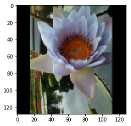
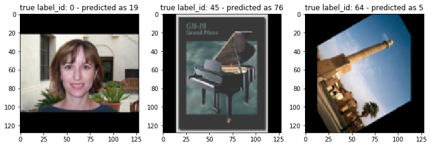
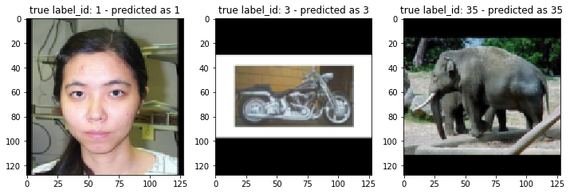

NNabla Models Finetuning Tutorial
=================================

Here we demonstrate how to perform finetuning using nnabla's pre-trained
models.

Load the model
--------------

Loading the model is very simple. All you need is just 2 lines.

.. code:: python

    from nnabla.models.imagenet import ResNet18
    model = ResNet18()

You can choose other ResNet models such as ``ResNet34``, ``ResNet50``,
by specifying the model's name as an argument. Of course, you can choose
other pretrained models as well. See the
`Docs <https://nnabla.readthedocs.io/en/latest/python/api/models/imagenet.html>`__.

**NOTE**: If you use the ``ResNet18`` for the first time, nnabla will
automatically download the weights from ``https://nnabla.org`` and it
may take up to a few minutes.

Dataset
-------

In this tutorial, we use
`Caltech101 <http://www.vision.caltech.edu/Image_Datasets/Caltech101/>`__
as the dataset for finetuning. Caltech101 consists of more than 9,000
object images in total and each image belongs to one of 101 distinct
categories or "clutter" category. We use images from 101 categories for
simple classification.

We have a script named ``caltech101_data.py`` which can automatically
download the dataset and store it in ``nnabla_data``.

If you have your own dataset and ``DataIterator`` which can load your
data, you can use it instead.

.. code:: python

    run caltech101_data.py

.. code:: python

    batch_size = 32  # we set batch_size = 32
    all_data = data_iterator_caltech101(batch_size)

Since there is no separate data for training and validation in
caltech101, we need to *manually* split it up. Here, we will split the
dataset as the following way; **80% for training, and 20% for
validation.**

.. code:: python

    num_samples = all_data.size
    num_train_samples = int(0.8 * num_samples)  # Take 80% for training, and the rest for validation. 
    num_class = 101
    data_iterator_train = all_data.slice(
            rng=None, slice_start=0, slice_end=num_train_samples)
    data_iterator_valid = all_data.slice(
            rng=None, slice_start=num_train_samples, slice_end=num_samples)

Now we have model and data!

Optional: Check the image in the dataset
~~~~~~~~~~~~~~~~~~~~~~~~~~~~~~~~~~~~~~~~

Let's take a look at what kind of images are included in the dataset.
You can get images by ``DataIterator``'s method, ``next``

.. code:: python

    import matplotlib.pyplot as plt
    %matplotlib inline
    images, labels = data_iterator_train.next()
    sample_image, sample_label = images[0], labels[0]
    plt.imshow(sample_image.transpose(1,2,0))
    plt.show()
    print("image_shape: {}".format(sample_image.shape))
    print("label_id: {}".format(sample_label))

.. parsed-literal::

    image_shape: (3, 128, 128)
    label_id: [94]

Preparing Graph Construction
~~~~~~~~~~~~~~~~~~~~~~~~~~~~

Let's start with importing basic modules.

.. code:: python

    import nnabla as nn
    
    # Optional: If you want to use GPU
    from nnabla.ext_utils import get_extension_context
    ctx = get_extension_context("cudnn")
    nn.set_default_context(ctx)
    ext = nn.ext_utils.import_extension_module("cudnn")

Create input Variables for the Network
~~~~~~~~~~~~~~~~~~~~~~~~~~~~~~~~~~~~~~

Now we are going to create the input variables.

.. code:: python

    channels, image_height, image_width = sample_image.shape  # use info from the image we got
    
    # input variables for the validation network
    image_valid = nn.Variable((batch_size, channels, image_height, image_width))
    label_valid = nn.Variable((batch_size, 1))
    input_image_valid = {"image": image_valid, "label": label_valid}
    
    # input variables for the training network
    image_train = nn.Variable((batch_size, channels, image_height, image_width))
    label_train = nn.Variable((batch_size, 1))
    input_image_train = {"image": image_train, "label": label_train}

Create the training graph using the pretrained model
~~~~~~~~~~~~~~~~~~~~~~~~~~~~~~~~~~~~~~~~~~~~~~~~~~~~

If you take a look at the `Model's API
Reference <https://nnabla.readthedocs.io/en/latest/python/api/models/imagenet.html>`__,
you can find ``use_up_to`` option. Specifying one of the pre-defined
strings when calling the model, the computation graph will be
constructed up to the layer you specify. For example, in case of
``ResNet18``, you can choose one of the following as the last layer of
the graph.

-  'classifier' (default): The output of the final affine layer for
   classification.
-  'pool': The output of the final global average pooling.
-  'lastconv': The input of the final global average pooling without
   ReLU activation..
-  'lastconv+relu': Network up to 'lastconv' followed by ReLU
   activation.

For finetuning, it is common to replace only the upper layers with the
new (not trained) ones and re-use the lower layers with their pretrained
weights. Also, pretrained models have been trained on a classification
task on ImageNet, which has 1000 categories, so the output of the
``classifier`` layer has the output shape ``(batch_size, 1000)`` that
wouldn't fit our current dataset. For this reason, here we construct the
graph up to the ``pool`` layer, which corresponds to the
``global average pooling`` layer in the original graph, and connect it
to the additional affine (fully-connected) layer for 101-way
classification. For finetuning, it is common to train only the weights
for the newly added layers (in this case, the last affine layer), but in
this tutorial, we will update the weights for *all* layers in the graph.
Also, when creating a training graph, you need to set ``training=True``.

.. code:: python

    import nnabla.parametric_functions as PF
    
    y_train = model(image_train, force_global_pooling=True, use_up_to="pool", training=True)
    with nn.parameter_scope("finetuning_fc"):
        pred_train = PF.affine(y_train, 101)  # adding the affine layer to the graph.

**NOTE**: You need to specify ``force_global_pooling=True`` when the
input shape is different from what the model expects. You can check the
model's default input shape by typing ``model.input_shape``.

Create the validation graph using the model
~~~~~~~~~~~~~~~~~~~~~~~~~~~~~~~~~~~~~~~~~~~

Creating the validation graph is almost the same. You simply need to
change ``training`` flag to ``False``.

.. code:: python

    y_valid = model(image_valid, 
                    force_global_pooling=True, use_up_to="pool", training=False)
    with nn.parameter_scope("finetuning_fc"):
        pred_valid = PF.affine(y_valid, 101)
    pred_valid.persistent = True  # to keep the value when get `forward(clear_buffer=True)`-ed.

Define the functions for computing Loss and Categorical Error
~~~~~~~~~~~~~~~~~~~~~~~~~~~~~~~~~~~~~~~~~~~~~~~~~~~~~~~~~~~~~

.. code:: python

    import nnabla.functions as F
    
    
    def loss_function(pred, label):
        """
            Compute loss.
        """
        loss = F.mean(F.softmax_cross_entropy(pred, label))
        return loss
    
    loss_valid = loss_function(pred_valid, label_valid)
    top_1_error_valid = F.mean(F.top_n_error(pred_valid, label_valid))
    loss_train = loss_function(pred_train, label_train)
    top_1_error_train = F.mean(F.top_n_error(pred_train, label_train))

Prepare the solver
~~~~~~~~~~~~~~~~~~

.. code:: python

    import nnabla.solvers as S
    
    solver = S.Momentum(0.01)  # you can choose others as well
    
    solver.set_parameters(nn.get_parameters())

Some setting for iteration
~~~~~~~~~~~~~~~~~~~~~~~~~~

.. code:: python

    num_epoch = 10  # arbitrary
    one_epoch = data_iterator_train.size // batch_size
    max_iter = num_epoch * one_epoch
    val_iter = data_iterator_valid.size // batch_size

Performance before finetuning
~~~~~~~~~~~~~~~~~~~~~~~~~~~~~

Let's see how *well* the model works. Note that all the weights are
pretrained on ImageNet except for the last affine layer. First, prepare
a function to show us the model's performance,

.. code:: python

    def run_validation(pred_valid, loss_valid, top_1_error_valid,
                       input_image_valid, data_iterator_valid, 
                       with_visualized=False, num_visualized=3):
        assert num_visualized < pred_valid.shape[0], "too many images to plot."
        val_iter = data_iterator_valid.size // pred_valid.shape[0]
        ve = 0.
        vloss = 0.
        for j in range(val_iter):
            v_image, v_label = data_iterator_valid.next()
            input_image_valid["image"].d = v_image
            input_image_valid["label"].d = v_label
            nn.forward_all([loss_valid, top_1_error_valid], clear_no_need_grad=True)
            vloss += loss_valid.d.copy()
            ve += top_1_error_valid.d.copy()
    
        vloss /= val_iter
        ve /= val_iter
        
        if with_visualized:
            ind = 1
            random_start = np.random.randint(pred_valid.shape[0] - num_visualized)
            fig = plt.figure(figsize=(12., 12.))
            for n in range(random_start, random_start + num_visualized):
                sample_image, sample_label = v_image[n], v_label[n]
                ax = fig.add_subplot(1, num_visualized, ind)
                ax.imshow(sample_image.transpose(1,2,0))
                with nn.auto_forward():
                    predicted_id = np.argmax(F.softmax(pred_valid)[n].d)
                result = "true label_id: {} - predicted as {}".format(str(sample_label[0]), str(predicted_id))
                ax.set_title(result)
                ind += 1
            fig.show()
    
        return ve, vloss

.. code:: python

    _, _ = run_validation(pred_valid, loss_valid, top_1_error_valid, input_image_valid, data_iterator_valid, with_visualized=True)

As you can see, the model fails to classify images properly. Now, let's begin the finetuning and see how performance improves.

Start Finetuning
~~~~~~~~~~~~~~~~

Let's prepare the monitor for training.

.. code:: python

    from nnabla.monitor import Monitor, MonitorSeries, MonitorTimeElapsed
    monitor = Monitor("tmp.monitor")
    monitor_loss = MonitorSeries("Training loss", monitor, interval=200)
    monitor_err = MonitorSeries("Training error", monitor, interval=200)
    monitor_vloss = MonitorSeries("Test loss", monitor, interval=200)
    monitor_verr = MonitorSeries("Test error", monitor, interval=200)

.. code:: python

    # Training-loop
    for i in range(max_iter):
        image, label = data_iterator_train.next()
        input_image_train["image"].d = image
        input_image_train["label"].d = label
        nn.forward_all([loss_train, top_1_error_train], clear_no_need_grad=True)
    
        monitor_loss.add(i, loss_train.d.copy())
        monitor_err.add(i, top_1_error_train.d.copy())
    
        solver.zero_grad()
        loss_train.backward(clear_buffer=True)
    
        # update parameters
        solver.weight_decay(3e-4)
        solver.update()
    
        if i % 200 == 0:
            ve, vloss = run_validation(pred_valid, loss_valid, top_1_error_valid,
                                       input_image_valid, data_iterator_valid, 
                                       with_visualized=False, num_visualized=3)
    
            monitor_vloss.add(i, vloss)
            monitor_verr.add(i, ve)

.. parsed-literal::

    2019-07-05 14:26:26,885 [nnabla][INFO]: iter=199 {Training loss}=1.5021580457687378
    2019-07-05 14:26:26,887 [nnabla][INFO]: iter=199 {Training error}=0.3345312476158142
    2019-07-05 14:26:28,756 [nnabla][INFO]: iter=200 {Test loss}=2.975713219355654
    2019-07-05 14:26:28,756 [nnabla][INFO]: iter=200 {Test error}=0.5384837962962963
    2019-07-05 14:26:50,249 [nnabla][INFO]: iter=399 {Training loss}=0.22022955119609833
    2019-07-05 14:26:50,250 [nnabla][INFO]: iter=399 {Training error}=0.053437501192092896
    2019-07-05 14:26:52,256 [nnabla][INFO]: iter=400 {Test loss}=0.12045302835327608
    2019-07-05 14:26:52,257 [nnabla][INFO]: iter=400 {Test error}=0.029513888888888888
    2019-07-05 14:27:14,151 [nnabla][INFO]: iter=599 {Training loss}=0.0659928247332573
    2019-07-05 14:27:14,152 [nnabla][INFO]: iter=599 {Training error}=0.012500000186264515
    2019-07-05 14:27:16,175 [nnabla][INFO]: iter=600 {Test loss}=0.08744175952893717
    2019-07-05 14:27:16,175 [nnabla][INFO]: iter=600 {Test error}=0.02199074074074074
    2019-07-05 14:27:38,097 [nnabla][INFO]: iter=799 {Training loss}=0.03324155509471893
    2019-07-05 14:27:38,098 [nnabla][INFO]: iter=799 {Training error}=0.0054687499068677425
    2019-07-05 14:27:40,120 [nnabla][INFO]: iter=800 {Test loss}=0.07678695395588875
    2019-07-05 14:27:40,121 [nnabla][INFO]: iter=800 {Test error}=0.02025462962962963
    2019-07-05 14:28:02,041 [nnabla][INFO]: iter=999 {Training loss}=0.019672293215990067
    2019-07-05 14:28:02,042 [nnabla][INFO]: iter=999 {Training error}=0.0017187499906867743
    2019-07-05 14:28:04,064 [nnabla][INFO]: iter=1000 {Test loss}=0.06333287184437116
    2019-07-05 14:28:04,065 [nnabla][INFO]: iter=1000 {Test error}=0.017361111111111112
    2019-07-05 14:28:25,984 [nnabla][INFO]: iter=1199 {Training loss}=0.009992362931370735
    2019-07-05 14:28:25,985 [nnabla][INFO]: iter=1199 {Training error}=0.0003124999930150807
    2019-07-05 14:28:28,008 [nnabla][INFO]: iter=1200 {Test loss}=0.06950318495984431
    2019-07-05 14:28:28,008 [nnabla][INFO]: iter=1200 {Test error}=0.015625
    2019-07-05 14:28:49,954 [nnabla][INFO]: iter=1399 {Training loss}=0.007941835559904575
    2019-07-05 14:28:49,955 [nnabla][INFO]: iter=1399 {Training error}=0.0003124999930150807
    2019-07-05 14:28:51,978 [nnabla][INFO]: iter=1400 {Test loss}=0.06711215277512868
    2019-07-05 14:28:51,979 [nnabla][INFO]: iter=1400 {Test error}=0.016203703703703703
    2019-07-05 14:29:13,898 [nnabla][INFO]: iter=1599 {Training loss}=0.008225565776228905
    2019-07-05 14:29:13,899 [nnabla][INFO]: iter=1599 {Training error}=0.0007812500116415322
    2019-07-05 14:29:15,923 [nnabla][INFO]: iter=1600 {Test loss}=0.06447940292181792
    2019-07-05 14:29:15,923 [nnabla][INFO]: iter=1600 {Test error}=0.016203703703703703
    2019-07-05 14:29:37,850 [nnabla][INFO]: iter=1799 {Training loss}=0.005678100511431694
    2019-07-05 14:29:37,850 [nnabla][INFO]: iter=1799 {Training error}=0.0
    2019-07-05 14:29:39,873 [nnabla][INFO]: iter=1800 {Test loss}=0.06282947226255028
    2019-07-05 14:29:39,873 [nnabla][INFO]: iter=1800 {Test error}=0.01678240740740741
    2019-07-05 14:30:01,795 [nnabla][INFO]: iter=1999 {Training loss}=0.006834140978753567
    2019-07-05 14:30:01,796 [nnabla][INFO]: iter=1999 {Training error}=0.00046874998952262104
    2019-07-05 14:30:03,818 [nnabla][INFO]: iter=2000 {Test loss}=0.05948294078310331
    2019-07-05 14:30:03,818 [nnabla][INFO]: iter=2000 {Test error}=0.014467592592592593

As you see, the loss and error rate is decreasing as the finetuning
progresses. Let's see the classification result after finetuning.

.. code:: python

    _, _ = run_validation(pred_valid, loss_valid, top_1_error_valid, input_image_valid, data_iterator_valid, with_visualized=True)

You can see now the model is able to classify the image properly.

Finetuning more
===============

we have a convenient script named ``finetuning.py``. By using this, you
can try finetuning with different models **even on your original
dataset**.

To do this, you need to prepare your own dataset and do some
preprocessing. We will explain how to do this in the following.

Prepare your dataset
--------------------

Suppose you have a lot of images which can be used for image
classification. You need to organize your data in a certain manner.
Here, we will explain that with another dataset, `Stanford Dogs
Dataset <http://vision.stanford.edu/aditya86/ImageNetDogs/>`__. First,
visit the official page and download ``images.tar`` (here is the `direct
link <http://vision.stanford.edu/aditya86/ImageNetDogs/images.tar>`__).
Next, untar the archive and then you will see a directory named
``Images``. Inside that directory, there are many subdirectories and
each subdirectory stores images which belong to 1 category. For example,
a directory ``n02099712-Labrador_retriever`` contains labrador
retriever's images only. So if you want to use your own dataset, you
need to organize your images and directiories in the same way like the
following;

::

    parent_directory  
    ├── subdirectory_for_category_A  
    │   ├── image_0.jpg  
    │   ├── image_1.jpg  
    │   ├── image_2.jpg  
    │   ├── ...  
    │  
    ├── subdirectory_for_category_B  
    │   ├── image_0.jpg  
    │   ├── ...  
    │  
    ├── subdirectory_for_category_C  
    │   ├── image_0.jpg  
    │   ├── ...  
    │  
    ├── subdirectory_for_category_D  
    │   ├── image_0.jpg  
    │   ├── ...  
    │  
     ...

The numbers of images in each category can vary, do not have to be
exactly the same. Once you arrange your dataset, now you're good to go!

Create image classification dataset using NNabla CLI
----------------------------------------------------

Now that you prepare and organize your dataset, the only thing you have
to do is to create a ``.csv`` file which will be used in
``finetuning.py``. To do so, you can use NNabla's `Python Command Line
Interface <https://nnabla.readthedocs.io/en/latest/python/command_line_interface.html#create-image-classification-dataset>`__.
Just type like the following.

::

    nnabla_cli create_image_classification_dataset -i <path to parent directory> -o <output directory which contains "preprocessed" images> -c <number of channels> -w <width> -g <height> -m <padding or trimming> -s <whether apply shuffle or not> -f1 <name of the output csv file for training data> -f2 <name of the output csv file for test data> -r2 <ratio(%) of test data to training data>

If you do that on Stanford Dogs Dataset,

::

    nnabla_cli create_image_classification_dataset -i Images -o arranged_images -c 3 -w 128 -g 128 -m padding -s true -f1 stanford_dog_train.csv -f2 stanford_dog_test.csv -r2 20

Note that output ``.csv`` file will be stored in the same directory you
specified with -o option. For more information, please check the
`docs <https://nnabla.readthedocs.io/en/latest/python/command_line_interface.html#create-image-classification-dataset>`__.

After executing the command above, you can start finetuning on your
dataset.

Run finetuning
--------------

All you need is just to type one line.

::

    python finetuning.py --model <model name> --train-csv <.csv file containing training data>  --test-csv <.csv file containing test data>

It will execute finetuning on your dataset!

.. code:: python

    run finetuning.py --model ResNet34 --epoch 10 --train-csv ~/nnabla_data/stanford_dog_arranged/stanford_dog_train.csv --test-csv ~/nnabla_data/stanford_dog_arranged/stanford_dog_test.csv --shuffle True

An example of how to use finetuning's result for inference
----------------------------------------------------------

Once the finetuning finished, let's use it for inference! The script
above has saved the parameters at every certain iteration you specified.
So now call the same model you trained and this time let's use the
finetuned parameters in the following way.

.. code:: python

    from nnabla.models.imagenet import ResNet34
    import nnabla as nn
    
    param_path = "params_XXX.h5"  # specify the path to the saved parameter (.h5)
    
    model = ResNet34()
    batch_size = 1  # just for inference
    input_shape = (batch_size, ) + model.input_shape

Then define an input Variable and a network for inference. Note that you
need to construct the network exactly the same way as done in finetuning
script (layer configuration, parameters names, and so on...).

.. code:: python

    x = nn.Variable(input_shape)  # input Variable
    pooled = model(x, use_up_to="pool", training=False)
    with nn.parameter_scope("finetuning"):
        with nn.parameter_scope("last_fc"):
            pred = PF.affine(pooled, 120)

Load the parameters which you finetuned above. You can use
``nn.load_parameters()`` to load the parameters. Once you call this, the
parameters stored in the ``params.h5`` will be stored in global scope.
You can check the parameters are different before and after
``nn.load_parameters()`` by using ``nn.get_parameters()``.

.. code:: python

    nn.load_parameters(param_path)  # load the finetuned parameters.
    pred.forward()
