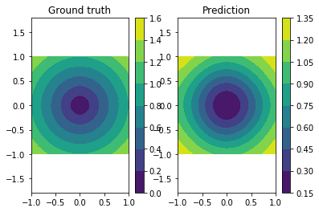

NNabla Python API Demonstration Tutorial
========================================

Let us import nnabla first, and some additional useful tools.

.. code:: python

    # python2/3 compatibility
    from __future__ import print_function
    from __future__ import absolute_import
    from __future__ import division

.. code:: python

    import nnabla as nn  # Abbreviate as nn for convenience.
    
    import numpy as np
    %matplotlib inline
    import matplotlib.pyplot as plt

.. parsed-literal::

    2017-09-27 14:00:30,785 [nnabla][INFO]: Initializing CPU extension...

NdArray
-------

NdArray is a data container of a multi-dimensional array. NdArray is
device (e.g. CPU, CUDA) and type (e.g. uint8, float32) agnostic, in
which both type and device are implicitly casted or transferred when it
is used. Below, you create a NdArray with a shape of ``(2, 3, 4)``.

.. code:: python

    a = nn.NdArray((2, 3, 4))

You can see the values held inside ``a`` by the following. The values
are not initialized, and are created as float32 by default.

.. code:: python

    print(a.data)

.. parsed-literal::

    [[[  9.42546995e+24   4.56809286e-41   8.47690058e-38   0.00000000e+00]
      [  7.38056336e+34   7.50334969e+28   1.17078231e-32   7.58387310e+31]
      [  7.87001454e-12   9.84394250e-12   6.85712044e+22   1.81785692e+31]]
    
     [[  1.84681296e+25   1.84933247e+20   4.85656319e+33   2.06176836e-19]
      [  6.80020530e+22   1.69307638e+22   2.11235872e-19   1.94316151e-19]
      [  1.81805047e+31   3.01289097e+29   2.07004908e-19   1.84648795e+25]]]

The accessor ``.data`` returns a reference to the values of NdArray as
``numpy.ndarray``. You can modify these by using the Numpy API as
follows.

.. code:: python

    print('[Substituting random values]')
    a.data = np.random.randn(*a.shape)
    print(a.data)
    print('[Slicing]')
    a.data[0, :, ::2] = 0
    print(a.data)

.. parsed-literal::

    [Substituting random values]
    [[[ 0.36133638  0.22121875 -1.5912329  -0.33490974]
      [ 1.35962474  0.2165522   0.54483992 -0.61813235]
      [-0.13718799 -0.44104072 -0.51307833  0.73900551]]
    
     [[-0.59464753 -2.17738533 -0.28626776 -0.45654735]
      [ 0.73566747  0.87292582 -0.41605178  0.04792296]
      [-0.63856047  0.31966645 -0.63974309 -0.61385244]]]
    [Slicing]
    [[[ 0.          0.22121875  0.         -0.33490974]
      [ 0.          0.2165522   0.         -0.61813235]
      [ 0.         -0.44104072  0.          0.73900551]]
    
     [[-0.59464753 -2.17738533 -0.28626776 -0.45654735]
      [ 0.73566747  0.87292582 -0.41605178  0.04792296]
      [-0.63856047  0.31966645 -0.63974309 -0.61385244]]]

Note that the above operation is all done in the host device (CPU).
NdArray provides more efficient functions in case you want to fill all
values with a constant, ``.zero`` and ``.fill``. They are lazily
evaluated when the data is requested (when neural network computation
requests the data, or when numpy array is requested by Python) The
filling operation is executed within a specific device (e.g. CUDA GPU),
and more efficient if you specify the device setting, which we explain
later.

.. code:: python

    a.fill(1)  # Filling all values with one.
    print(a.data)

.. parsed-literal::

    [[[ 1.  1.  1.  1.]
      [ 1.  1.  1.  1.]
      [ 1.  1.  1.  1.]]
    
     [[ 1.  1.  1.  1.]
      [ 1.  1.  1.  1.]
      [ 1.  1.  1.  1.]]]

You can create an NdArray instance directly from a Numpy array object.

.. code:: python

    b = nn.NdArray.from_numpy_array(np.ones(a.shape))
    print(b.data)

.. parsed-literal::

    [[[ 1.  1.  1.  1.]
      [ 1.  1.  1.  1.]
      [ 1.  1.  1.  1.]]
    
     [[ 1.  1.  1.  1.]
      [ 1.  1.  1.  1.]
      [ 1.  1.  1.  1.]]]

NdArray is used in Variable class, as well as NNabla's imperative
computation of neural networks. We describe them in the later sections.

Variable
--------

Variable class is used when you construct a neural network. The neural
network can be described as a graph in which an edge represents a
function (a.k.a operator and layer) which defines operation of a minimum
unit of computation, and a node represents a variable which holds
input/output values of a function (Function class is explained later).
The graph is called "Computation Graph".

In NNabla, a Variable, a node of a computation graph, holds two
``NdArray``\ s, one for storing the input or output values of a function
during forward propagation (executing computation graph in the forward
order), while another for storing the backward error signal (gradient)
during backward propagation (executing computation graph in backward
order to propagate error signals down to parameters (weights) of neural
networks). The first one is called ``data``, the second is ``grad`` in
NNabla.

The following line creates a Variable instance with a shape of (2, 3,
4). It has ``data`` and ``grad`` as ``NdArray``. The flag ``need_grad``
is used to omit unnecessary gradient computation during backprop if set
to False.

.. code:: python

    x = nn.Variable([2, 3, 4], need_grad=True)
    print('x.data:', x.data)
    print('x.grad:', x.grad)

.. parsed-literal::

    x.data: <NdArray((2, 3, 4)) at 0x7f575caf4ea0>
    x.grad: <NdArray((2, 3, 4)) at 0x7f575caf4ea0>

You can get the shape by:

.. code:: python

    x.shape

.. parsed-literal::

    (2, 3, 4)

Since both ``data`` and ``grad`` are ``NdArray``, you can get a
reference to its values as NdArray with the ``.data`` accessor, but also
it can be referred by ``.d`` or ``.g`` property for ``data`` and ``grad``
respectively.

.. code:: python

    print('x.data')
    print(x.d)
    x.d = 1.2345  # To avoid NaN
    assert np.all(x.d == x.data.data), 'd: {} != {}'.format(x.d, x.data.data)
    print('x.grad')
    print(x.g)
    x.g = 1.2345  # To avoid NaN
    assert np.all(x.g == x.grad.data), 'g: {} != {}'.format(x.g, x.grad.data)
    
    # Zeroing grad values
    x.grad.zero()
    print('x.grad (after `.zero()`)')
    print(x.g)

.. parsed-literal::

    x.data
    [[[  9.42553452e+24   4.56809286e-41   8.32543479e-38   0.00000000e+00]
      [             nan              nan   0.00000000e+00   0.00000000e+00]
      [  3.70977305e+25   4.56809286e-41   3.78350585e-44   0.00000000e+00]]
    
     [[  5.68736600e-38   0.00000000e+00   1.86176378e-13   4.56809286e-41]
      [  4.74367616e+25   4.56809286e-41   5.43829710e+19   4.56809286e-41]
      [  0.00000000e+00   0.00000000e+00   2.93623372e-38   0.00000000e+00]]]
    x.grad
    [[[  9.42576510e+24   4.56809286e-41   9.42576510e+24   4.56809286e-41]
      [  9.27127763e-38   0.00000000e+00   9.27127763e-38   0.00000000e+00]
      [  1.69275966e+22   4.80112800e+30   1.21230330e+25   7.22962302e+31]]
    
     [[  1.10471027e-32   4.63080422e+27   2.44632805e+20   2.87606258e+20]
      [  4.46263300e+30   4.62311881e+30   7.65000750e+28   3.01339003e+29]
      [  2.08627352e-10   1.03961868e+21   7.99576678e+20   1.74441223e+22]]]
    x.grad (after `.zero()`)
    [[[ 0.  0.  0.  0.]
      [ 0.  0.  0.  0.]
      [ 0.  0.  0.  0.]]
    
     [[ 0.  0.  0.  0.]
      [ 0.  0.  0.  0.]
      [ 0.  0.  0.  0.]]]

Like ``NdArray``, a ``Variable`` can also be created from Numpy
array(s).

.. code:: python

    x2 = nn.Variable.from_numpy_array(np.ones((3,)), need_grad=True)
    print(x2)
    print(x2.d)
    x3 = nn.Variable.from_numpy_array(np.ones((3,)), np.zeros((3,)), need_grad=True)
    print(x3)
    print(x3.d)
    print(x3.g)

.. parsed-literal::

    <Variable((3,), need_grad=True) at 0x7f572a5242c8>
    [ 1.  1.  1.]
    <Variable((3,), need_grad=True) at 0x7f572a5244a8>
    [ 1.  1.  1.]
    [ 0.  0.  0.]

Besides storing values of a computation graph, pointing a parent edge
(function) to trace the computation graph is an important role. Here
``x`` doesn't have any connection. Therefore, the ``.parent`` property
returns None.

.. code:: python

    print(x.parent)

.. parsed-literal::

    None

Function
--------

A function defines a operation block of a computation graph as we
described above. The module ``nnabla.functions`` offers various
functions (e.g. Convolution, Affine and ReLU). You can see the list of
functions available in the `API reference
guide <http://nnabla.readthedocs.io/en/latest/python/api/function.html#module-nnabla.functions>`__.

.. code:: python

    import nnabla.functions as F

As an example, here you will defines a computation graph that computes
the element-wise Sigmoid function outputs for the input variable and
sums up all values into a scalar. (This is simple enough to explain how
it behaves but a meaningless example in the context of neural network
training. We will show you a neural network example later.)

.. code:: python

    sigmoid_output = F.sigmoid(x)
    sum_output = F.reduce_sum(sigmoid_output)

The function API in ``nnabla.functions`` takes one (or several)
Variable(s) and arguments (if any), and returns one (or several) output
Variable(s). The ``.parent`` points to the function instance which
created it. Note that no computation occurs at this time since we just
define the graph. (This is the default behavior of NNabla computation
graph API. You can also fire actual computation during graph definition
which we call "Dynamic mode" (explained later)).

.. code:: python

    print("sigmoid_output.parent.name:", sigmoid_output.parent.name)
    print("x:", x)
    print("sigmoid_output.parent.inputs refers to x:", sigmoid_output.parent.inputs)

.. parsed-literal::

    sigmoid_output.parent.name: Sigmoid
    x: <Variable((2, 3, 4), need_grad=True) at 0x7f572a51a778>
    sigmoid_output.parent.inputs refers to x: [<Variable((2, 3, 4), need_grad=True) at 0x7f572a273a48>]

.. code:: python

    print("sum_output.parent.name:", sum_output.parent.name)
    print("sigmoid_output:", sigmoid_output)
    print("sum_output.parent.inputs refers to sigmoid_output:", sum_output.parent.inputs)

.. parsed-literal::

    sum_output.parent.name: ReduceSum
    sigmoid_output: <Variable((2, 3, 4), need_grad=True) at 0x7f572a524638>
    sum_output.parent.inputs refers to sigmoid_output: [<Variable((2, 3, 4), need_grad=True) at 0x7f572a273a48>]

The ``.forward()`` at a leaf Variable executes the forward pass
computation in the computation graph.

.. code:: python

    sum_output.forward()
    print("CG output:", sum_output.d)
    print("Reference:", np.sum(1.0 / (1.0 + np.exp(-x.d))))

.. parsed-literal::

    CG output: 18.59052085876465
    Reference: 18.5905

The ``.backward()`` does the backward propagation through the graph.
Here we initialize the ``grad`` values as zero before backprop since the
NNabla backprop algorithm always accumulates the gradient in the root
variables.

.. code:: python

    x.grad.zero()
    sum_output.backward()
    print("d sum_o / d sigmoid_o:")
    print(sigmoid_output.g)
    print("d sum_o / d x:")
    print(x.g)

.. parsed-literal::

    d sum_o / d sigmoid_o:
    [[[ 1.  1.  1.  1.]
      [ 1.  1.  1.  1.]
      [ 1.  1.  1.  1.]]
    
     [[ 1.  1.  1.  1.]
      [ 1.  1.  1.  1.]
      [ 1.  1.  1.  1.]]]
    d sum_o / d x:
    [[[ 0.17459197  0.17459197  0.17459197  0.17459197]
      [ 0.17459197  0.17459197  0.17459197  0.17459197]
      [ 0.17459197  0.17459197  0.17459197  0.17459197]]
    
     [[ 0.17459197  0.17459197  0.17459197  0.17459197]
      [ 0.17459197  0.17459197  0.17459197  0.17459197]
      [ 0.17459197  0.17459197  0.17459197  0.17459197]]]

NNabla is developed by mainly focused on neural network training and
inference. Neural networks have parameters to be learned associated with
computation blocks such as Convolution, Affine (a.k.a. fully connected,
dense etc.). In NNabla, the learnable parameters are also represented as
``Variable`` objects. Just like input variables, those parameter
variables are also used by passing into ``Function``\ s. For example,
Affine function takes input, weights and biases as inputs.

.. code:: python

    x = nn.Variable([5, 2])  # Input
    w = nn.Variable([2, 3], need_grad=True)  # Weights
    b = nn.Variable([3], need_grad=True)  # Biases
    affine_out = F.affine(x, w, b)  # Create a graph including only affine

The above example takes an input with B=5 (batchsize) and D=2
(dimensions) and maps it to D'=3 outputs, i.e. (B, D') output.

You may also notice that here you set ``need_grad=True`` only for
parameter variables (w and b). The x is a non-parameter variable and the
root of computation graph. Therefore, it doesn't require gradient
computation. In this configuration, the gradient computation for x is
not executed in the first affine, which will omit the computation of
unnecessary backpropagation.

The next block sets data and initializes grad, then applies forward and
backward computation.

.. code:: python

    # Set random input and parameters
    x.d = np.random.randn(*x.shape)
    w.d = np.random.randn(*w.shape)
    b.d = np.random.randn(*b.shape)
    # Initialize grad
    x.grad.zero()  # Just for showing gradients are not computed when need_grad=False (default).
    w.grad.zero()
    b.grad.zero()
    
    # Forward and backward
    affine_out.forward()
    affine_out.backward()
    # Note: Calling backward at non-scalar Variable propagates 1 as error message from all element of outputs. .

You can see that affine\_out holds an output of Affine.

.. code:: python

    print('F.affine')
    print(affine_out.d)
    print('Reference')
    print(np.dot(x.d, w.d) + b.d)

.. parsed-literal::

    F.affine
    [[-0.17701732  2.86095762 -0.82298267]
     [-0.75544345 -1.16702223 -2.44841242]
     [-0.36278027 -3.4771595  -0.75681627]
     [ 0.32743117  0.24258983  1.30944324]
     [-0.87201929  1.94556415 -3.23357344]]
    Reference
    [[-0.1770173   2.86095762 -0.82298267]
     [-0.75544345 -1.16702223 -2.44841242]
     [-0.3627803  -3.4771595  -0.75681627]
     [ 0.32743117  0.24258983  1.309443  ]
     [-0.87201929  1.94556415 -3.23357344]]

The resulting gradients of weights and biases are as follows.

.. code:: python

    print("dw")
    print(w.g)
    print("db")
    print(b.g)

.. parsed-literal::

    dw
    [[ 3.10820675  3.10820675  3.10820675]
     [ 0.37446201  0.37446201  0.37446201]]
    db
    [ 5.  5.  5.]

The gradient of ``x`` is not changed because ``need_grad`` is set as
False.

.. code:: python

    print(x.g)

.. parsed-literal::

    [[ 0.  0.]
     [ 0.  0.]
     [ 0.  0.]
     [ 0.  0.]
     [ 0.  0.]]

Parametric Function
-------------------

Considering parameters as inputs of ``Function`` enhances expressiveness
and flexibility of computation graphs. However, to define all parameters
for each learnable function is annoying for users to define a neural
network. In NNabla, trainable models are usually created by composing
functions that have optimizable parameters. These functions are called
"Parametric Functions". The Parametric Function API provides various
parametric functions and an interface for composing trainable models.

To use parametric functions, import:

.. code:: python

    import nnabla.parametric_functions as PF

The function with optimizable parameter can be created as below.

.. code:: python

    with nn.parameter_scope("affine1"):
        c1 = PF.affine(x, 3)

The first line creates a **parameter scope**. The second line then
applies ``PF.affine`` - an affine transform - to ``x``, and creates a
variable ``c1`` holding that result. The parameters are created and
initialized randomly at function call, and registered by a name
"affine1" using ``parameter_scope`` context. The function
``nnabla.get_parameters()`` allows to get the registered parameters.

.. code:: python

    nn.get_parameters()

.. parsed-literal::

    OrderedDict([('affine1/affine/W',
                  <Variable((2, 3), need_grad=True) at 0x7f572822f0e8>),
                 ('affine1/affine/b',
                  <Variable((3,), need_grad=True) at 0x7f572822f138>)])

The ``name=`` argument of any PF function creates the equivalent
parameter space to the above definition of ``PF.affine`` transformation
as below. It could save the space of your Python code. The
``nnabla.parametric_scope`` is more useful when you group multiple
parametric functions such as Convolution-BatchNormalization found in a
typical unit of CNNs.

.. code:: python

    c1 = PF.affine(x, 3, name='affine1')
    nn.get_parameters()

.. parsed-literal::

    OrderedDict([('affine1/affine/W',
                  <Variable((2, 3), need_grad=True) at 0x7f572822f0e8>),
                 ('affine1/affine/b',
                  <Variable((3,), need_grad=True) at 0x7f572822f138>)])

It is worth noting that the shapes of both outputs and parameter
variables (as you can see above) are automatically determined by only
providing the output size of affine transformation(in the example above
the output size is 3). This helps to create a graph in an easy way.

.. code:: python

    c1.shape

.. parsed-literal::

    (5, 3)

Parameter scope can be nested as follows (although a meaningless
example).

.. code:: python

    with nn.parameter_scope('foo'):
        h = PF.affine(x, 3)
        with nn.parameter_scope('bar'):
            h = PF.affine(h, 4)

This creates the following.

.. code:: python

    nn.get_parameters()

.. parsed-literal::

    OrderedDict([('affine1/affine/W',
                  <Variable((2, 3), need_grad=True) at 0x7f572822f0e8>),
                 ('affine1/affine/b',
                  <Variable((3,), need_grad=True) at 0x7f572822f138>),
                 ('foo/affine/W',
                  <Variable((2, 3), need_grad=True) at 0x7f572822fa98>),
                 ('foo/affine/b',
                  <Variable((3,), need_grad=True) at 0x7f572822fae8>),
                 ('foo/bar/affine/W',
                  <Variable((3, 4), need_grad=True) at 0x7f572822f728>),
                 ('foo/bar/affine/b',
                  <Variable((4,), need_grad=True) at 0x7f572822fdb8>)])

Also, ``get_parameters()`` can be used in ``parameter_scope``. For
example:

.. code:: python

    with nn.parameter_scope("foo"):
        print(nn.get_parameters())

.. parsed-literal::

    OrderedDict([('affine/W', <Variable((2, 3), need_grad=True) at 0x7f572822fa98>), ('affine/b', <Variable((3,), need_grad=True) at 0x7f572822fae8>), ('bar/affine/W', <Variable((3, 4), need_grad=True) at 0x7f572822f728>), ('bar/affine/b', <Variable((4,), need_grad=True) at 0x7f572822fdb8>)])

``nnabla.clear_parameters()`` can be used to delete registered
parameters under the scope.

.. code:: python

    with nn.parameter_scope("foo"):
        nn.clear_parameters()
    print(nn.get_parameters())

.. parsed-literal::

    OrderedDict([('affine1/affine/W', <Variable((2, 3), need_grad=True) at 0x7f572822f0e8>), ('affine1/affine/b', <Variable((3,), need_grad=True) at 0x7f572822f138>)])

MLP Example For Explanation
---------------------------

The following block creates a computation graph to predict one
dimensional output from two dimensional inputs by a 2 layer fully
connected neural network (multi-layer perceptron).

.. code:: python

    nn.clear_parameters()
    batchsize = 16
    x = nn.Variable([batchsize, 2])
    with nn.parameter_scope("fc1"):
        h = F.tanh(PF.affine(x, 512))
    with nn.parameter_scope("fc2"):
        y = PF.affine(h, 1)
    print("Shapes:", h.shape, y.shape)

.. parsed-literal::

    Shapes: (16, 512) (16, 1)

This will create the following parameter variables.

.. code:: python

    nn.get_parameters()

.. parsed-literal::

    OrderedDict([('fc1/affine/W',
                  <Variable((2, 512), need_grad=True) at 0x7f572822fef8>),
                 ('fc1/affine/b',
                  <Variable((512,), need_grad=True) at 0x7f572822f9a8>),
                 ('fc2/affine/W',
                  <Variable((512, 1), need_grad=True) at 0x7f572822f778>),
                 ('fc2/affine/b',
                  <Variable((1,), need_grad=True) at 0x7f572822ff98>)])

As described above, you can execute the forward pass by calling forward
method at the terminal variable.

.. code:: python

    x.d = np.random.randn(*x.shape)  # Set random input
    y.forward()
    print(y.d)

.. parsed-literal::

    [[-0.05708594]
     [ 0.01661986]
     [-0.34168088]
     [ 0.05822293]
     [-0.16566885]
     [-0.04867431]
     [ 0.2633169 ]
     [ 0.10496549]
     [-0.01291842]
     [-0.09726256]
     [-0.05720493]
     [-0.09691752]
     [-0.07822668]
     [-0.17180404]
     [ 0.11970415]
     [-0.08222144]]

Training a neural networks needs a loss value to be minimized by
gradient descent with backprop. In NNabla, loss function is also a just
function, and packaged in the functions module.

.. code:: python

    # Variable for label
    label = nn.Variable([batchsize, 1])
    # Set loss
    loss = F.reduce_mean(F.squared_error(y, label))
    
    # Execute forward pass.
    label.d = np.random.randn(*label.shape)  # Randomly generate labels
    loss.forward()
    print(loss.d)

.. parsed-literal::

    1.9382084608078003

As you've seen above, NNabla ``backward`` accumulates the gradients at
the root variables. You have to initialize the grad of the parameter
variables before backprop (We will show you the easiest way with
``Solver`` API).

.. code:: python

    # Collect all parameter variables and init grad.
    for name, param in nn.get_parameters().items():
        param.grad.zero()
    # Gradients are accumulated to grad of params.
    loss.backward()

Imperative Mode
---------------

After performing backprop, gradients are held in parameter variable
grads. The next block will update the parameters with vanilla gradient
descent.

.. code:: python

    for name, param in nn.get_parameters().items():
        param.data -= param.grad * 0.001  # 0.001 as learning rate

The above computation is an example of NNabla's "Imperative Mode" for
executing neural networks. Normally, NNabla functions (instances of
`nnabla.functions <https://nnabla.readthedocs.io/en/latest/python/api/function.html#module-nnabla.functions>`__)
take ``Variable``\ s as their input. When at least one ``NdArray`` is
provided as an input for NNabla functions (instead of ``Variable``\ s),
the function computation will be fired immediately, and returns an
``NdArray`` as the output, instead of returning a ``Variable``. In the
above example, the NNabla functions ``F.mul_scalar`` and ``F.sub2`` are
called by the overridden operators ``*`` and ``-=``, respectively.

In other words, NNabla's "Imperative mode" doesn't create a computation
graph, and can be used like NumPy. If device acceleration such as CUDA
is enabled, it can be used like NumPy empowered with device
acceleration. Parametric functions can also be used with NdArray
input(s). The following block demonstrates a simple imperative execution
example.

.. code:: python

    # A simple example of imperative mode.
    xi = nn.NdArray.from_numpy_array(np.arange(4).reshape(2, 2))
    yi = F.relu(xi - 1)
    print(xi.data)
    print(yi.data)

.. parsed-literal::

    [[0 1]
     [2 3]]
    [[ 0.  0.]
     [ 1.  2.]]

Note that in-place substitution from the rhs to the lhs cannot be done
by the ``=`` operator. For example, when ``x`` is an ``NdArray``,
writing ``x = x + 1`` will *not* increment all values of ``x`` -
instead, the expression on the lhs will create a *new* ``NdArray``
object that different from the one originally bound by ``x``, and binds
the new ``NdArray`` object to the Python variable ``x`` on the rhs.

For in-place editing of ``NdArrays``, the in-place assignment operators
``+=``, ``-=``, ``*=``, and ``/=`` can be used. The ``copy_from`` method
can also be used to copy values of an existing ``NdArray`` to another.
For example, incrementing 1 to ``x``, an ``NdArray``, can be done by
``x.copy_from(x+1)``. The copy is performed with device acceleration if
a device context is specified by using ``nnabla.set_default_context`` or
``nnabla.context_scope``.

.. code:: python

    # The following doesn't perform substitution but assigns a new NdArray object to `xi`. 
    # xi = xi + 1
    
    # The following copies the result of `xi + 1` to `xi`.
    xi.copy_from(xi + 1)
    assert np.all(xi.data == (np.arange(4).reshape(2, 2) + 1))
    
    # Inplace operations like `+=`, `*=` can also be used (more efficient).
    xi += 1
    assert np.all(xi.data == (np.arange(4).reshape(2, 2) + 2))

Solver
------

NNabla provides stochastic gradient descent algorithms to optimize
parameters listed in the ``nnabla.solvers`` module. The parameter
updates demonstrated above can be replaced with this Solver API, which
is easier and usually faster.

.. code:: python

    from nnabla import solvers as S
    solver = S.Sgd(lr=0.00001)
    solver.set_parameters(nn.get_parameters())

.. code:: python

    # Set random data
    x.d = np.random.randn(*x.shape)
    label.d = np.random.randn(*label.shape)
    
    # Forward
    loss.forward()

Just call the the following solver method to fill zero grad region, then
backprop

.. code:: python

    solver.zero_grad()
    loss.backward()

The following block updates parameters with the Vanilla Sgd rule
(equivalent to the imperative example above).

.. code:: python

    solver.update()

Toy Problem To Demonstrate Training
-----------------------------------

The following function defines a regression problem which computes the
norm of a vector.

.. code:: python

    def vector2length(x):
        # x : [B, 2] where B is number of samples.
        return np.sqrt(np.sum(x ** 2, axis=1, keepdims=True))

We visualize this mapping with the contour plot by matplotlib as
follows.

.. code:: python

    # Data for plotting contour on a grid data.
    xs = np.linspace(-1, 1, 100)
    ys = np.linspace(-1, 1, 100)
    grid = np.meshgrid(xs, ys)
    X = grid[0].flatten()
    Y = grid[1].flatten()
    
    def plot_true():
        """Plotting contour of true mapping from a grid data created above."""
        plt.contourf(xs, ys, vector2length(np.hstack([X[:, None], Y[:, None]])).reshape(100, 100))
        plt.axis('equal')
        plt.colorbar()
        
    plot_true()

.. image:: python_api_files/python_api_98_0.png

We define a deep prediction neural network.

.. code:: python

    def length_mlp(x):
        h = x
        for i, hnum in enumerate([4, 8, 4, 2]):
            h = F.tanh(PF.affine(h, hnum, name="fc{}".format(i)))
        y = PF.affine(h, 1, name='fc')
        return y

.. code:: python

    nn.clear_parameters()
    batchsize = 100
    x = nn.Variable([batchsize, 2])
    y = length_mlp(x)
    label = nn.Variable([batchsize, 1])
    loss = F.reduce_mean(F.squared_error(y, label))

We created a 5 layers deep MLP using for-loop. Note that only 3 lines of
the code potentially create infinitely deep neural networks. The next
block adds helper functions to visualize the learned function.

.. code:: python

    def predict(inp):
        ret = []
        for i in range(0, inp.shape[0], x.shape[0]):
            xx = inp[i:i + x.shape[0]]
            # Imperative execution
            xi = nn.NdArray.from_numpy_array(xx)
            yi = length_mlp(xi)
            ret.append(yi.data.copy())
        return np.vstack(ret)
    
    def plot_prediction():
        plt.contourf(xs, ys, predict(np.hstack([X[:, None], Y[:, None]])).reshape(100, 100))
        plt.colorbar()
        plt.axis('equal')

Next we instantiate a solver object as follows. We use Adam optimizer
which is one of the most popular SGD algorithm used in the literature.

.. code:: python

    from nnabla import solvers as S
    solver = S.Adam(alpha=0.01)
    solver.set_parameters(nn.get_parameters())

The following function generates data from the true system infinitely.

.. code:: python

    def random_data_provider(n):
        x = np.random.uniform(-1, 1, size=(n, 2))
        y = vector2length(x)
        return x, y

In the next block, we run 2000 training steps (SGD updates).

.. code:: python

    num_iter = 2000
    for i in range(num_iter):
        # Sample data and set them to input variables of training. 
        xx, ll = random_data_provider(batchsize)
        x.d = xx
        label.d = ll
        # Forward propagation given inputs.
        loss.forward(clear_no_need_grad=True)
        # Parameter gradients initialization and gradients computation by backprop.
        solver.zero_grad()
        loss.backward(clear_buffer=True)
        # Apply weight decay and update by Adam rule.
        solver.weight_decay(1e-6)
        solver.update()
        # Just print progress.
        if i % 100 == 0 or i == num_iter - 1:
            print("Loss@{:4d}: {}".format(i, loss.d))

.. parsed-literal::

    Loss@   0: 0.6976373195648193
    Loss@ 100: 0.08075223118066788
    Loss@ 200: 0.005213144235312939
    Loss@ 300: 0.001955194864422083
    Loss@ 400: 0.0011660841992124915
    Loss@ 500: 0.0006421314901672304
    Loss@ 600: 0.0009330055327154696
    Loss@ 700: 0.0008817618945613503
    Loss@ 800: 0.0006205961108207703
    Loss@ 900: 0.0009072928223758936
    Loss@1000: 0.0008160348515957594
    Loss@1100: 0.0011569359339773655
    Loss@1200: 0.000837412488181144
    Loss@1300: 0.0011542742140591145
    Loss@1400: 0.0005833200993947685
    Loss@1500: 0.0009848927147686481
    Loss@1600: 0.0005141657311469316
    Loss@1700: 0.0009339841199107468
    Loss@1800: 0.000950580753851682
    Loss@1900: 0.0005430278833955526
    Loss@1999: 0.0007046313839964569

**Memory usage optimization**: You may notice that, in the above
updates, ``.forward()`` is called with the ``clear_no_need_grad=``
option, and ``.backward()`` is called with the ``clear_buffer=`` option.
Training of neural network in more realistic scenarios usually consumes
huge memory due to the nature of backpropagation algorithm, in which all
of the forward variable buffer ``data`` should be kept in order to
compute the gradient of a function. In a naive implementation, we keep
all the variable ``data`` and ``grad`` living until the ``NdArray``
objects are not referenced (i.e. the graph is deleted). The ``clear_*``
options in ``.forward()`` and ``.backward()`` enables to save memory
consumption due to that by clearing (erasing) memory of ``data`` and
``grad`` when it is not referenced by any subsequent computation. (More
precisely speaking, it doesn't free memory actually. We use our memory
pool engine by default to avoid memory alloc/free overhead). The
unreferenced buffers can be re-used in subsequent computation. See the
document of ``Variable`` for more details. Note that the following
``loss.forward(clear_buffer=True)`` clears ``data`` of any intermediate
variables. If you are interested in intermediate variables for some
purposes (e.g. debug, log), you can use the ``.persistent`` flag to
prevent clearing buffer of a specific ``Variable`` like below.

.. code:: python

    loss.forward(clear_buffer=True)
    print("The prediction `y` is cleared because it's an intermediate variable.")
    print(y.d.flatten()[:4])  # to save space show only 4 values
    y.persistent = True
    loss.forward(clear_buffer=True)
    print("The prediction `y` is kept by the persistent flag.")
    print(y.d.flatten()[:4])  # to save space show only 4 value

.. parsed-literal::

    The prediction `y` is cleared because it's an intermediate variable.
    [  2.27279830e-04   6.02164946e-05   5.33679675e-04   2.35557582e-05]
    The prediction `y` is kept by the persistent flag.
    [ 1.0851264   0.87657517  0.79603785  0.40098712]

We can confirm the prediction performs fairly well by looking at the
following visualization of the ground truth and prediction function.

.. code:: python

    plt.subplot(121)
    plt.title("Ground truth")
    plot_true()
    plt.subplot(122)
    plt.title("Prediction")
    plot_prediction()

You can save learned parameters by ``nnabla.save_parameters`` and load
by ``nnabla.load_parameters``.

.. code:: python

    path_param = "param-vector2length.h5"
    nn.save_parameters(path_param)
    # Remove all once
    nn.clear_parameters()
    nn.get_parameters()

.. parsed-literal::

    2017-09-27 14:00:40,544 [nnabla][INFO]: Parameter save (.h5): param-vector2length.h5

.. parsed-literal::

    OrderedDict()

.. code:: python

    # Load again
    nn.load_parameters(path_param)
    print('\n'.join(map(str, nn.get_parameters().items())))

.. parsed-literal::

    2017-09-27 14:00:40,564 [nnabla][INFO]: Parameter load (<built-in function format>): param-vector2length.h5

.. parsed-literal::

    ('fc0/affine/W', <Variable((2, 4), need_grad=True) at 0x7f576328df48>)
    ('fc0/affine/b', <Variable((4,), need_grad=True) at 0x7f57245f2868>)
    ('fc1/affine/W', <Variable((4, 8), need_grad=True) at 0x7f576328def8>)
    ('fc1/affine/b', <Variable((8,), need_grad=True) at 0x7f5727ee5c78>)
    ('fc2/affine/W', <Variable((8, 4), need_grad=True) at 0x7f5763297318>)
    ('fc2/affine/b', <Variable((4,), need_grad=True) at 0x7f5727d29908>)
    ('fc3/affine/W', <Variable((4, 2), need_grad=True) at 0x7f57632973b8>)
    ('fc3/affine/b', <Variable((2,), need_grad=True) at 0x7f57632974a8>)
    ('fc/affine/W', <Variable((2, 1), need_grad=True) at 0x7f57632974f8>)
    ('fc/affine/b', <Variable((1,), need_grad=True) at 0x7f5763297598>)

Both save and load functions can also be used in a parameter scope.

.. code:: python

    with nn.parameter_scope('foo'):
        nn.load_parameters(path_param)
    print('\n'.join(map(str, nn.get_parameters().items())))

.. parsed-literal::

    2017-09-27 14:00:40,714 [nnabla][INFO]: Parameter load (<built-in function format>): param-vector2length.h5

.. parsed-literal::

    ('fc0/affine/W', <Variable((2, 4), need_grad=True) at 0x7f576328df48>)
    ('fc0/affine/b', <Variable((4,), need_grad=True) at 0x7f57245f2868>)
    ('fc1/affine/W', <Variable((4, 8), need_grad=True) at 0x7f576328def8>)
    ('fc1/affine/b', <Variable((8,), need_grad=True) at 0x7f5727ee5c78>)
    ('fc2/affine/W', <Variable((8, 4), need_grad=True) at 0x7f5763297318>)
    ('fc2/affine/b', <Variable((4,), need_grad=True) at 0x7f5727d29908>)
    ('fc3/affine/W', <Variable((4, 2), need_grad=True) at 0x7f57632973b8>)
    ('fc3/affine/b', <Variable((2,), need_grad=True) at 0x7f57632974a8>)
    ('fc/affine/W', <Variable((2, 1), need_grad=True) at 0x7f57632974f8>)
    ('fc/affine/b', <Variable((1,), need_grad=True) at 0x7f5763297598>)
    ('foo/fc0/affine/W', <Variable((2, 4), need_grad=True) at 0x7f5763297958>)
    ('foo/fc0/affine/b', <Variable((4,), need_grad=True) at 0x7f57632978b8>)
    ('foo/fc1/affine/W', <Variable((4, 8), need_grad=True) at 0x7f572a51ac78>)
    ('foo/fc1/affine/b', <Variable((8,), need_grad=True) at 0x7f5763297c78>)
    ('foo/fc2/affine/W', <Variable((8, 4), need_grad=True) at 0x7f5763297a98>)
    ('foo/fc2/affine/b', <Variable((4,), need_grad=True) at 0x7f5763297d68>)
    ('foo/fc3/affine/W', <Variable((4, 2), need_grad=True) at 0x7f5763297e08>)
    ('foo/fc3/affine/b', <Variable((2,), need_grad=True) at 0x7f5763297ea8>)
    ('foo/fc/affine/W', <Variable((2, 1), need_grad=True) at 0x7f5763297f48>)
    ('foo/fc/affine/b', <Variable((1,), need_grad=True) at 0x7f5763297cc8>)

.. code:: python

    !rm {path_param}  # Clean ups
