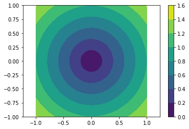
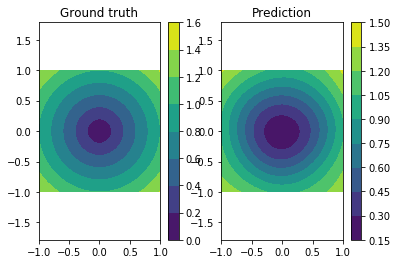

NNabla Python API Demonstration Tutorial
========================================

Let us import nnabla first, and some additional useful tools.

.. code-block:: python2

    import nnabla as nn  # Abbreviate as nn for convenience.
    
    import numpy as np
    %matplotlib inline
    import matplotlib.pyplot as plt

.. parsed-literal::

    2017-06-26 23:11:00,013 [nnabla][INFO]: Initializing CPU extension...

NdArray
-------

NdArray is a data container of a multi-dimensional array. NdArray is
device (e.g. CPU, CUDA) and type (e.g. uint8, float32) agnostic, in
which both type and device are implicitly casted or transferred when it
is used. Below, you create a NdArray with a shape of ``(2, 3, 4)``.

.. code-block:: python2

    a = nn.NdArray((2, 3, 4))

You can see the values held inside ``a`` by the following. The values
are not initialized, and are created as float32 by default.

.. code-block:: python2

    print a.data

.. parsed-literal::

    [[[ -8.57284198e+09   4.56907377e-41  -8.57284198e+09   4.56907377e-41]
      [  0.00000000e+00   0.00000000e+00   0.00000000e+00   0.00000000e+00]
      [  0.00000000e+00   0.00000000e+00   0.00000000e+00   0.00000000e+00]]
    
     [[  0.00000000e+00   0.00000000e+00   0.00000000e+00   0.00000000e+00]
      [  0.00000000e+00   0.00000000e+00   6.74024561e-43   0.00000000e+00]
      [ -8.57256346e+09   4.56907377e-41  -8.57256346e+09   4.56907377e-41]]]

The accessor ``.data`` returns a reference to the values of NdArray as
``numpy.ndarray``. You can modify these by using the Numpy API as
follows.

.. code-block:: python2

    print '[Substituting random values]'
    a.data = np.random.randn(*a.shape)
    print a.data
    print '[Slicing]'
    a.data[0, :, ::2] = 0
    print a.data

.. parsed-literal::

    [Substituting random values]
    [[[-0.44771791  0.37770718  0.13974769 -0.7574079 ]
      [-0.69822484  0.72812998  0.65710258  1.39894378]
      [ 2.45816112  0.14256425 -0.10612717  0.37355551]]
    
     [[-1.26604652 -1.17278957  0.93183202 -1.35603702]
      [-0.37144065 -0.10313081 -0.89111573 -1.47255397]
      [ 0.62756163 -0.6097846   1.48144531  0.41393015]]]
    [Slicing]
    [[[ 0.          0.37770718  0.         -0.7574079 ]
      [ 0.          0.72812998  0.          1.39894378]
      [ 0.          0.14256425  0.          0.37355551]]
    
     [[-1.26604652 -1.17278957  0.93183202 -1.35603702]
      [-0.37144065 -0.10313081 -0.89111573 -1.47255397]
      [ 0.62756163 -0.6097846   1.48144531  0.41393015]]]

Note that the above operation is all done in the host device (CPU).
NdArray provides more efficient functions in case you want to fill all
values with a constant, ``.zero`` and ``.fill``. They are lazily
evaluated when the data is requested (when neural network computation
requests the data, or when numpy array is requested by Python) The
filling operation is executed within a specific device (e.g. CUDA GPU),
and more efficient if you specify the device setting, which we explain
later.

.. code-block:: python2

    a.fill(1)  # Filling all values with one.
    print a.data

.. parsed-literal::

    [[[ 1.  1.  1.  1.]
      [ 1.  1.  1.  1.]
      [ 1.  1.  1.  1.]]
    
     [[ 1.  1.  1.  1.]
      [ 1.  1.  1.  1.]
      [ 1.  1.  1.  1.]]]

You can create an NdArray instance directly from a Numpy array object.

.. code-block:: python2

    b = nn.NdArray.from_numpy_array(np.ones(a.shape))
    print b.data

.. parsed-literal::

    [[[ 1.  1.  1.  1.]
      [ 1.  1.  1.  1.]
      [ 1.  1.  1.  1.]]
    
     [[ 1.  1.  1.  1.]
      [ 1.  1.  1.  1.]
      [ 1.  1.  1.  1.]]]

NdArray is used in Variable class, as well as NNabla's imperative
computation of neural networks. We describe them in the later sections.

Variable
--------

Variable class is used when you construct a neural network. The neural
network can be described as a graph in which an edge represents a
function (a.k.a operator and layer) which defines operation of a minimum
unit of computation, and a node represents a variable which holds
input/output values of a function (Function class is explained later).
The graph is called "Computation Graph".

In NNabla, a Variable, a node of a computation graph, holds two
``NdArray``\ s, one for storing the input or output values of a function
during forward propagation (executing computation graph in the forward
order), while another for storing the backward error signal (gradient)
during backward propagation (executing computation graph in backward
order to propagate error signals down to parameters (weights) of neural
networks). The first one is called ``data``, the second is ``grad`` in
NNabla.

The following line creates a Variable instance with a shape of (2, 3,
4). It has ``data`` and ``grad`` as ``NdArray``. The flag ``need_grad``
is used to omit unnecessary gradient computation during backprop if set
to False.

.. code-block:: python2

    x = nn.Variable([2, 3, 4], need_grad=True)
    print 'x.data:', x.data
    print 'x.grad:', x.grad

.. parsed-literal::

    x.data: <NdArray((2, 3, 4)) at 0x7f5e93877120>
    x.grad: <NdArray((2, 3, 4)) at 0x7f5e93877120>

You can get the shape by:

.. code-block:: python2

    x.shape

.. parsed-literal::

    (2, 3, 4)

Since both ``data`` and ``grad`` are ``NdArray``, you can get a
reference to its values as NdArray with the ``.data`` accessor, but also
it can be refered by ``.d`` or ``.g`` property for ``data`` and ``grad``
respectively.

.. code-block:: python2

    print 'x.data'
    print x.d
    x.d = 1.2345  # To avoid NaN
    assert np.all(x.d == x.data.data), 'd: {} != {}'.format(x.d, x.data.data)
    print 'x.grad'
    print x.g
    x.g = 1.2345  # To avoid NaN
    assert np.all(x.g == x.grad.data), 'g: {} != {}'.format(x.g, x.grad.data)
    
    # Zeroing grad values
    x.grad.zero()
    print 'x.grad (after `.zero()`)'
    print x.g

.. parsed-literal::

    x.data
    [[[ -8.57293210e+09   4.56907377e-41  -8.57293210e+09   4.56907377e-41]
      [             nan   4.56907377e-41   1.09979112e+27   1.83946147e+25]
      [  1.69275966e+22   4.80112800e+30   1.21230330e+25   7.22962302e+31]]
    
     [[  1.10471027e-32   4.63080422e+27   2.44632805e+20   2.87606258e+20]
      [  4.46263300e+30   4.62311881e+30   7.65000750e+28   3.01339003e+29]
      [  2.08627352e-10   1.03903997e+21   2.46406626e+32   6.74187108e+22]]]
    x.grad
    [[[ -8.57288294e+09   4.56907377e-41  -8.57288294e+09   4.56907377e-41]
      [             nan   0.00000000e+00   1.09979112e+27   1.83946147e+25]
      [  1.69275966e+22   4.80112800e+30   1.21230330e+25   7.22962302e+31]]
    
     [[  1.10471027e-32   4.63080422e+27   2.44632805e+20   2.87606258e+20]
      [  4.46263300e+30   4.62311881e+30   7.65000750e+28   3.01339003e+29]
      [  2.08627352e-10   1.03903997e+21   2.46406626e+32   6.74187108e+22]]]
    x.grad (after `.zero()`)
    [[[ 0.  0.  0.  0.]
      [ 0.  0.  0.  0.]
      [ 0.  0.  0.  0.]]
    
     [[ 0.  0.  0.  0.]
      [ 0.  0.  0.  0.]
      [ 0.  0.  0.  0.]]]

Like ``NdArray``, a ``Variable`` can also be created from Numpy
array(s).

.. code-block:: python2

    x2 = nn.Variable.from_numpy_array(np.ones((3,)), need_grad=True)
    print x2
    print x2.d
    x3 = nn.Variable.from_numpy_array(np.ones((3,)), np.zeros((3,)), need_grad=True)
    print x3
    print x3.d
    print x3.g

.. parsed-literal::

    <Variable((3,), need_grad=True) at 0x7f5e9387e258>
    [ 1.  1.  1.]
    <Variable((3,), need_grad=True) at 0x7f5e9387ec18>
    [ 1.  1.  1.]
    [ 0.  0.  0.]

Besides storing values of a computation graph, pointing a parent edge
(function) to trace the computation graph is an important role. Here
``x`` doesn't have any connection. Therefore, the ``.parent`` property
returns None.

.. code-block:: python2

    print x.parent

.. parsed-literal::

    None

Function
--------

A function defines a operation block of a computation graph as we
described above. The module ``nnabla.functions`` offers various
functions (e.g. Convolution, Affine and ReLU). You can see the list of
functions available in the `API reference
guide <http://nnabla.readthedocs.io/en/latest/python/api/function.html#module-nnabla.functions>`__.

.. code-block:: python2

    import nnabla.functions as F

As an example, here you will defines a computation graph that computes
the element-wise Sigmoid function outputs for the input variable and
sums up all values into a scalar. (This is simple enough to explain how
it behaves but a meaningless example in the context of neural network
training. We will show you a neural network example later.)

.. code-block:: python2

    sigmoid_output = F.sigmoid(x)
    sum_output = F.reduce_sum(sigmoid_output)

The function API in ``nnabla.functions`` takes one (or several)
Variable(s) and arguments (if any), and returns one (or several) output
Variable(s). The ``.parent`` points to the function instance which
created it. Note that no computation occurs at this time since we just
define the graph. (This is the default behavior of NNabla computation
graph API. You can also fire actual computation during graph definition
which we call "Dynamic mode" (explained later)).

.. code-block:: python2

    print "sigmoid_output.parent.name:", sigmoid_output.parent.name
    print "x:", x
    print "sigmoid_output.parent.inputs refers to x:", sigmoid_output.parent.inputs

.. parsed-literal::

    sigmoid_output.parent.name: Sigmoid
    x: <Variable((2, 3, 4), need_grad=True) at 0x7f5e9387e2c0>
    sigmoid_output.parent.inputs refers to x: [<Variable((2, 3, 4), need_grad=True) at 0x7f5e935a48d8>]

.. code-block:: python2

    print "sum_output.parent.name:", sum_output.parent.name
    print "sigmoid_output:", sigmoid_output
    print "sum_output.parent.inputs refers to sigmoid_output:", sum_output.parent.inputs

.. parsed-literal::

    sum_output.parent.name: ReduceSum
    sigmoid_output: <Variable((2, 3, 4), need_grad=True) at 0x7f5e935a46d0>
    sum_output.parent.inputs refers to sigmoid_output: [<Variable((2, 3, 4), need_grad=True) at 0x7f5e935a4940>]

The ``.forward()`` at a leaf Variable executes the forward pass
computation in the computation graph.

.. code-block:: python2

    sum_output.forward()
    print "CG output:", sum_output.d
    print "Reference:", np.sum(1.0 / (1.0 + np.exp(-x.d)))

.. parsed-literal::

    CG output: 18.5905208588
    Reference: 18.5905

The ``.backward()`` does the backward propagation through the graph.
Here we initialize the ``grad`` values as zero before backprop since the
NNabla backprop algorithm always accumulates the gradient in the root
variables.

.. code-block:: python2

    x.grad.zero()
    sum_output.backward()
    print "d sum_o / d sigmoid_o:"
    print sigmoid_output.g
    print "d sum_o / d x:"
    print x.g

.. parsed-literal::

    d sum_o / d sigmoid_o:
    [[[ 1.  1.  1.  1.]
      [ 1.  1.  1.  1.]
      [ 1.  1.  1.  1.]]
    
     [[ 1.  1.  1.  1.]
      [ 1.  1.  1.  1.]
      [ 1.  1.  1.  1.]]]
    d sum_o / d x:
    [[[ 0.17459197  0.17459197  0.17459197  0.17459197]
      [ 0.17459197  0.17459197  0.17459197  0.17459197]
      [ 0.17459197  0.17459197  0.17459197  0.17459197]]
    
     [[ 0.17459197  0.17459197  0.17459197  0.17459197]
      [ 0.17459197  0.17459197  0.17459197  0.17459197]
      [ 0.17459197  0.17459197  0.17459197  0.17459197]]]

NNabla is developed by mainly focused on neural network training and
inference. Neural networks have parameters to be learned associated with
computation blocks such as Convolution, Affine (a.k.a. fully connected,
dense etc.). In NNabla, the learnable parameters are also represented as
``Variable`` objects. Just like input variables, those parameter
variables are also used by passing into ``Function``\ s. For example,
Affine function takes input, weights and biases as inputs.

.. code-block:: python2

    x = nn.Variable([5, 2])  # Input
    w = nn.Variable([2, 3], need_grad=True)  # Weights
    b = nn.Variable([3], need_grad=True)  # Biases
    affine_out = F.affine(x, w, b)  # Create a graph including only affine

The above example takes an input with B=5 (batchsize) and D=2
(dimensions) and maps it to D'=3 outputs, i.e. (B, D') output.

You may also notice that here you set ``need_grad=True`` only for
parameter variables (w and b). The x is a non-parameter variable and the
root of computation graph. Therefore, it doesn't require gradient
computation. In this configuration, the gradient computation for x is
not executed in the first affine, which will omit the computation of
unnecessary backpropagation.

The next block sets data and initializes grad, then applies forward and
backward computation.

.. code-block:: python2

    # Set random input and parameters
    x.d = np.random.randn(*x.shape)
    w.d = np.random.randn(*w.shape)
    b.d = np.random.randn(*b.shape)
    # Initialize grad
    x.grad.zero()  # Just for showing gradients are not computed when need_grad=False (default).
    w.grad.zero()
    b.grad.zero()
    
    # Forward and backward
    affine_out.forward()
    affine_out.backward()
    # Note: Calling backward at non-scalar Variable propagates 1 as error message from all element of outputs. .

You can see that affine\_out holds an output of Affine.

.. code-block:: python2

    print 'F.affine'
    print affine_out.d
    print 'Reference'
    print np.dot(x.d, w.d) + b.d

.. parsed-literal::

    F.affine
    [[-0.12508428  0.78213298 -0.31685624]
     [-2.05011082 -0.40075728 -0.22697631]
     [-1.75955343  1.1205312  -0.4265328 ]
     [-1.03893924 -0.40710089 -0.18724398]
     [-2.58731937 -2.25192761  0.00879636]]
    Reference
    [[-0.12508428  0.78213304 -0.31685624]
     [-2.05011082 -0.40075728 -0.22697631]
     [-1.75955343  1.1205312  -0.4265328 ]
     [-1.03893924 -0.40710089 -0.18724398]
     [-2.58731937 -2.25192761  0.00879636]]

The resulting gradients of weights and biases are as follows.

.. code-block:: python2

    print "dw"
    print w.g
    print "db"
    print b.g

.. parsed-literal::

    dw
    [[ 1.40481603  1.40481603  1.40481603]
     [-0.10959685 -0.10959685 -0.10959685]]
    db
    [ 5.  5.  5.]

The gradient of ``x`` is not changed because ``need_grad`` is set as
False.

.. code-block:: python2

    print x.g

.. parsed-literal::

    [[ 0.  0.]
     [ 0.  0.]
     [ 0.  0.]
     [ 0.  0.]
     [ 0.  0.]]

Parametric Function
-------------------

Considering parameters as inputs of ``Function`` enhances expressiveness
and flexibility of computation graphs. However, to define all parameters
for each learnable function is annoying for users to define a neural
network. In NNabla, trainable models are usually created by composing
functions that have optimizable parameters. These functions are called
"Parametric Functions". The Parametric Function API provides various
parametric functions and an interface for composing trainable models.

To use parametric functions, import:

.. code-block:: python2

    import nnabla.parametric_functions as PF

The function with optimizable parameter can be created as below.

.. code-block:: python2

    with nn.parameter_scope("affine1"):
        c1 = PF.affine(x, 3)

The first line creates a **parameter scope**. The second line then
applies ``PF.affine`` - an affine transform - to ``x``, and creates a
variable ``c1`` holding that result. The parameters are created and
initialized randomly at function call, and registered by a name
"affine1" using ``parameter_scope`` context. The function
``nnabla.get_parameters()`` allows to get the registered parameters.

.. code-block:: python2

    nn.get_parameters()

.. parsed-literal::

    OrderedDict([('affine1/affine/W',
                  <Variable((2, 3), need_grad=True) at 0x7f5e91557120>),
                 ('affine1/affine/b',
                  <Variable((3,), need_grad=True) at 0x7f5e91557188>)])

The ``name=`` argument of any PF function creates the equivalent
parameter space to the above definition of ``PF.affine`` transformation
as below. It could save the space of your Python code. The
``nnabla.parametric_scope`` is more useful when you group multiple
parametric functions such as Convolution-BatchNormalization found in a
typical unit of CNNs.

.. code-block:: python2

    c1 = PF.affine(x, 3, name='affine1')
    nn.get_parameters()

.. parsed-literal::

    OrderedDict([('affine1/affine/W',
                  <Variable((2, 3), need_grad=True) at 0x7f5e91557120>),
                 ('affine1/affine/b',
                  <Variable((3,), need_grad=True) at 0x7f5e91557188>)])

It is worth noting that the shapes of both outputs and parameter
variables (as you can see above) are automatically determined by only
providing the output size of affine transformation(in the example above
the output size is 3). This helps to create a graph in an easy way.

.. code-block:: python2

    c1.shape

.. parsed-literal::

    (5, 3)

Parameter scope can be nested as follows (although a meaningless
example).

.. code-block:: python2

    with nn.parameter_scope('foo'):
        h = PF.affine(x, 3)
        with nn.parameter_scope('bar'):
            h = PF.affine(h, 4)

This creates the following.

.. code-block:: python2

    nn.get_parameters()

.. parsed-literal::

    OrderedDict([('affine1/affine/W',
                  <Variable((2, 3), need_grad=True) at 0x7f5e91557120>),
                 ('affine1/affine/b',
                  <Variable((3,), need_grad=True) at 0x7f5e91557188>),
                 ('foo/affine/W',
                  <Variable((2, 3), need_grad=True) at 0x7f5e915574c8>),
                 ('foo/affine/b',
                  <Variable((3,), need_grad=True) at 0x7f5e91557530>),
                 ('foo/bar/affine/W',
                  <Variable((3, 4), need_grad=True) at 0x7f5e91557600>),
                 ('foo/bar/affine/b',
                  <Variable((4,), need_grad=True) at 0x7f5e91557668>)])

Also, ``get_parameters()`` can be used in ``parameter_scope``. For
example:

.. code-block:: python2

    with nn.parameter_scope("foo"):
        print nn.get_parameters()

.. parsed-literal::

    OrderedDict([('affine/W', <Variable((2, 3), need_grad=True) at 0x7f5e915574c8>), ('affine/b', <Variable((3,), need_grad=True) at 0x7f5e91557530>), ('bar/affine/W', <Variable((3, 4), need_grad=True) at 0x7f5e91557600>), ('bar/affine/b', <Variable((4,), need_grad=True) at 0x7f5e91557668>)])

``nnabla.clear_parameters()`` can be used to delete registered
parameters under the scope.

.. code-block:: python2

    with nn.parameter_scope("foo"):
        nn.clear_parameters()
    print nn.get_parameters()

.. parsed-literal::

    OrderedDict([('affine1/affine/W', <Variable((2, 3), need_grad=True) at 0x7f5e91557120>), ('affine1/affine/b', <Variable((3,), need_grad=True) at 0x7f5e91557188>)])

MLP Example For Explanation
---------------------------

The following block creates a computation graph to predict one
dimensional output from two dimensional inputs by a 2 layer fully
connected neural network (multi-layer perceptron).

.. code-block:: python2

    nn.clear_parameters()
    batchsize = 16
    x = nn.Variable([batchsize, 2])
    with nn.parameter_scope("fc1"):
        h = F.tanh(PF.affine(x, 512))
    with nn.parameter_scope("fc2"):
        y = PF.affine(h, 1)
    print "Shapes:", h.shape, y.shape

.. parsed-literal::

    Shapes: (16, 512) (16, 1)

This will create the following parameter variables.

.. code-block:: python2

    nn.get_parameters()

.. parsed-literal::

    OrderedDict([('fc1/affine/W',
                  <Variable((2, 512), need_grad=True) at 0x7f5e915578d8>),
                 ('fc1/affine/b',
                  <Variable((512,), need_grad=True) at 0x7f5e91557870>),
                 ('fc2/affine/W',
                  <Variable((512, 1), need_grad=True) at 0x7f5e91557598>),
                 ('fc2/affine/b',
                  <Variable((1,), need_grad=True) at 0x7f5e91557a10>)])

As described above, you can execute the forward pass by calling forward
method at the terminal variable.

.. code-block:: python2

    x.d = np.random.randn(*x.shape)  # Set random input
    y.forward()
    print y.d

.. parsed-literal::

    [[-0.11192071]
     [ 0.01330618]
     [-0.09277273]
     [ 0.02282887]
     [-0.13924919]
     [ 0.06651091]
     [ 0.00193427]
     [-0.04056951]
     [-0.01993009]
     [ 0.05051719]
     [-0.04514493]
     [ 0.07883289]
     [ 0.03532286]
     [-0.00734853]
     [ 0.04141491]
     [ 0.05428782]]

Training a neural networks needs a loss value to be minimized by
gradient descent with backpop. In NNabla, loss function is also a just
function, and packaged in the functions module.

.. code-block:: python2

    # Variable for label
    label = nn.Variable([batchsize, 1])
    # Set loss
    loss = F.reduce_mean(F.squared_error(y, label))
    
    # Execute forward pass.
    label.d = np.random.randn(*label.shape)  # Randomly generate labels
    loss.forward()
    print loss.d

.. parsed-literal::

    0.605832397938

As you've seen above, NNabla ``backward`` accumulates the gradients at
the root variables. You have to initialize the grad of the parameter
variables before backprop (We will show you the easiest way with
``Solver`` API).

.. code-block:: python2

    # Collect all parameter variables and init grad.
    for name, param in nn.get_parameters().items():
        param.grad.zero()
    # Grdients are accumulated to grad of params.
    loss.backward()

Imperative Mode
---------------

After performing backprop, gradients are held in parameter variable
grads. The next block will update the parameters with vanilla gradient
descent.

.. code-block:: python2

    for name, param in nn.get_parameters().items():
        F.sub2(param.data, F.mul_scalar(param.grad, 0.001), outputs=[param.data])  # 0.001 as learning rate

The above computation is an example of NNabla's "Imperative Mode" of
execution of neural networks. If any input of a function takes an
``NdArray``, the function computation will be fired immediately, and
returns NdArray(s) as output(s). Hence, the "Imperative mode" doesn't
create a computation graph, and can be used like Numpy with device
acceleration (if CUDA etc is enabled). Parametric functions can also be
used with NdArray input(s). The following block demonstrates a simple
imperative execution example.

.. code-block:: python2

    # A simple example of imperative mode.
    xi = nn.NdArray((2, 2))
    xi.data = np.arange(4).reshape(2, 2) - 1
    yi = F.relu(xi)
    print xi.data
    print yi.data

.. parsed-literal::

    [[-1.  0.]
     [ 1.  2.]]
    [[ 0.  0.]
     [ 1.  2.]]

Solver
------

NNabla provides stochastic gradient descent algorithms to optimize
parameters listed in the ``nnabla.solvers`` module. The parameter
updates demonstrated above can be replaced with this Solver API, which
is easier and usually faster.

.. code-block:: python2

    from nnabla import solvers as S
    solver = S.Sgd(lr=0.00001)
    solver.set_parameters(nn.get_parameters())

.. code-block:: python2

    # Set random data
    x.d = np.random.randn(*x.shape)
    label.d = np.random.randn(*label.shape)
    
    # Forward
    loss.forward()

Just call the the following solver method to fill zero grad region, then
backprop

.. code-block:: python2

    solver.zero_grad()
    loss.backward()

The following block updates parameters with the Vanilla Sgd rule
(equivalent to the imperative example above).

.. code-block:: python2

    solver.update()

Toy Problem To Demonstrate Training
-----------------------------------

The following function defines a regression problem which computes the
norm of a vector.

.. code-block:: python2

    def vector2length(x):
        # x : [B, 2] where B is number of samples.
        return np.sqrt(np.sum(x ** 2, axis=1, keepdims=True))

We visualize this mapping with the contour plot by matplotlib as
follows.

.. code-block:: python2

    # Data for plotting contour on a grid data.
    xs = np.linspace(-1, 1, 100)
    ys = np.linspace(-1, 1, 100)
    grid = np.meshgrid(xs, ys)
    X = grid[0].flatten()
    Y = grid[1].flatten()
    
    def plot_true():
        """Plotting contour of true mapping from a grid data created above."""
        plt.contourf(xs, ys, vector2length(np.hstack([X[:, None], Y[:, None]])).reshape(100, 100))
        plt.axis('equal')
        plt.colorbar()
        
    plot_true()

We define a deep prediction neural network.

.. code-block:: python2

    def length_mlp(x):
        h = x
        for i, hnum in enumerate([4, 8, 4, 2]):
            h = F.tanh(PF.affine(h, hnum, name="fc{}".format(i)))
        y = PF.affine(h, 1, name='fc')
        return y

.. code-block:: python2

    nn.clear_parameters()
    batchsize = 100
    x = nn.Variable([batchsize, 2])
    y = length_mlp(x)
    label = nn.Variable([batchsize, 1])
    loss = F.reduce_mean(F.squared_error(y, label))

We created a 5 layers deep MLP using for-loop. Note that only 3 lines of
the code pottentially create infinitely deep neural networks. The next
block adds helper functions to visialize the learned function.

.. code-block:: python2

    def predict(inp):
        ret = []
        for i in range(0, inp.shape[0], x.shape[0]):
            xx = inp[i:i + x.shape[0]]
            # Imperative execution
            xi = nn.NdArray.from_numpy_array(xx)
            yi = length_mlp(xi)
            ret.append(yi.data.copy())
        return np.vstack(ret)
    
    def plot_prediction():
        plt.contourf(xs, ys, predict(np.hstack([X[:, None], Y[:, None]])).reshape(100, 100))
        plt.colorbar()
        plt.axis('equal')

Next we instantiate a solver object as follows. We use Adam optimizer
which is one of the most popular SGD algorithm used in the literature.

.. code-block:: python2

    from nnabla import solvers as S
    solver = S.Adam(alpha=0.01)
    solver.set_parameters(nn.get_parameters())

The following function generates data from the true system infinitely.

.. code-block:: python2

    def random_data_provider(n):
        x = np.random.uniform(-1, 1, size=(n, 2))
        y = vector2length(x)
        return x, y

In the next block, we run 2000 training steps (SGD updates).

.. code-block:: python2

    num_iter = 2000
    for i in range(num_iter):
        # Sample data and set them to input variables of training. 
        xx, ll = random_data_provider(batchsize)
        x.d = xx
        label.d = ll
        # Forward propagation given inputs.
        loss.forward(clear_no_need_grad=True)
        # Parameter gradients initialization and gradients computation by backprop.
        solver.zero_grad()
        loss.backward(clear_buffer=True)
        # Apply weight decay and update by Adam rule.
        solver.weight_decay(1e-6)
        solver.update()
        # Just print progress.
        if i % 100 == 0 or i == num_iter - 1:
            print "Loss@{:4d}: {}".format(i, loss.d)

.. parsed-literal::

    Loss@   0: 1.41921281815
    Loss@ 100: 0.0575609095395
    Loss@ 200: 0.0476776212454
    Loss@ 300: 0.00250923167914
    Loss@ 400: 0.00137762445956
    Loss@ 500: 0.00102305703331
    Loss@ 600: 0.000931202783249
    Loss@ 700: 0.00154988327995
    Loss@ 800: 0.00154625205323
    Loss@ 900: 0.00146807299461
    Loss@1000: 0.000928562716581
    Loss@1100: 0.000884895969648
    Loss@1200: 0.00086419924628
    Loss@1300: 0.000785566866398
    Loss@1400: 0.000894531258382
    Loss@1500: 0.00105767603964
    Loss@1600: 0.000928580528125
    Loss@1700: 0.00119259918574
    Loss@1800: 0.000793418090325
    Loss@1900: 0.000500827969518
    Loss@1999: 0.000929419475142

**Memory usage optimization**: You may notice that, in the above
updates, ``.forward()`` is called with the ``clear_no_need_grad=``
option, and ``.backward()`` is called with the ``clear_buffer=`` option.
Training of neural network in more realistic scenarios usually consumes
huge memory due to the nature of backpropagation algorithm, in which all
of the forward variable buffer ``data`` should be kept in order to
compute the gradient of a function. In a naive implementation, we keep
all the variable ``data`` and ``grad`` living until the ``NdArray``
objects are not referenced (i.e. the graph is deleted). The ``clear_*``
options in ``.forward()`` and ``.backward()`` enables to save memory
consumptions due to that by clearing (erasing) memory of ``data`` and
``grad`` when it is not referenced by any subsequent computation. (More
precisely speaking, it doesn't free memory actually. We use our memory
pool engine by default to avoid memory alloc/free overhead). The
unreferenced buffers can be re-used in subequent computation. See the
document of ``Variable`` for more details. Note that the following
``loss.forward(clear_buffer=True)`` clears ``data`` of any intermediate
variables. If you are interested in intermediate variables for some
purposes (e.g. debug, log), you can use the ``.persistent`` flag to
prevent clearing buffer of a specific ``Variable`` like below.

.. code-block:: python2

    loss.forward(clear_buffer=True)
    print "The prediction `y` is cleared because it's an intermedicate variable."
    print y.d.flatten()[:4]  # to save space show only 4 values
    y.persistent = True
    loss.forward(clear_buffer=True)
    print "The prediction `y` is kept by the persistent flag."
    print y.d.flatten()[:4]  # to save space show only 4 value

.. parsed-literal::

    The prediction `y` is cleared because it's an intermedicate variable.
    [ 0.00010636  0.00016095  0.00029495  0.00013584]
    The prediction `y` is kept by the persistent flag.
    [ 1.00525522  0.70511746  0.72825861  0.62030995]

We can confirm the prediction performs fairly well by looking at the
following visualization of the ground truth and prediction function.

.. code-block:: python2

    plt.subplot(121)
    plt.title("Ground truth")
    plot_true()
    plt.subplot(122)
    plt.title("Prediction")
    plot_prediction()

You can save learned parameters by ``nnabla.save_parameters`` and load
by ``nnabla.load_parameters``.

.. code-block:: python2

    path_param = "param-vector2length.h5"
    nn.save_parameters(path_param)
    # Remove all once
    nn.clear_parameters()
    nn.get_parameters()

.. parsed-literal::

    2017-06-26 23:11:07,458 [nnabla][INFO]: Parameter save (hdf5): param-vector2length.h5

.. parsed-literal::

    OrderedDict()

.. code-block:: python2

    # Load again
    nn.load_parameters(path_param)
    print '\n'.join(map(str, nn.get_parameters().items()))

.. parsed-literal::

    2017-06-26 23:11:07,624 [nnabla][INFO]: Parameter load (<built-in function format>): param-vector2length.h5

.. parsed-literal::

    (u'fc0/affine/W', <Variable((2, 4), need_grad=True) at 0x7f5e91569808>)
    (u'fc0/affine/b', <Variable((4,), need_grad=True) at 0x7f5e91569738>)
    (u'fc1/affine/W', <Variable((4, 8), need_grad=True) at 0x7f5e91569870>)
    (u'fc1/affine/b', <Variable((8,), need_grad=True) at 0x7f5e91569600>)
    (u'fc2/affine/W', <Variable((8, 4), need_grad=True) at 0x7f5e915697a0>)
    (u'fc2/affine/b', <Variable((4,), need_grad=True) at 0x7f5e91569668>)
    (u'fc3/affine/W', <Variable((4, 2), need_grad=True) at 0x7f5e915696d0>)
    (u'fc3/affine/b', <Variable((2,), need_grad=True) at 0x7f5e91569390>)
    (u'fc/affine/W', <Variable((2, 1), need_grad=True) at 0x7f5e91569598>)
    (u'fc/affine/b', <Variable((1,), need_grad=True) at 0x7f5e9120ace8>)

Both save and load functions can also be used in a parameter scope.

.. code-block:: python2

    with nn.parameter_scope('foo'):
        nn.load_parameters(path_param)
    print '\n'.join(map(str, nn.get_parameters().items()))

.. parsed-literal::

    2017-06-26 23:11:07,747 [nnabla][INFO]: Parameter load (<built-in function format>): param-vector2length.h5

.. parsed-literal::

    (u'fc0/affine/W', <Variable((2, 4), need_grad=True) at 0x7f5e91569808>)
    (u'fc0/affine/b', <Variable((4,), need_grad=True) at 0x7f5e91569738>)
    (u'fc1/affine/W', <Variable((4, 8), need_grad=True) at 0x7f5e91569870>)
    (u'fc1/affine/b', <Variable((8,), need_grad=True) at 0x7f5e91569600>)
    (u'fc2/affine/W', <Variable((8, 4), need_grad=True) at 0x7f5e915697a0>)
    (u'fc2/affine/b', <Variable((4,), need_grad=True) at 0x7f5e91569668>)
    (u'fc3/affine/W', <Variable((4, 2), need_grad=True) at 0x7f5e915696d0>)
    (u'fc3/affine/b', <Variable((2,), need_grad=True) at 0x7f5e91569390>)
    (u'fc/affine/W', <Variable((2, 1), need_grad=True) at 0x7f5e91569598>)
    (u'fc/affine/b', <Variable((1,), need_grad=True) at 0x7f5e9120ace8>)
    (u'foo/fc0/affine/W', <Variable((2, 4), need_grad=True) at 0x7f5ea7e59ae0>)
    (u'foo/fc0/affine/b', <Variable((4,), need_grad=True) at 0x7f5ea7e59b48>)
    (u'foo/fc1/affine/W', <Variable((4, 8), need_grad=True) at 0x7f5ea7e59808>)
    (u'foo/fc1/affine/b', <Variable((8,), need_grad=True) at 0x7f5ea7e59c18>)
    (u'foo/fc2/affine/W', <Variable((8, 4), need_grad=True) at 0x7f5ea7e59c80>)
    (u'foo/fc2/affine/b', <Variable((4,), need_grad=True) at 0x7f5ea7e59ce8>)
    (u'foo/fc3/affine/W', <Variable((4, 2), need_grad=True) at 0x7f5ea7e59d50>)
    (u'foo/fc3/affine/b', <Variable((2,), need_grad=True) at 0x7f5ea7e59db8>)
    (u'foo/fc/affine/W', <Variable((2, 1), need_grad=True) at 0x7f5ea7e59bb0>)
    (u'foo/fc/affine/b', <Variable((1,), need_grad=True) at 0x7f5ea7e592c0>)

.. code-block:: python2

    !rm {path_param}  # Clean ups

