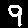

# C++ inference with MNIST classification model.

## Introduction

This example demonstrates the workflow to train a classification model in Python and to execute it in C++. Although this example is only tested on Ubuntu 16.04 so far, a similar procedure should work on the other operating systems with little effort to the build system depending on the OSs. We will add some of more useful examples in the near future.


# Install C++ libraries

Follow [the installation manual](http://nnabla.readthedocs.io/en/latest/cpp/installation.html).

Note: this example requires NNabla Python package installed.

## Train a classification model in Python
First, you run a Python training script provided in the MNIST example folder in order to get a trained model for MNIST digit classification.

```shell
# at examples/vision/mnist
python classification.py  # Optionally you can use -c cuda.cudnn option.
```

After training finishes, you can find a parameter file created in the `tmp.monitor` folder with name `lenet_params_010000.h5`

## Create NNP file

In order to execute your trained model on C++ code, the trained model parameters must be converted to a NNabla file format (NNP) with a network definition. NNabla file format can store the information of network definitions, parameters, and executor settings etc. We provide an example script which creates a NNP file from learned parameters and a Python script of model definition.

```shell
# at .
python save_nnp_classification.py
```

It reads parameter file, and creates a computation graph using loaded parameters. The computation graph is only used for dumping the network structure into NNP file.

```pyton
    runtime_contents = {
        'networks': [
            {'name': 'runtime',
             'batch_size': args.batch_size,
             'outputs': {'y': pred},
             'names': {'x': image}}],
        'executors': [
            {'name': 'runtime',
             'network': 'runtime',
             'data': ['x'],
             'output': ['y']}]}
    nn.utils.save.save(nnp_file, runtime_contents)
```
In the above code, the network structure containing parameters and the execution configuration is saved into the NNP file `lenet_010000.nnp`. The contents is described in a JSON like format. In the `netoworks` field, a newtork with a name `runtime`. It has a default batch size. The computation graph can be set by the output variable `pred` in the `outputs` field. At the same time, the output variable `pred` of the computation graph is registered as a name `y`. To query an input or intermediate variable in the computation graph via the C++ interface, you should set a filed `names` in a format of `{<name>: <Variable>}`.

The named variables are actually reference at the `executors` config. The executor config is used in C++ for executing network in a more simpler way. The executor `runtime` is added where the newtork `runtime` is executed. The input and output variables are specified by names that are registered in the `networks` field.

## Build MNIST inference example C++ code

```shell
make
```

The above command generates an executable `mnist_runtime` at the current directly.

The build file `GNUMakefile` is really simple. It links `libnnabla.so` and `libnnabla_utils.so` with the executable generated from `mnist_runtime.cpp`, and compiles with C++11 option `-std=c++11`.


## Execute handwritten digit classification

By running the generated example with no argument, you can see the usage documentation.

```shell
./mnist_runtime
```

Output:
```
Usage: ./mnist_runtime nnp_file input_pgm

Positional arguments: 
  nnp_file  : .nnp file created by examples/vision/mnist/save_nnp_classification.py.
  input_pgm : PGM (P5) file of a 28 x 28 image where pixel values < 256.
```

Sample images that I created using GIMP editor are located in this folder.

0 | 1 | 2 | 3 | 4 | 5 | 6 | 7 | 8 | 9 
:---:|:---:|:---:|:---:|:---:|:---:|:---:|:---:|:---:|:---:
|||||||||

The following command executes image classifiation with the trained model `lenet_010000.nnp` given an input image.


```shell
./mnist_runtime lenet_010000.nnp 5.pgm
```

The output shows it makes a prediction. In my case, it's correct.
```
Prediction scores: -24.1875 -14.0103 -13.2646 7.52215 -13.7401 31.1683 -0.501035 -4.69472 6.2626 1.87513
Prediction: 5
```

## Walk through the example code

1. Add include for the NNabla header files.
```c++
#include <nbla/logger.hpp>
#include <nbla_utils/nnp.hpp>
```

2. Create a execution engine context. Following configuration enables our cached (memory pool) cpu array as array backend.
```c++
nbla::Context ctx{"cpu", "CpuCachedArray", "0", "default"};
```

3. Create `Nnp` object with the default context.
```c++
nbla::utils::nnp::Nnp nnp(ctx);
```

4. Set nnp file to the `Nnp` object. It imediately parses the file format and stores the extracted info.
```c++
nnp.add(nnp_file);
```

5. Get an executor instance. The above `save_nnp_classification.py` script saved an executor named `runtime`.
```c++
auto executor = nnp.get_executor("runtime");
```

5. Overwrite batch size as 1. This example always takes input for each image.
```c++
executor->set_batch_size(1); // Use batch_size = 1.
```

6. Get input data as a CPU array. See [computation_graph/variable.hpp](../../../include/nbla/computation_graph/variable.hpp) and [variable.hpp](../../../include/nbla/variable.hpp) for API manual written in the headers.
```c++
nbla::CgVariablePtr x = executor->get_data_variables().at(0).variable;
uint8_t *data = x->variable()->cast_data_and_get_pointer<uint8_t>(ctx);
```

7. Read input pgm file and store image data into the CPU array. The `read_pgm_mnist` is implemented above the `main` function.
```c++
read_pgm_mnist(input_bin, data);
```

8. Execute prediction.
```c++
executor->execute();
```

9. Get output as an CPU array.
```c++
nbla::CgVariablePtr y = executor->get_output_variables().at(0).variable;
const float *y_data = y->variable()->get_data_pointer<float>(ctx);
```

10. Show prediction scores and the most likely predicted number of the input image. 
```c++
int prediction = 0;
float max_score = -1e10;
std::cout << "Prediction scores:";
for (int i = 0; i < 10; i++) {
  if (y_data[i] > max_score) {
	prediction = i;
	max_score = y_data[i];
  }
  std::cout << " " << std::setw(5) << y_data[i];
}
std::cout << std::endl;
std::cout << "Prediction: " << prediction << std::endl;
```


