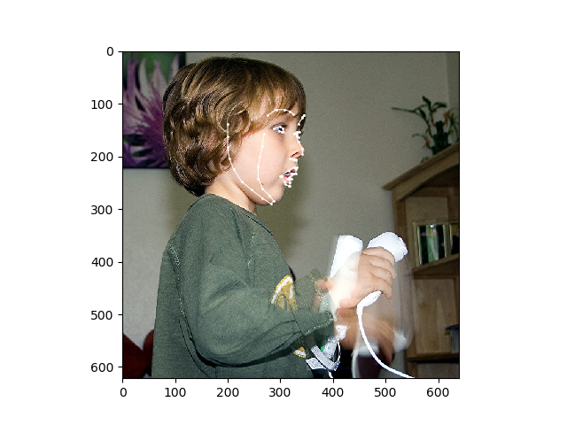
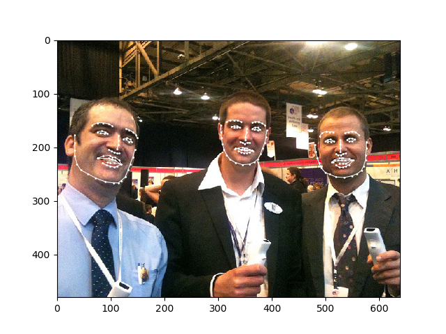

# FAN: Face-Alignment Network
This repository contains the code (in NNabla) for "[ How far are we from solving the 2D & 3D Face Alignment problem?](https://arxiv.org/abs/1703.07332)"
paper by [Adrian Bulat et al.](https://github.com/1adrianb/face-alignment).

## Introduction
This paper investigates how far a very deep neural network is from attaining close to saturating performance on existing 2D and 3D face alignment datasets. The paper provides following five contributions:
* Construct a very strong baseline by combining a state-of-the-art architecture for landmark localization with a state-of-the-art residual block, train it on a very large yet synthetically expanded 2D facial landmark dataset and finally evaluate it on all other 2D facial landmark datasets.
* Create a guided-by-2D landmarks network which converts 2D landmark annotations to 3D and unifies all existing datasets, leading to the creation of LS3D-W, the largest and most challenging 3D facial landmark dataset to date ~230,000 images.
* Train a neural network for 3D face alignment and evaluate it on the newly introduced LS3D-W.
* Introduce a "new" factor `size of the network`, affecting face alignment performance apart from large pose, initialization and resolution.
* Both 2D and 3D face alignment networks achieve performance of remarkable accuracy which is probably close to saturating the datasets used.

### Prerequisites

* torch == 1.4.0  
* dlib
* skimage
* opencv
* nnabla >= 1.5.0

### Inference

The pre-trained FAN models can be used to detect facial landmarks from a given facial image. Author's pre-trained weights converted to NNabla format can be downloaded from the below links:
### Pre-trained Weights :
| 2D-FAN |  3D-FAN |  ResNetDepth |
|---|---|---|
|[2D-FAN pre-trained weights](https://nnabla.org/pretrained-models/nnabla-examples/face-alignment/2DFAN4_NNabla_model.h5)|[3D-FAN pre-trained weights](https://nnabla.org/pretrained-models/nnabla-examples/face-alignment/3DFAN4_NNabla_model.h5)|[ResNetDepth pre-trained weights](https://nnabla.org/pretrained-models/nnabla-examples/face-alignment/Resnet_Depth_NNabla_model.h5)|

### Inference using the downloaded pre-trained weights.
Clone the nnabla-examples [repository](https://github.com/sony/nnabla-examples.git).
```
cd nnabla-examples/facial-keypoint-detection/face-alignment
```
Run the following command for inference using 2D-FAN
```
python model_inference.py --model {path to downloaded 2D-FAN NNabla weght file} --test-image {sample image} --output {path to output image}
```
Run the following command for inference using 3D-FAN
```
python model_inference.py --landmarks-type-3D --model {path to downloaded 3D-FAN NNabla weght file} --resnet-depth-model {path to downloaded ResNetDepth NNabla weght file} --test-image {path to input sample image} --output {path to output image}
```
### Inference using pre-trained weights provided by original authors
See the following [link](./authors_weights_inference.md) to use the original author's pre-trained weights for inference.
## Results obtained from 2D-FAN


## Results obtained from 3D-FAN


