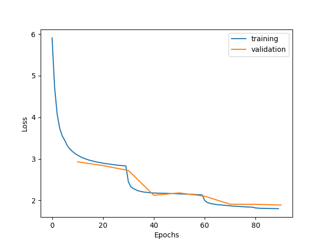
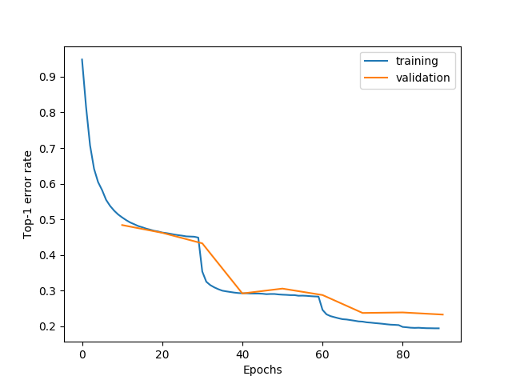

# ImageNet training examples


This is an official training example of [ImageNet ILSVRC2012](http://www.image-net.org/) classification with NNabla.
Note that the training completely relies on NVIDIA's GPUs, and uses NVIDIA's data processing library called [DALI](https://docs.nvidia.com/deeplearning/sdk/dali-developer-guide/docs/index.html) which runs only on Linux.

The previous implementation (with lower performance both in speed & accuracy) has been moved to [`obsolete/`](./obsolete).

## Setting up

### Clone repository

```shell
git clone git@github.com:sony/nnabla-examples.git
```

### Set up dependencies

We recommend you to follow [our Docker workflow](../doc/docker.md) to set up a training environment.
If you would like to manually install all the requirements, install the following.

* CUDA (10.0 is recommended)
* nnabla and a CUDA extension (with [multi-GPU](https://nnabla.readthedocs.io/en/latest/python/pip_installation_cuda.html#installation-with-multi-gpu-supported) support is recommended)
* [DALI](https://docs.nvidia.com/deeplearning/sdk/dali-developer-guide/docs/index.html) (works with 0.16 or higher)
* For distributed multi-GPU training:
  * OpenMPI
  * NCCL2


### Preparing ImageNet dataset

#### Download ILSVRC2012

(You can skip this part if you already have ILSVRC2012 dataset on your machine.)

Download archived image files for both training and validation, `ILSVRC2012_img_train.tar` and `ILSVRC2012_img_val.tar`, from [the download page](http://image-net.org/download-images) (registration is required), and extract files as following.

```bash
# cd to dataset root and set path to tar files
TRAIN_TAR=<path to tar>/ILSVRC2012_img_train.tar
VAL_TAR=<path to tar>/ILSVRC2012_img_val.tar

# Create a directory structure
# We will extract images to `train/{WordNet ID; e.g. n01440764}/`
tar tf $TRAIN_TAR | sed 's/.tar//g' | xargs -i mkdir -p train/{}

# Untar training images
tar xvf $TRAIN_TAR --to-command='tar xvf - -C train/${TAR_FILENAME%.*}'

# Untar validation images
mkdir val
tar xvf $VAL_TAR -C val
```

#### Create a image list file

Next, we create two text files which contain a list of image paths associated with their image category IDs. The files are used as inputs of the training script later. Run the following to obtain those.

```shell
python create_input_files.py -T <path/to/ILSVRC2012_img_train>
```

You are going to get the files like the following.

- train_label
```
n02172182/n02172182_4324.JPEG 625
n02172182/n02172182_6601.JPEG 625
n02172182/n02172182_1015.JPEG 625
n02172182/n02172182_3296.JPEG 625
...
```

- val_label
```
ILSVRC2012_val_00000001.JPEG 490
ILSVRC2012_val_00000002.JPEG 361
ILSVRC2012_val_00000003.JPEG 171
...
```

Note that the category IDs are ranging from 0 to 999, and the numbers are sequentially assigned by an alphabetical order of WordNet IDs (e.g., `n02172182`).

#
# Training

The following is a command used when we run distributed training with 4 V100 GPUs.

```shell
mpirun -n 4 python train.py \
  -a resnet50

  -b 192 \
  -t half --channel-last \
  -T <path/to/ILSVRC2012 training data directory> \
  -V <path/to/ILSVRC2012 validation data directory>
```

Training results including logs and parameters will be produced in `tmp.monitor.{datatime}`. Given the generated logs, you can visualize training curves of training loss and validation error as images by the following commands

```shell
nnabla_cli plot_series Train-loss.series.txt Validation-loss.series.txt -l training -l validation -o rn50-mixed-nhwc-loss.png -x Epochs -y "Loss"
nnabla_cli plot_series Train-error.series.txt Validation-error.series.txt -l training -l validation -o rn50-mixed-nhwc-error.png -x Epochs -y "Top-1 error rate"
```

and those look like as following.

| Loss | Error |
|:---:|:---:|
|  |  |


**Options**:

* `-a` specifies a network archicture type such as `'resnet50'` and `'se_resnext50'`.
* `-b` specifies the number of batch size. If you see memory allocation error during execution, please adjust this to fit your training into your GPU.
* `-t half` enables mixed precision training, which saves memory and also gives speedup with GPUs with NVIDIA's TensorCore.
* `--channel-last` trains your model with NHWC memory layout. This reduces overheads due to transpose operations for each TensorCore execution. It also utilizes fused batch normalization operation which combines batch normalization, addition, and activation into a single kernel. It gives some advantages for speed and memory cost.
* If you want to run it on a single GPU, just omit `mpirun -n 4`. You can specify gpu ID by `-d` option when single GPU mode.
* Run `python train.py -h` to see other options.

### Training results

Training results are summarized as follows.

| Arch. | GPUs | MP*1 | Batch size per GPU |Training time (h)*2 | Validation error (%) | Pretrained parameters | Note |
|:---:|:---:|:---:|:---:|:---:|:---:|:---:|:---|
| ResNet18 | 4 x V100 | Yes | 256 | 6.67 | 29.42 | [Download](https://nnabla.org/pretrained-models/nnabla-examples/ilsvrc2012/rn18-nhwc.h5) | |
| ResNet34 | 4 x V100 | Yes | 256 | 7.63 | 26.44 | [Download](https://nnabla.org/pretrained-models/nnabla-examples/ilsvrc2012/rn34-nhwc.h5) | |
| ResNet50 | 4 x V100 | Yes | 192 | 7.29 (3.19) | 23.28 | [Download](https://nnabla.org/pretrained-models/nnabla-examples/ilsvrc2012/rn50-nhwc.h5) | |
| ResNet101 | 4 x V100 | Yes | 128 | 10.85 | 21.89 | [Download](https://nnabla.org/pretrained-models/nnabla-examples/ilsvrc2012/rn101-nhwc.h5) | |
| ResNet152 | 4 x V100 | Yes | 96 | | | | Observed `NaN` loss after several epochs. We may need to adjust some hyper parameters for mixed precision and distributed training such as loss scaling value. |
| ResNet50 | 4 x V100 | No | 112 | 23.25 | 23.27 | [Download](https://nnabla.org/pretrained-models/nnabla-examples/ilsvrc2012/rn50-nchw.h5) | |
| ResNeXt50 | 4 x V100 | Yes | 96 | 11.85 | 22.46 | [Download](https://nnabla.org/pretrained-models/nnabla-examples/ilsvrc2012/resnext50_nhwc.h5) | |
| SE-ResNet50 | 4 x V100 | Yes | 128 | 13.04 | 22.77 | [Download](https://nnabla.org/pretrained-models/nnabla-examples/ilsvrc2012/se_resnet50_nhwc.h5) | *3 |
| SE-ResNeXt50 | 4 x V100 | Yes | 96 | 19.76 | 21.72 | [Download](https://nnabla.org/pretrained-models/nnabla-examples/ilsvrc2012/se_resnext50_nhwc.h5) | *3 |

* *1 Mixed precision training with NHWC layout  (`-t half --channel-last`).
* *2 Number in `()` is speed up from full precision training
* *3 You may notice that we got the higher error rate than the author's model found below. The author mentions that they trained their model "with more epoches" than models reported in the paper, but such kind of hyperparametes for training are not provided (not clearly described) in their repository. We may obtain a comparable result if we train the model with more epoches.

You can also find pretrained weights that are provided by some authors and converted to nnabla's weight format for performance evaluatation.

| Arch. | MP | Validation error (%) | Pretrained parameters | Author's page | Note |
|:---:|:---:|:---:|:---:|:---:|:---|
| SE-ResNet50 | No | 22.42 (22.37 *1) | [Download](https://nnabla.org/pretrained-models/nnabla-examples/ilsvrc2012/se_resnet50_by_author.h5) | [GitHub](https://github.com/hujie-frank/SENet) | Use `-n senet_author` in `infer.py` to specify how to normalize an input image. |
| SE-ResNeXt50 | No | 20.98 (20.97 *1) | [Download](https://nnabla.org/pretrained-models/nnabla-examples/ilsvrc2012/se_resnext50_by_author.h5) | [GitHub](https://github.com/hujie-frank/SENet) | Use `-n senet_author` in `infer.py` to specify how to normalize an input image. |

* *1 Numbers reported in [the author's repository](https://github.com/hujie-frank/SENet#trained-models).

### Convert memory layout and input channels of pretrained parameter file

You may want to change the memory layout of trained parameters from NHWC (trained with `channel_last=True`) to NCHW and vice versa, for fine-tuning on differnt tasks for example.
You may also want to the remove the 4-th channel in the first convolution which was padded to RGB input during training for speed advantage.

The following command converts a parameter file to a desired configuration.

```shell
python convert_parameter_format.py {input h5 file} {output h5 file} -m {layout either nchw or nhwc} -3
```

See options with `python convert_parameter_format.py -h`.


## Inference with a trained model

A parameter file obtained after training can be used for inference as following. See help with `python infer.py -h` for more options.

```shell
python infer.py {input image file} {h5 parameter file} -a {network architecture name such as `resnet50` and `se_resnext50}
```
