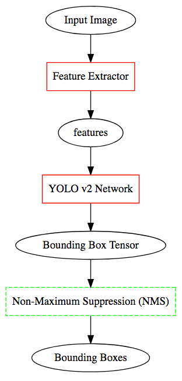
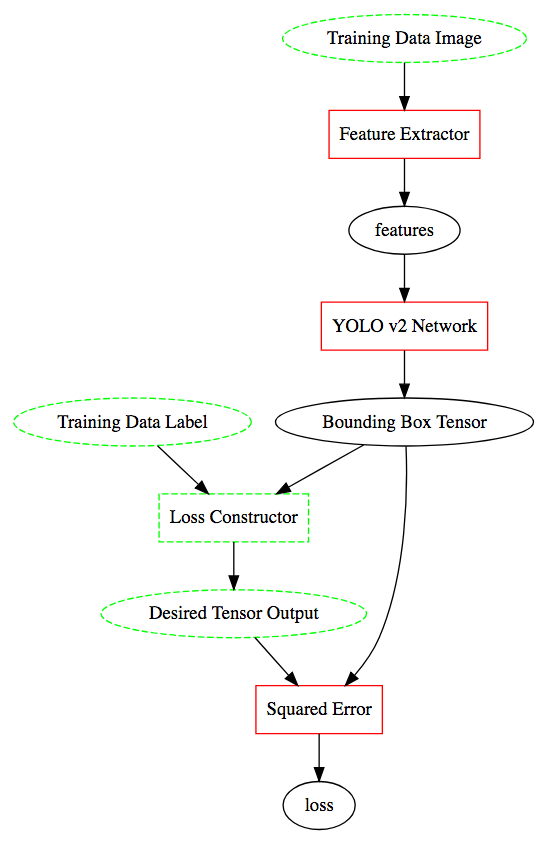

# YOLO v2 Network Details
This documentation is intended for in-house use.

## Inference
The network for inference is given as follows:

```viz
digraph G {
  node [shape="rect"]
  fe [label="Feature Extractor" color="red"]
  yolo [label="YOLO v2 Network" color="red"]
  nms[label="Non-Maximum Suppression (NMS)" color="green" style="dashed"]

  node [shape="oval"]
  bbtensor[label="Bounding Box Tensor"]

  x[label="Input Image"]
  bb[label="Bounding Boxes"]
  x -> fe -> features -> yolo -> bbtensor -> nms -> bb
}
```


Non-Maximum Suppression (NMS) is a non-differentiable process (at least in the current implementation of YOLO-v2-NNabla). Therefore, regression cannot be directly performed on the final bounding boxes. In YOLO v2, instead of this, regression is performed on the "Bounding Box Tensor." Therefore, the resulting YOLO v2 training network is composed as follows:

### Remarks on the "reorg" Step
In the "YOLO v2 Network" part in the diagram above, there is a part where the network branches off and is concatenated later to produce the final output. In this branched-off pass, there is a composition of network functions called the "reorg" function. This function appears in the original Darknet implementation of YOLO v2, and is composed by convolution and reshaping functions.

However, it was indicated by our team member (Narihira-san), that the original Darknet implementation of "reorg" contains a bug,
where some function is called with incorrect (mixed-up) arguments. Nevertheless of this bug, the original Darknet implementation is capable
of training the YOLO v2 Network.
The current YOLO-v2-NNabla contains both implementations, the intended implementation and the original implementation containing the bug.
The current code uses the one containing the bug, to make it closer to the original Darknet implementation.


## Training
The network for training is given as follows:

```viz
digraph G {
  node [shape="rect"]
  fe [label="Feature Extractor" color="red"]
  yolo [label="YOLO v2 Network" color="red"]
  lossc [label="Loss Constructor" color="green" style="dashed"]
  sq [label="Squared Error" color="red"]
  node [shape="oval"]

  l[label="Training Data Label" color="green" style="dashed"]
  x[label="Training Data Image" color="green" style="dashed"]
  bbtensor[label="Bounding Box Tensor"]
  des[label="Desired Tensor Output" color="green" style="dashed"]
  x -> fe -> features -> yolo -> bbtensor
  l -> lossc
  bbtensor -> lossc
  lossc -> des
  bbtensor -> sq
  des -> sq
  sq -> loss
}
```


- **Remark:** We have decomposed the "YOLO v2 Network" into several components (including )
In this second diagram, the dashed squares and ovals indicate non-differentiable functions and variables. Most notably, the "Desired Tensor Output" ...

Normally, training can be done by doing regression directly on the final output. The final output in this case is the list of bounding boxes. However, as it can be seen in the previous section, calculating the bounding boxes require a non-differentiable process, namely the NMS step, making the final bounding box output non-differentiable.

To yield this problem, YOLO v2 does regression on what is called the "Bounding Box Tensor" in the diagram above (this is a term unique to this writing, and it is not called that way in the original paper). This tensor contains all of the bounding box candidates in all of the grids. To do regression on this tensor, the YOLO v2 process does the following:

1. Based on the true label and and the Bounding Box Tensor, it uses a Loss Constructor to construct the "Desired Tensor Output."
   - This is done entirely inside `region_loss.py`.
2. A squared-error loss is taken between the Bounding Box Tensor and the Desired Tensor Output.
3. Since we have obtained a differentiable loss, the parameters are updated by the usual methods using gradient descent.