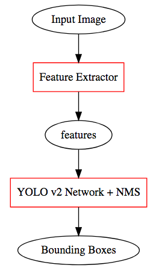
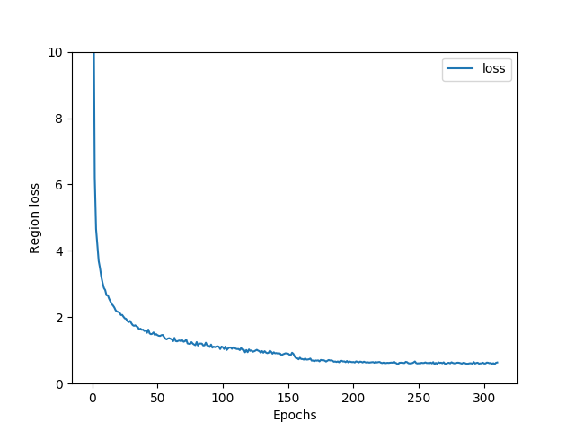

# Tutorial: Training the YOLO v2 Network with YOLO-v2-NNabla

Welcome to YOLO-v2-NNabla! This tutorial will explain in detail on NNabla using YOLO-v2-NNabla.

This tutorial will cover the following four topics:

1. Prepare the **dataset.**
   - In [the original YOLO v2 paper][1], one of the training datasets that are being used is a composition of two datasets, PASCAL VOC 2007 and VOC 2012. This tutorial will use this composed dataset. Since this involves various steps, It will be described in detail in this tutorial.
2. **Train** the network.
   - `train.py` will be mainly used for this purpose.
3. Run image object detection **using the trained parameters**.
   - `yolov2_detection.py` will be mainly used for this purpose.
   - This is mostly the same as [Quick Start: Image Object Detection with YOLO-v2-NNabla](./quickstart.md), until the final step, where the trained network weights are used instead of the pretrained network weights.
4. **Evaluate the network's mAP** (Mean Average Precision).
   - Mean Average Precision is the score used for evaluating the image object detection performance in [the original YOLO v2 paper][1].
   - `valid.py` and `scripts/voc_eval.py` will be mainly used for this purpose.


For the following topics, please see the corresponding tutorials:

- To train your network using a custom dataset, see [Tutorial: Training the YOLO v2 Network with a Custom Dataset](tutorial_custom_dataset.md).
- To train your network using a custom feature extractor, see [Tutorial: Training the YOLO v2 Network with a Custom Feature Extractor](tutorial_custom_features.md).
- To run image object detection on pretrained network weights, see [Quick Start: Image Object Detection with YOLO-v2-NNabla](../quickstart.md).


## Prerequisites: Install NNabla, and Clone This Repository
Please follow the following sections in [Quick Start: Image Object Detection with YOLO-v2-NNabla](../quickstart.md), where these steps are covered in detail:

- Prerequisites: Install NNabla and Other Required Software
- Step 1: Clone This Repository

After these steps, you will have NNabla and other required software installed in your system, and the training script for YOLO-v2-NNabla.

In the next section, we will download and prepare the dataset (images, bounding box labels, etc.) used for training and validation, which is not included in the downloaded repository.


## Part 1: Preparing the Dataset
In [the original paper][1], the Pascal VOC Dataset is used as one of the training datasets. This tutorial will first cover how to use the Pascal VOC Dataset for YOLO-v2-NNabla as an example. Training the network on the MS COCO Dataset can be done by mostly following similar steps as training on VOC - for details, see the "Training YOLO on COCO" section on the [YOLO v2 paper author's website](https://pjreddie.com/darknet/yolov2/). To train the network on your own dataset, see [Tutorial: Training the YOLO v2 Network with a Custom Dataset](tutorial_custom_dataset.md).

To prepare the dataset, follow the steps on the "Training YOLO on VOC" section [on this website ](https://pjreddie.com/darknet/yolov2/), written by the original author of [the YOLO v2 paper][1]. This tutorial will cover the same content in somewhat more detail.

### Step 1-1: Get the Pascal VOC 2007 and 2012 Datasets
This section follows the first half of the "Get The Pascal VOC Data" section in [the original YOLO v2 project website](https://pjreddie.com/darknet/yolov2/).

First, download the following three files from the following locations:

- From the "Test Data" section in [The PASCAL Visual Object Classes Challenge 2007](http://host.robots.ox.ac.uk/pascal/VOC/voc2007/index.html#testdata) website,
  - Download the annotated test data (430MB tar file), `VOCtest_06-Nov-2007.tar`
- From the "Development Kit" section in [The PASCAL Visual Object Classes Challenge 2007](http://host.robots.ox.ac.uk/pascal/VOC/voc2007/index.html#devkit) website,
  - Download the training/validation data (450MB tar file), `VOCtrainval_06-Nov-2007.tar`
- From the "Development Kit" section in [Visual Object Classes Challenge 2012 (VOC2012)
](http://host.robots.ox.ac.uk/pascal/VOC/voc2012/index.html#devkit) website,
  - Download the training/validation data (2GB tar file), `VOCtrainval_11-May-2012.tar`


### Step 1-2: Unarchive the Pascal VOC 2007 and 2012 Datasets
This section follows the second half of the "Get The Pascal VOC Data" section in [the original YOLO v2 project website](https://pjreddie.com/darknet/yolov2/).

Each of the downloaded files are stored in the [tar archive format](https://en.wikipedia.org/wiki/Tar_(computing)), similar to \*.zip archives.

If you are working on a Linux machine, run the following commands on your terminal to unarchive the downloaded files:
```
tar xf VOCtest_06-Nov-2007.tar
tar xf VOCtrainval_06-Nov-2007.tar
tar xf VOCtrainval_11-May-2012.tar
```
Running these commands will produce a directory named `VOCdevkit`, which contains all of the files required to construct the dataset.

If you are working on a Windows machine, please use an unarchiving software that is capable of unarchiving \*.tar archive files. After unarchiving all of the files, please place all of the files under the folder `VOCdevkit`.


### Step 1-3: Convert the Bounding Box Label Format
This section follows the "Generate Labels for VOC" section in [the original YOLO v2 project website](https://pjreddie.com/darknet/yolov2/).

YOLO v2 is a network to be used for image object detection. YOLO-v2-NNabla uses the following three parts of the downloaded dataset for training and validation:

- The raw images.
- The bounding box labels for each image.
  - Each bounding box contains the position, size, and the class of the object that is contained in the box.
- The names (description) for each class.
  - Since the class labels are stored as integers, we need a file to specify the description of each integer.

Among these data, the bounding box labels must be converted to a specific format so that YOLO-v2-NNabla can read and use.

To do this, follow the following three steps:

1. Download the following Python script provided by the YOLO v2 paper author via GitHub:
   - https://raw.githubusercontent.com/pjreddie/darknet/master/scripts/voc_label.py
2. Place the downloaded `voc_label.py` under the same directory (folder) as the `VOCdevkit` directory (folder) which you have created in the previous section
3. Run `python voc_label.py`

If you are running on a Linux system, these steps can be done by running the following commands on the terminal:
```
wget https://raw.githubusercontent.com/pjreddie/darknet/master/scripts/voc_label.py
# Make sure `voc_label.py` is placed under the same directory as the `VOCdevkit` directory
python voc_label.py
```

Running `voc_label.py` will create label files inside `VOCdevkit/VOC2007/labels/` and `VOCdevkit/VOC2012/labels/`. As mentioned in [the original YOLO v2 project website](https://pjreddie.com/darknet/yolov2/), after running this script, you should see the following files under your current directory:
```
2007_test.txt   VOCdevkit
2007_train.txt  voc_label.py
2007_val.txt    VOCtest_06-Nov-2007.tar
2012_train.txt  VOCtrainval_06-Nov-2007.tar
2012_val.txt    VOCtrainval_11-May-2012.tar
```

### Step 1-4: Combine the Datasets Together
Each of the text files that are generated under the same directory (folder) as `voc_label.py` is a list of image files for the training/testing dataset for the corresponding year.

In YOLO v2, each datum in the training dataset always comes in a pair of one image and one label text file. In the previous step, Step 1-3, `voc_label.py` creates label files for each image file which has a similar filename (the corresponding image file path can be determined by the label file path, and vice versa). Therefore, by providing the is list to the YOLO-v2-NNabla training script, YOLO-v2-NNabla will automatically find the corresponding label file for each image in the provided list.

Therefore, these lists can be combined to create a larger dataset, containing more images. Here, we will be using the following datasets for the training and validation datasets:

- Training dataset:
  - 2007_train.txt
  - 2007_val.txt
  - 2012_train.txt
  - 2012_val.txt
- Validation dataset:
  - 2007_test.txt

To construct the training dataset, we must combine the contents (the list of filepaths) in the four text files of the file names.

#### On Linux
If you are running on a Linux system, simply run the following command to generate `train.txt`, which has all of the four dataset combined:
```
cat 2007_train.txt 2007_val.txt 2012_train.txt 2012_val.txt > train.txt
```
`train.txt` will be generated under the same directory as each of the text files.

#### On Windows
If you are running on a Windows system, simply follow the following steps:

1. Open each of the four text files (`2007_train.txt`, `2007_val.txt`, `2012_train.txt`, and `2012_val.txt`).
2. Copy and paste the contents of each file, into one text file.
3. Save the text file with the name `train.txt`, next to the same files as each of the text files.


## Part 2: Training the Network
This part will cover how to train the network using YOLO-v2-NNabla.

### Step 2-1: Download the Pretrained Parameters for Darknet19
The YOLO v2 network roughly consists of two parts:


- **Remark:** We have included the Non-maximum Suppression (NMS) procedure inside the "YOLO v2 Network."

When training the YOLO v2 network, the feature extractor must be pretrained. The "YOLO v2 Network" uses the features from the pretrained image feature extractor to infer its bounding boxes. YOLO-v2-NNabla uses Darknet19, proposed by the author of the YOLO v2 paper, used in the original YOLO v2 paper. The structure of Darknet19 is described in `darknet19.py`.

Therefore, in this downloading process, we are downloading the pretrained parameters for the image feature extractor.

- **Remark:** To use your own image feature extractor instead of Darknet19, please see [Tutorial: Training the YOLO v2 Network with a Custom Feature Extractor](tutorial_custom_features.md).

As of the time of this writing, the author of the YOLO v2 paper publishes the pretrained weights of Darknet19 in the original [YOLO v2 project website](https://pjreddie.com/darknet/yolov2/), in the "Download Pretrained Convolutional Weights" section. A direct link to the pretrained Darknet19 from the original YOLO v2 project website is https://pjreddie.com/media/files/darknet19_448.conv.23 .


### Step 2-2: Convert the Pretrained Parameters for Darknet19
After downloading the pretrained weights for Darknet19, we must convert them to NNabla format. The pretrained weights are provided in the \*.weights format, as in the entire pretrained YOLO v2 network described in [Quick Start: Image Object Detection with YOLO-v2-NNabla](../quickstart.md). We therefore must first convert this file to NNabla's \*.h5 format before it could be used in NNabla.

To do this, run the following command on your terminal:
```
python convert_darknet19_448_conv_23_weights_to_nnabla.py --input darknet19_448.conv.23
```

This will produce a file named `darknet19_448.conv.23.h5`, which can be loaded in YOLO-v2-NNabla.


### Step 2-3: Train the YOLO v2 Network
We are now ready to train the YOLO v2 Network!

```
python train.py -w ./darknet19_448.conv.23.h5 -t {path-to-dataset}/train.txt -o backup -g {GPU number}
```

- **Remarks:**
  - The `-g` option specifies the GPU ID where the training runs.
  - The `-t` option must specify the training dataset, i.e. the `train.txt` file created in step 1-4.
  - The `-o backup` specifies **the output directory for the intermediate weight files during training, and the final weight files.** By default, weight files are saved every 10 epochs, where the training lasts for 310 epochs by default (actually, plus a few more, to be exact - however, only the weights of 310 epochs are saved by the training script, which is an issue). To save the intermediate and final weight results in a different directory, change this `-o` argument to something different, such as `-o weight_output_dir`.
  - The default arguments related to batch size are set as  `--accum-times 8` and `--batch-size 8`. Those arguments indicate options for gradient accumulation. Currently, YOLO-v2-NNabla assumes a total batch size of 64 images per batch. To virtually realize a batch size of 64, YOLO-v2-NNabla uses batch accumulation, i.e. it accumulates the gradients of several mini-batches to emulate a larger batch size. `--batch-size 8` indicates that each mini-batch will contain 8 images. `--accum-times 8` indicates that the mini-batch will be accumulated 8 times to create one whole batch.
  - The OpenCV Python package can optionally be used to speed up data preprocessing. If Anaconda Python is used, you can install OpenCV by executing `conda install -y opencv` in most cases. If it is installed, the training script automatically detects and uses OpenCV package. **We recommend disabling multi threading in OpenCV by setting an environment variable** `OMP_NUM_THREADS=1`**.** Also, if large RAM space (>10GB if VOC dataset) is available on your machine, an option `--on-memory-data` will load entire dataset onto the host RAM, that will reduce the image loading overhead during training, hence speedup. With this setting, the training completes in 33 hours on GTX1080.
  - The `--anchors` option which specifies anchor box biases is ommited because the default bias setting is for the Pascal VOC dataset. Please make sure to specify this when you train on another dataset.

**Troubleshooting:**
- If you have saved `darknet19_448.conv.23.h5` with a different filename in the previous section, make sure to specify the correct filename.

The command line tool `nnabla_cli plot_series` bundled with nnabla package will plot a training loss curve like the following;




### Step 2-4: Get the Final Trained Network Weights
As explained in the previous section, by default, `train.py` will run for 310 epochs (actually a little more, but the training script will discard the results of the last epochs and will only save weight files up to 310 epochs, which is an issue) using the VOC dataset. The final network weights outputted by `train.py` is stored as `./backup/000310.h5`.

- **Remark:** As explained in the previous section, directory name `backup` depends on the argument `-o backup` when running `python train.py`.


## Part 3: Run Image Object Detection Using the Trained Network Weights
Once you have obtained the final network weight file, `./backup/000310.h5`, you can use it to perform image object detection with your own training results.

To do this, first please read the quickstart documentation: [Quick Start: Image Object Detection with YOLO-v2-NNabla](../quickstart.md), especially the part "Step 4: Run the Detection Script."

Running image object detection with your own network weights is then fairly straightforward. Instead of the pretrained weight filename, `yolov2-voc.h5`, specify your own network weight file, `./backup/000310.h5`:
```
python yolov2_detection.py input_image.jpg \
--weights ./backup/000310.h5 \
--class-names ./data/voc.names \
--classes 20 \
--anchors 'voc'
```

## Part 4: Evaluate the YOLO v2 Network
In [the original YOLO v2 paper][1], the network's image object detection performance is evaluated under its mAP (Mean Average Precision). In YOLO-v2-NNabla, the mAP of the trained network can be evaluated in two steps by running two scripts, `valid.py` and `scripts/voc_eval.py`.

### Step 4-1:
The first step of evaluating the mAP for the trained network is to run `valid.py`. To do this, run the following command on your terminal:
```
python valid.py -w backup/000310.h5 -v {path-to-dataset}/2007_test.txt -o results -g {GPU ID}
```
- **Remark:**
  - The `-v` option must specify the validation dataset, i.e. the `2007_test.txt` file created in step 1-3.
  - `backup/000310.h5` is the name of the final network weight file obtained after training. If it has a different filepath (for example, you have specified a different weight output directory name instead of `backup`), please specify the path for the network weight file that you want to perform evaluation on.

After running this on the terminal, `valid.py` will produce 20 text files (which is the number of classes in the training dataset - note that `valid.py` assumes Pascal VOC 2007+2012 as the default dataset) under the directory `results`. Each of the 20 text files has the name of the format `comp4_det_test_*.txt`. The argument `results` in the command above is the output directory for these output text files. To change the output directory, simply change this argument, `results`, to the directory name of your choice.
  - The `--anchors` option is ommited by the same reason in `train.py`. See above.

- **Remark (issue):** Currently, `valid.py` calculates the bounding boxes using its own NMS (Non-maximum suppression) implementation, instead of `nnabla.functions.nms_detection2d`. It has been experimentally confirmed that there are times when these two implementations output different results, although most of the time they output the same results.

### Step 4-2:
After producing `results/comp4_det_test_*.txt` using `valid.py`, we must post-process these text files to calculate the actual mAP values.

To do this, simply run:
```
python scripts/voc_eval.py -d {path-to-dataset} results/comp4_det_test_
```
- **Remarks:**
  - This Python script is ported from a MATLAB script included in the PASCAL VOC Development Kit, which can be found in the same location mentioned in the section "Part 1: Preparing the Dataset." The license for this script can be found in the [LICENSE.external](../LICENSE.external) file under the YOLO-v2-NNabla directory.

This script will output data in the following format:
```
VOC07 metric? Yes
AP for aeroplane = 0.[number]
AP for bicycle = 0.[number]
AP for bird = 0.[number]
AP for boat = 0.[number]
AP for bottle = 0.[number]
AP for bus = 0.[number]
AP for car = 0.[number]
AP for cat = 0.[number]
AP for chair = 0.[number]
AP for cow = 0.[number]
AP for diningtable = 0.[number]
AP for dog = 0.[number]
AP for horse = 0.[number]
AP for motorbike = 0.[number]
AP for person = 0.[number]
AP for pottedplant = 0.[number]
AP for sheep = 0.[number]
AP for sofa = 0.[number]
AP for train = 0.[number]
AP for tvmonitor = 0.[number]
Mean AP = 0.[number]
```
Here, each `0.[number]` in this example will be outputted as an actual number.

Each line in the output, such as "AP for aeroplane," indicates the Average Precision (AP) for the given class name, here, "aeroplane." The final line in the first half, "Mean AP = 0.[number]," is the Mean Average Precision (mAP) score for the network.

After this output, the script will also output a list of numbers:
```
Results:
0.[number]
0.[number]
0.[number]
0.[number]
0.[number]
0.[number]
0.[number]
0.[number]
0.[number]
0.[number]
0.[number]
0.[number]
0.[number]
0.[number]
0.[number]
0.[number]
0.[number]
0.[number]
0.[number]
0.[number]
0.[number]
```
The contents of this output are basically the same as the first half, except the text is excluded, and the number is rounded to the third decimal place.


If the training works, you should get a mean AP around 72. That is a bit far from the reported number in the YOLOv2 paper, however, we have observed that [DarkNet detector training for YOLOv2](https://pjreddie.com/darknet/yolov2/#train-voc) produces a model gets the similar number (around 72 mean AP) although we get a mean AP 75.97 [by the officially provided YOLOv2 VOC model](https://pjreddie.com/media/files/yolov2-voc.weights).


[1]: https://arxiv.org/abs/1612.08242 "YOLOv2 arxiv"
