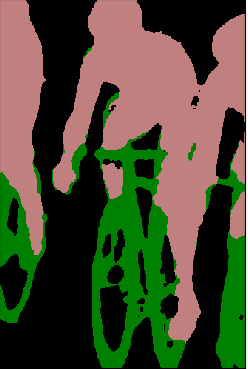
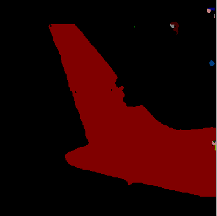
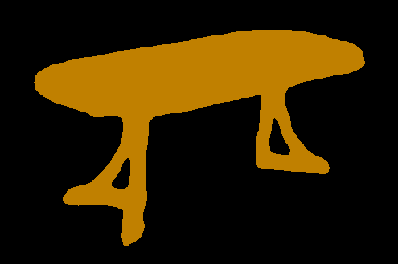
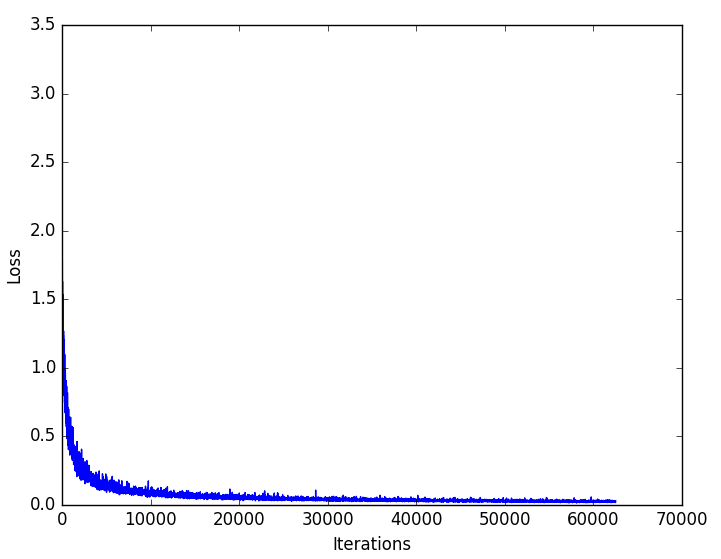
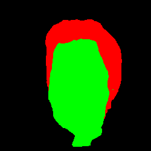
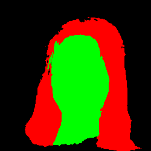
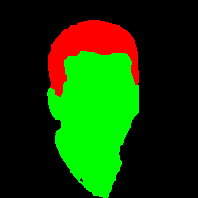

# Deeplabv3plus
This is a nnabla implementation for [Encoder-Decoder with Atrous Separable Convolution for Semantic Image Segmentation](https://arxiv.org/abs/1802.02611)

# Neural Network Libraries - Examples

Installation guide given in : https://github.com/sony/nnabla-examples/

# Setup Requirements

In Linux environment:
1. OpenCV
    ```
    conda install opencv
    ```
2. ImageIO
    ```
    pip install imageio
    ```
3. Tensorflow
    ```
    pip install tensorflow
    ```


# Some segmentation results on VOC validation images:
<p align="center">
    &nbsp;&nbsp;&nbsp;&nbsp;&nbsp;&nbsp;&nbsp;&nbsp;&nbsp;&nbsp;&nbsp;&nbsp;&nbsp;&nbsp;&nbsp;</br>
    &nbsp;&nbsp;&nbsp;&nbsp;&nbsp;&nbsp;&nbsp;&nbsp;&nbsp;&nbsp;&nbsp;&nbsp;&nbsp;&nbsp;&nbsp;</br>
    &nbsp;&nbsp;&nbsp;&nbsp;&nbsp;&nbsp;&nbsp;&nbsp;&nbsp;&nbsp;&nbsp;&nbsp;&nbsp;&nbsp;&nbsp;</br>
    &nbsp;&nbsp;&nbsp;&nbsp;&nbsp;&nbsp;&nbsp;&nbsp;&nbsp;&nbsp;&nbsp;&nbsp;&nbsp;&nbsp;&nbsp;</br>
</p>


# Quick Start Inference

To perform inference on a test image perform the following steps:


## Download pretrained model

To download a pretrained model from tensorflow's repository trained on [COCO+VOC trainaug dataset](https://github.com/tensorflow/models/blob/master/research/deeplab/g3doc/model_zoo.md) :
```bash
python download_pretrained_tf_deeplabv3plus_coco_voc_trainaug.py
```

This will download and uncompress the pretrained tensorflow model trained on COCO+Pascal VOC 2012 trainaug dataset with xception as backbone.

## Weight Conversion

Convert tensorflow weight/checkpoints to nnabla parameters file.
```bash
python convert_tf_nnabla.py --input-ckpt-file=/path to ckpt file --output-nnabla-file=/output.h5 file
```

**NOTE: input-ckpt-file is the path to the ckpt file downloaded and uncompressed in the previous step. Please give the path to the model-*.ckpt.**


## Inference

Perform inference on a test image using the converted Tensorflow model.
```bash
python model_inference.py --model-load-path=/path to parameter file --image-width=target width for input image --test-image-file=image file for inference --num-class=no. of categories --label-file-path=txt file having categories --output-stride=16
```

**NOTE: model-load-path is the path to the converted parameter filr(.h5) obtained in the previous step; 
and num-class=21 in the case of using the default tensorflow pretrained model downloaded in the "Download pretrained model" step (as it is trained on 21 categories).**


# Training

To train a Deeplab v3+ model in Nnabla, perform the following steps:

## Download Dataset

Support for the following dataset is provided:

##### VOC 2012 Semantic Segmentation dataset

Download the Pascal VOC dataset and uncompress it.
```bash
wget host.robots.ox.ac.uk/pascal/VOC/voc2012/VOCtrainval_11-May-2012.tar
```

## Run the data preparation script

- VOC 2012 Semantic Segmentation Dataset

To prepare VOC data for training:
```bash
python dataset_utils.py --train-file="" --val-file="" --data-dir=""
```
**NOTE:**
* train-file and val-file are the filenames of the train and val images provided by VOC under VOC2012/ImageSets/Segmentation/ respectively; data-dir is the path that contains the JPEGImages (e.g: --data-dir = =../../VOCdevkit/VOC2012/ )
* This will result in files train_images.txt, train_labels.txt, val_images.txt, val_labels.txt

After data preparation, the data directory structure should look like :
```
+ VOCdevkit
  + VOC2012
    + JPEGImages
    + SegmentationClass
      + encoded
```
and the current working directory should contain the following 4 files generated from running the above script:
```
+ train_image.txt
+ train_label.txt
+ val_image.txt
+ val_label.txt
```


## Download backbone pre-trained model from Tensorflow's Model Zoo

```bash
wget download.tensorflow.org/models/deeplabv3_xception_2018_01_04.tar.gz
```


## Convert the backbone pre-trained model to Nnabla

```bash
python convert_tf_nnabla.py --input-ckpt-file=/path to ckpt file --output-nnabla-file=/output .h5 file
```


## Run the training script

To run the training:

##### Single Process Training

```bash
python train.py \
    --train-dir=train_image.txt \
    --train-label-dir=train_label.txt \
    --val-dir=val_image.txt\
    --val-label-dir=val_label.txt \
    --accum-grad=1 \
    --warmup-epoch=5 \
    --max-iter=40000 \
    --model-save-interval=1000 \
    --model-save-path=/path to save model \
    --val-interval=1000 \
    --batch-size=1 \
    --num-class= no of categories in dataset \
    --pretrained-model-path=path to the pretrained model(.h5) \
    --train-samples=no. of train samples in dataset \
    --val-samples=no. of val samples in dataset \
```

    
##### Distributed Training
For distributed binary installation refer : https://nnabla.readthedocs.io/en/latest/python/pip_installation_cuda.html#installation-with-multi-gpu-supported


```bash
mpirun -n <no. of devices> python train.py \
    --train-dir=train_image.txt \
    --train-label-dir=train_label.txt \
    --val-dir=val_image.txt\
    --val-label-dir=val_label.txt \
    --accum-grad=1 \
    --warmup-epoch=5 \
    --max-iter=40000 \
    --model-save-interval=1000 \
    --model-save-path=/path to save model \
    --val-interval=1000 \
    --batch-size=1 \
    --num-class= no of categories in dataset \
    --pretrained-model-path=path to the pretrained model(.h5) \
    --train-samples=no. of train samples in dataset \
    --val-samples=no. of val samples in dataset \
    --distributed
```

**NOTE:**
**1. The text files passed as arguments to the training scripts are the ones generated in the "Run the data preparation script" Step.**
**2. For reproducing paper results, it is suggested to use batch-size > 16 (for distributed, set argument --batch-size = 16 / no.of devices) and max-iter=250,000 when training from scratch.**
**3. To compute the accuracy (mean IOU) while training/validation add argument --compute-acc to the training command.**

**Typical Training Loss curve:**
<p align="center">
    </br>
</p>    


# Fine-tuning with smaller dataset

This section demonstrates how to fine-tune Deeplab v3+ pre-trained model using LFW Part Labels dataset, which contains 2000 train+val labelled images having 3 classes: hair, face and background.

## Some fine-tuning results on LFW Part Labels validation images:
<p align="center">
    &nbsp;&nbsp;&nbsp;&nbsp;&nbsp;&nbsp;&nbsp;&nbsp;&nbsp;&nbsp;&nbsp;&nbsp;&nbsp;&nbsp;&nbsp;</br>
    &nbsp;&nbsp;&nbsp;&nbsp;&nbsp;&nbsp;&nbsp;&nbsp;&nbsp;&nbsp;&nbsp;&nbsp;&nbsp;&nbsp;&nbsp;</br>
    &nbsp;&nbsp;&nbsp;&nbsp;&nbsp;&nbsp;&nbsp;&nbsp;&nbsp;&nbsp;&nbsp;&nbsp;&nbsp;&nbsp;&nbsp;</br>
</p>

## Download Dataset

Download the LFW Part Labels dataset (images + ground truth labels) and uncompress it.
```bash
wget http://vis-www.cs.umass.edu/lfw/lfw-funneled.tgz
wget http://vis-www.cs.umass.edu/lfw/part_labels/parts_lfw_funneled_gt_images.tgz
```

Also download the train and val files to get the train and val data distributions:
```bash
wget http://vis-www.cs.umass.edu/lfw/part_labels/parts_train.txt
wget http://vis-www.cs.umass.edu/lfw/part_labels/parts_validation.txt
```

After download, the data directory structure should look like:
```
+ <data-dir>
  + lfw-funneled/
  + parts_lfw_funneled_gt_images/
  + parts_train.txt
  + parts_validation.txt
```

## Run the data preparation script

To prepare LFW Part Labels data for training:
```bash
python prepare_lfw_data.py --train-file="" --val-file="" --data-dir=""
```
**NOTE:** 
* train-file and val-file are the filenames of the train (parts_train.txt) and val(parts_validation) txt files; data-dir is the path that contains the data i.e., lfw_funneled/ , parts_lfw_funneled_images/ , etc.
* This will result in files lfw_train_images.txt, lfw_train_labels.txt, lfw_val_images.txt, lfw_val_labels.txt

After data preparation, the data directory structure should look like :
```
+ <data-dir>
  + lfw-funneled/
  + parts_lfw_funneled_gt_images/
      + encoded
```
and the current working directory should contain the following 4 files generated from running the above script:
```
+ lfw_train_image.txt
+ lfw_train_label.txt
+ lfw_val_image.txt
+ lfw_val_label.txt
```

## Execute Fine Tuning
* For fine-tuning with any dataset, prepare the dataset in the same way as above(writing a data preparation script is required; refer [prepare_lfw_data.py](https://github.com/LambdaScrum/sdeep-nnabla-examples/blob/feature/20190329-deeplabv3plus-finetuning/semantic-segmentation/deeplabv3plus/prepare_lfw_data.py)) and add ```--fine-tune``` argument to the training command.
* Hyper parameters such as learning rate, number of epochs, batch_size, and input image size should be adjusted depending on your purpose.
* Specify the VOC trained Deeplabv3+ model as pretrained model in ```--pretrained-model-path``` argument.


# Evaluate

To evaluate the trained model obtained from the previous step :

```bash
python eval.py \
    --model-load-path=/model_save_path/param_xxx.h5 \
    --val-samples=no. of val samples in dataset \
    --val-dir=val_image.txt \
    --val-label-dir=val_label.txt \
    --batch-size=1 \
    -c='cudnn' or 'cpu' \
    --num-class=no. of categories 
```

# Inference

Perform inference on a test image using the trained model.

```bash
python model_inference.py --model-load-path=/path to parameter file(.h5) --image-width=target width for input image --test-image-file=image file for inference --num-class=no. of categories --label-file-path=txt file having categories --output-stride=16
```

**NOTE: model-load-path is the path to the converted parameter file(.h5) obtained in training.**
