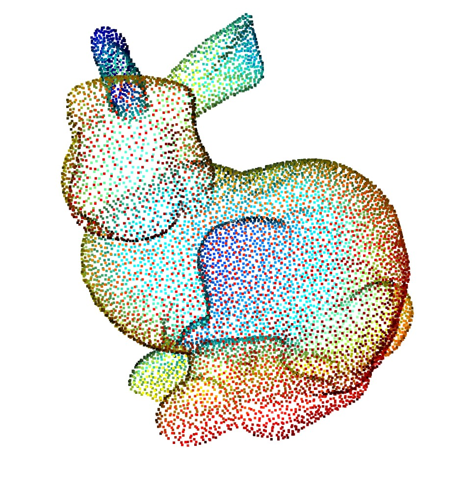
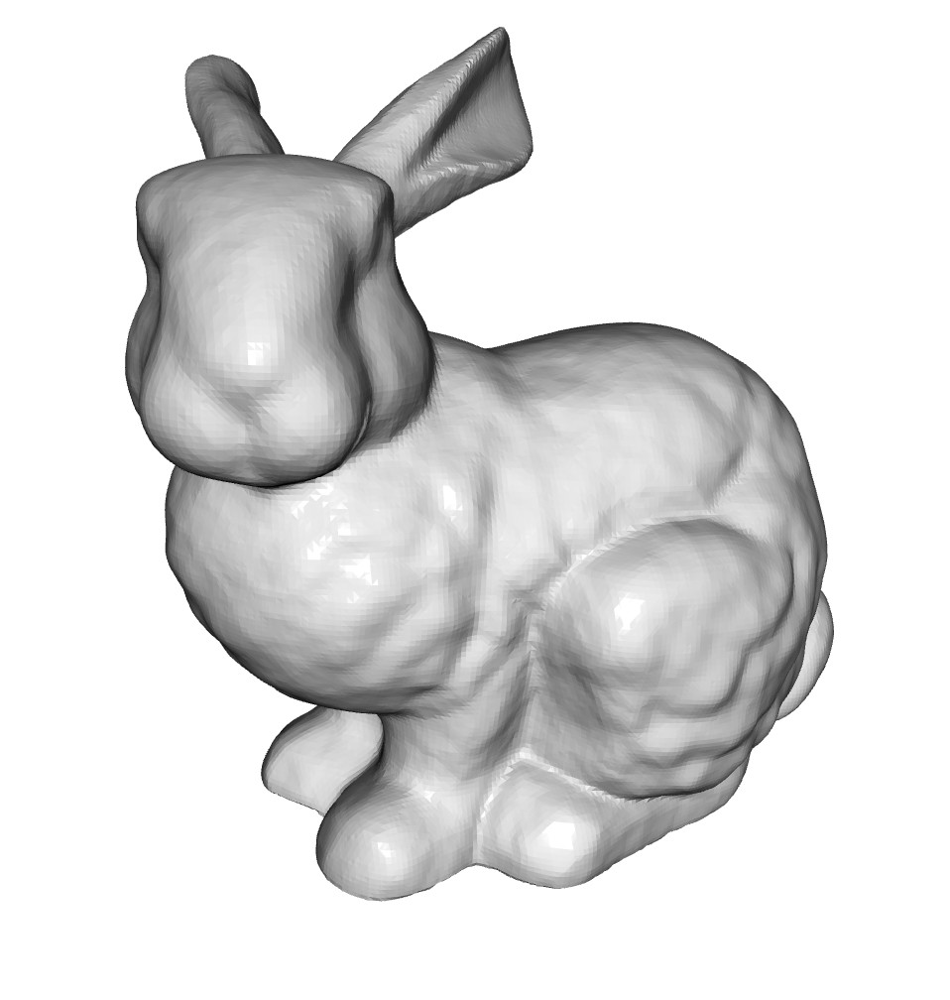
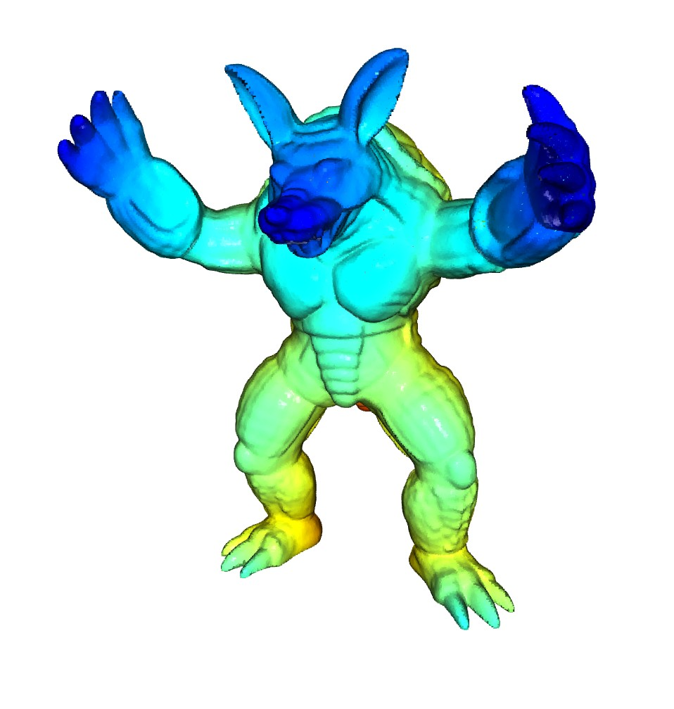
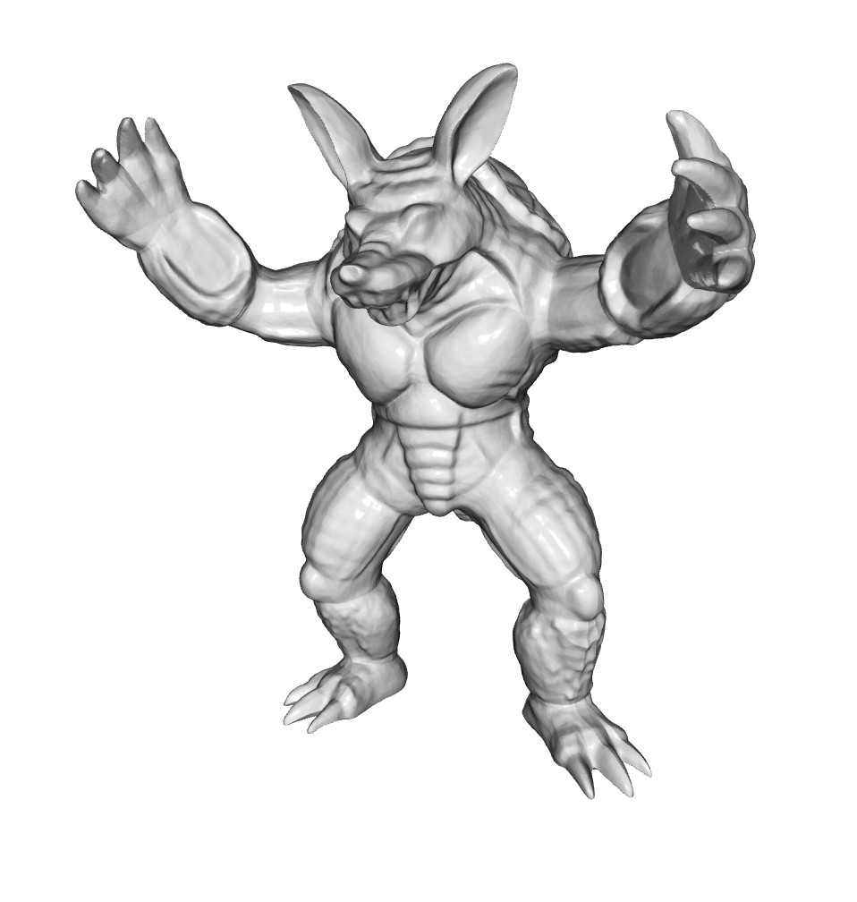
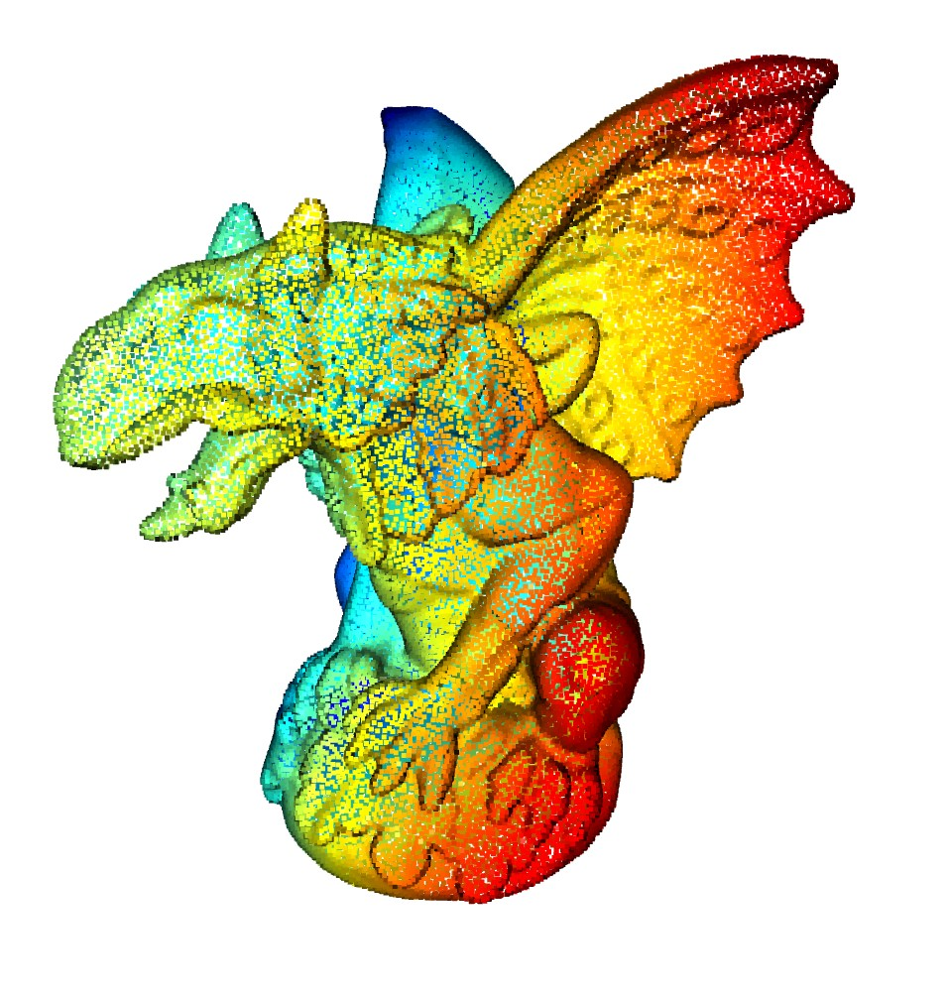
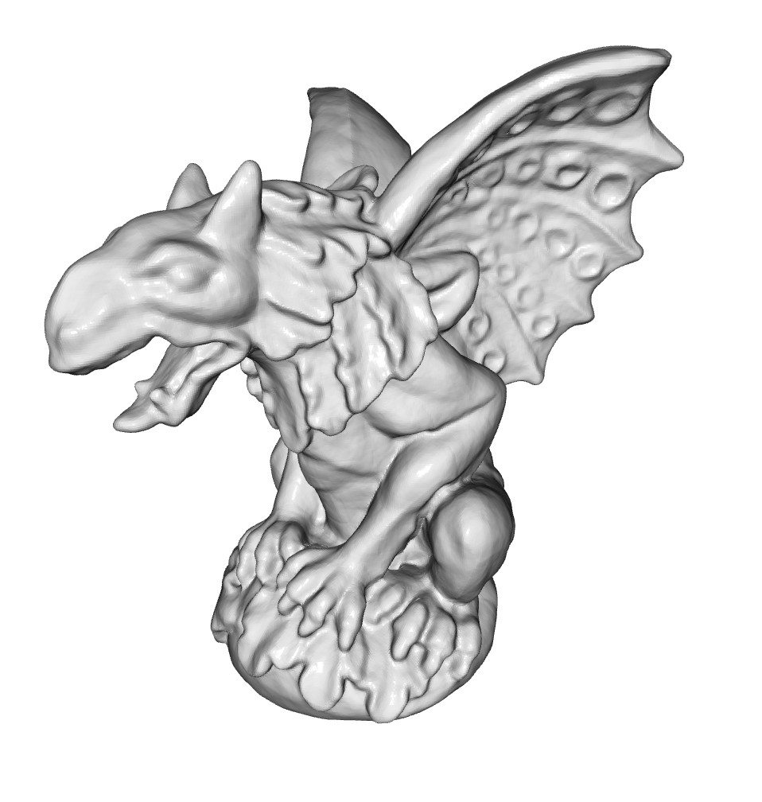
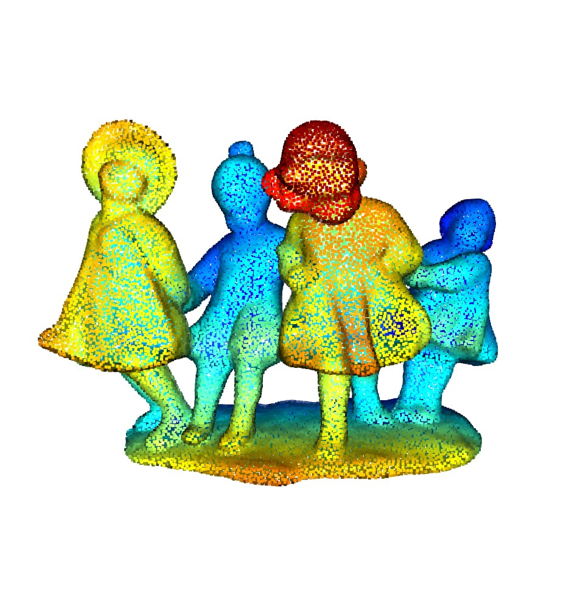
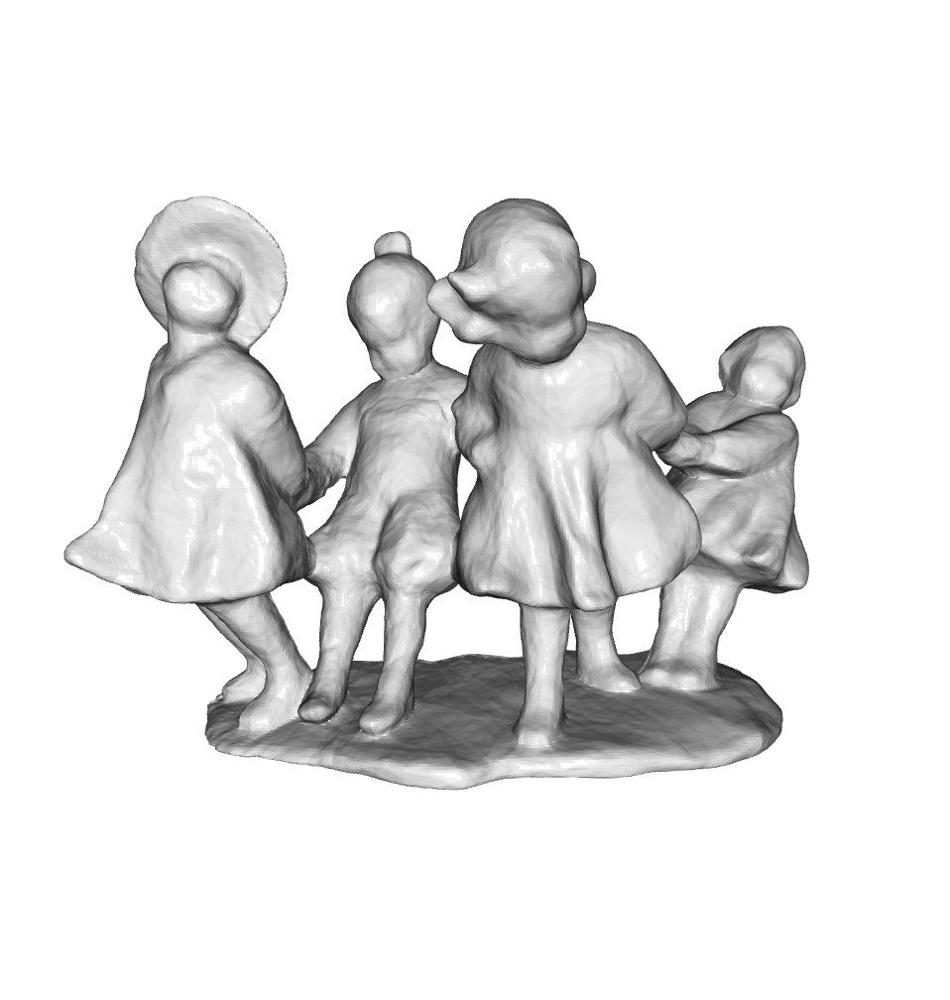

# Implicit Geometric Regularization for Learning Shapes

This is a reproduction of the shape reconstruction in [Implicit Geometric Regularization for Learning Shapes](https://arxiv.org/abs/2002.10099).

The zero level set {x | f(x)= 0} is used as the surface represenation, but with it only is not sufficient to approximate the surface since f should be other values than 0 in the space where x is not on the surface. Implicit Geometric Regularization utilizes the *eikonal* equation to let the surface be smooth in a space, such that the zero level set with the eikonal regularization (|df(x)| = 1) well approximates the signed distance function even if we do not have the ground truth of signed distances. Hence, this work casts the surface reconstruction problem as the optimization problem to minimize the f(x) on the point cloud with the *eikonal* equation constraint over the 3d space to obtain the signed distance function on the 3d space. The reconstruction is performed by Marching Cubes algorithm based on the output of f(x).

### Surface Reconstruction

    
   


### Evaluation and Trained Models

The metric value is the best ones over the training, and the trained model is the one in the final epoch.

| Data | Chamfer distance | Hausdorff distance | Trained Model | 
|:-------:|:--------:|:--------:|:--------:| 
| armadillo | 0.20 | 0.67 | [download](https://nnabla.org/pretrained-models/nnabla-examples/shape-reconstruction/implicit-geometric-regularization/armadillo_param_02500.h5) |
| bunny | 0.21 | 0.90 | [download](https://nnabla.org/pretrained-models/nnabla-examples/shape-reconstruction/implicit-geometric-regularization/bunny_param_02500.h5) |
| dragon | 0.12 | 0.61 | [download](https://nnabla.org/pretrained-models/nnabla-examples/shape-reconstruction/implicit-geometric-regularization/dragon_param_00400.h5) |
| drill | 0.45 | 0.96 | [download](https://nnabla.org/pretrained-models/nnabla-examples/shape-reconstruction/implicit-geometric-regularization/drill_param_02500.h5) |
| happy | 0.28 | 0.79 | [download](https://nnabla.org/pretrained-models/nnabla-examples/shape-reconstruction/implicit-geometric-regularization/happy_param_01500.h5) |
| lucy | 0.07 | 0.53 | [download](https://nnabla.org/pretrained-models/nnabla-examples/shape-reconstruction/implicit-geometric-regularization/lucy_param_01500.h5) |
| manuscript | 0.03 | 0.36 | [download](https://nnabla.org/pretrained-models/nnabla-examples/shape-reconstruction/implicit-geometric-regularization/manuscript_param_01500.h5) |
| rgb\_dragon | 0.22 | 0.73 | [download](https://nnabla.org/pretrained-models/nnabla-examples/shape-reconstruction/implicit-geometric-regularization/rgb_dragon_param_02500.h5) |
| statuette | 0.40 | 1.00 | [download](https://nnabla.org/pretrained-models/nnabla-examples/shape-reconstruction/implicit-geometric-regularization/statuette_param_01500.h5) |
| anchor | 0.18 | 0.75 | [download](https://nnabla.org/pretrained-models/nnabla-examples/shape-reconstruction/implicit-geometric-regularization/anchor_param_01500.h5) |
| daratech | 0.29 | 0.89 | [download](https://nnabla.org/pretrained-models/nnabla-examples/shape-reconstruction/implicit-geometric-regularization/daratech_param_01500.h5) |
| dc | 0.13 | 0.56 | [download](https://nnabla.org/pretrained-models/nnabla-examples/shape-reconstruction/implicit-geometric-regularization/dc_param_01500.h5) |
| gargoyle | 0.16 | 0.65 | [download](https://nnabla.org/pretrained-models/nnabla-examples/shape-reconstruction/implicit-geometric-regularization/gargoyle_param_01500.h5) |
| lord\_quas | 0.27 | 0.79 | [download](https://nnabla.org/pretrained-models/nnabla-examples/shape-reconstruction/implicit-geometric-regularization/lord_quas_param_01500.h5) |


## Dataset

### The Stanford 3D Scanning Repository

Run this command to download all reconstructed datasets, 

```bash
bash downloads.sh
```

Then, create the point cloud dataset from the reconstructed mesh like

```bash
python datasets.py create -f stanford_3d_scanning_datasets/bunny/reconstruction/bun_zipper.ply
```

If one wants to use all datasets, do like

```bash
for fpath in $(find ./ -name "*vrip*ply" | egrep -v "res|pcd") \
    $(find ./ -name "*zip*ply" | egrep -v "res|pcd") \
    $(ls stanford_3d_scanning_datasets/*.ply | egrep -v pcd) ; do
    python datasets.py create -f ${fpath}
done
```

### Surface Reconstruction Benchmark Data (Deep Geometric Prior for Surface Reconstruction)

Visit [here](https://drive.google.com/file/d/17Elfc1TTRzIQJhaNu5m7SckBH_mdjYSe/view?usp=sharing) and download the dataset, then 

```bash
unzip deep_geometric_prior_data.zip
```

## Training

```bash
python train.py -d 1 \
    -f stanford_3d_scanning_datasets/bunny/reconstruction/bun_zipper_pcd.ply \
    -m bunny \
    -k 50 \
    --lam 0.1
```

**NOTE**

- Train/test data split is 75-25, and if one wants to use a different dataset, change the `-f` and `-m` accordingly. See [commands.sh](./commands.sh) as an example for the training.
- Depending the size of datasets, the training takes less than 1 day with 1 GTX 1080 Ti except for Lucy, Asian Dragon, Vellum manuscript, Thai Statue.
- Chamfer and Hausdorff distances soon saturate over the training, but the loss are going down over the training. 


## Inference

This inference step is needed to perform the visualization and evaluation.

```bash
python infer.py -d 1 -mlp bunny/param_01500.h5 --sub-batch-size 2048 --grid-size 512
```

**NOTE** Sometime, the gradient direction is "descent". If so, add `-gd descent`.

## Visualization

```bash
python visualize.py mesh -f bunny/param_01500_mesh.ply
```

One can also use for the visualization of the point clouds.

```bash
python visualize.py pcd -f <pathto/point_cloud_data.{ply,xyz}>
```

Press "S" to save an image from an arbitrary view angle.

To show the synchronized two views of the point cloud sampled from a mesh and the mesh, 

```bash
pyton visualize.py pcdmesh -f bunny/param_01500_mesh.ply
```

For saving randomly rotated images, run the following

```bash
pyton visualize.py images -f bunny/param_01500_mesh.ply
```


## Evaluation

Evaluation computes Chamfer distance and Hausdorff distance.

```bash
python evaluate.py -d 1 \
    -f stanford_3d_scanning_datasets/bunny/reconstruction/bun_zipper.ply \
    -mdp bunny/param_01500_mesh.ply
```


## References
- Amos Gropp, Lior Yariv, Niv Haim, Matan Atzmon, Yaron Lipman, "Implicit Geometric Regularization for Learning Shapes", https://arxiv.org/abs/2002.10099
- https://github.com/peisuke/ImplicitGeometricRegularization.pytorch
- http://graphics.stanford.edu/data/3Dscanrep/
- https://github.com/fwilliams/deep-geometric-prior
