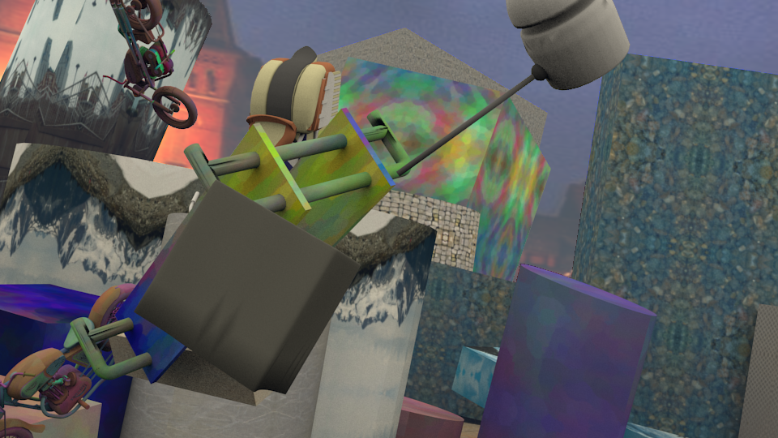
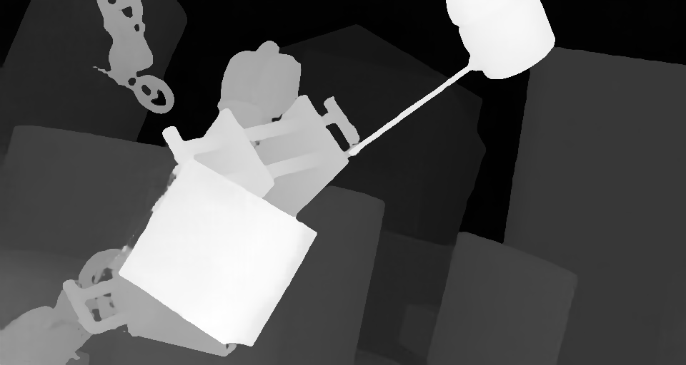
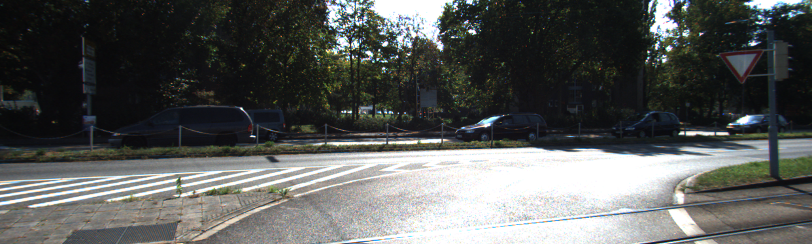
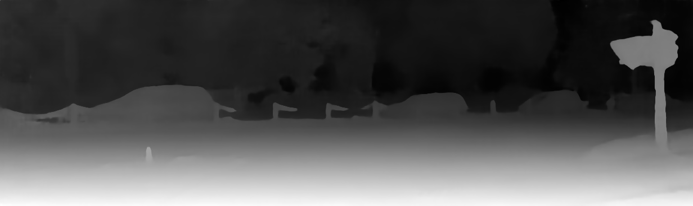

# Pyramid Stereo Matching Network
This repository contains the code (in NNabla) for "[Pyramid Stereo Matching Network](https://arxiv.org/abs/1803.08669)" 
paper (CVPR 2018) by [Jia-Ren Chang](https://jiarenchang.github.io/) and [Yong-Sheng Chen](https://people.cs.nctu.edu.tw/~yschen/).

## Contents
1. [Introduction](#introduction)
2. [Usage](#usage)
3. [Results](#results)
## Introduction

The objective of this implementation is estimation of depth from stereo pair of images. To achieve this, disparity (horizontal displacement between pair of pixels) has to be computed for each pixel in reference image. Supervised learning using convolutional neural networks (CNNs) has been currently used as one of the ways to solve this problem. However, previous architectures rely on patch-based Siamese networks, which becomes less effective when it comes to find correspondence of pixels in images which have occlussions, repetative patterns or reflective surfaces. A Pyramid stereo matching network (PSMNet) to exploit global context information in stereo matching has been proposed to tackle the problem. This method includes two main modules:
* Spatial Pyramid Pooling. 
* 3D CNN. 

Spatial Pyramid Pooling (SPP) and dilated convolution are used to enlarge the receptive fields. PSMNet extends pixel-level features to region-level features with different scales of receptive fields, the resultant combined global and local features are used to form the cost volume for reliable disparity estimation. A 3D CNN is used to regularize the cost volume. The Stacked Hourglass 3D CNN repeatedly processes the cost volume in a top-down/bottom-up manner to further improve the utilization of global context information.

## Usage
To prepare the SceneFlow dataset, please refer to the following ([also described in this link](https://lmb.informatik.uni-freiburg.de/resources/datasets/SceneFlowDatasets.en.html)).
```
Usage of Scene Flow dataset
Download RGB cleanpass images and its disparity for three subset: FlyingThings3D, Driving, and Monkaa.
Put them in the same folder.
And rename the folder as: "driving_frames_cleanpass", "driving_disparity", "monkaa_frames_cleanpass", "monkaa_disparity", "frames_cleanpass", "frames_disparity".
```
### Dependencies

- [Python3.x](https://www.python.org/downloads/)
- [NNabla](https://nnabla.org/)
- [KITTI Stereo](http://www.cvlibs.net/datasets/kitti/eval_stereo.php)
- [Scene Flow](https://lmb.informatik.uni-freiburg.de/resources/datasets/SceneFlowDatasets.en.html)

### Training 
Use the below command to train PSMNet on SceneFlow Dataset
```
python main.py --epoch 10 --dataset SceneFlow --gpus 0 --savemodel {path to save trained model}
```
Use the below command to finetune PSMNet on KITTI2015 dataset
```
python finetune.py --epoch 300 --dataset Kitti --gpus 0 --loadmodel {path of the pre-trained weight files} --savemodel {path to save trained model}
# --loadmodel - is the path of pretrained weights obtained after training PSMNet on SceneFlow dataset. It is used for finetuning the moel on KITTI2015 dataset. The pre-trained weight is available for downloading as mentioned in section **Pretrained Weights**
```
### Inference
Use the below command to run an inference:
```
python inference.py --dataset {dataset name} --loadmodel {path to the trained model} --save-nnp {True if you want to save NNP,otherwise False} -l {path to left input image} -r  {path to right input image}
Ex. python inference.py --dataset SceneFlow --loadmodel ./psmnet_trained_param_10.h5 --save-nnp False -l ./left/0006.png -r ./right/0006.png 
```
### Pretrained Weights
| KITTI |  Scene Flow |
|---|---|
|[Kitti pre-trained model](https://nnabla.org/pretrained-models/nnabla-examples/stereo-depth/psmnet_trained_kitti.h5)|[SceneFlow pre-trained model](https://nnabla.org/pretrained-models/nnabla-examples/stereo-depth/psmnet_trained_sceneflow.h5)|

## Results
### Results on KITTI 2015 leaderboard
[Leaderboard Link](http://www.cvlibs.net/datasets/kitti/eval_scene_flow.php?benchmark=stereo)

| SceneFlow EPE* | KITTI 3 px error** |
|---|---|
| 1.07 | 1.94% |

*End Point Error (state of art value is **1.09**), ** 3 pixel Error (we could not achieve the state of art 3 pixel error i.e **1.83%**).

**Predicted disparity from SceneFlow Dataset**



**Predicted disparity from KITTI Dataset**


